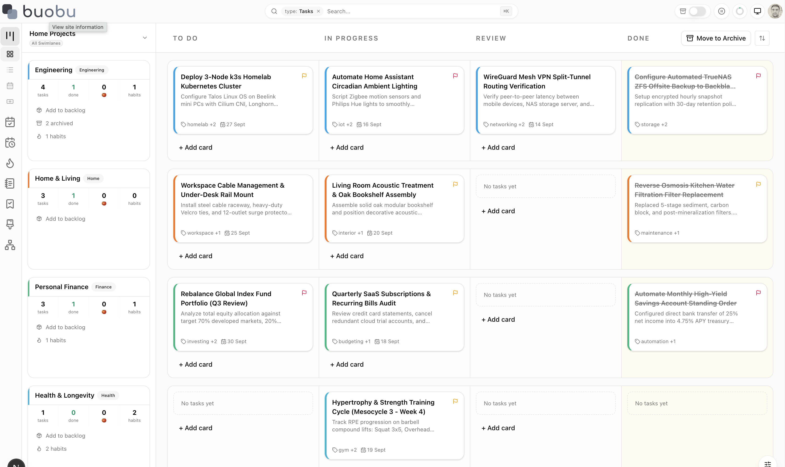
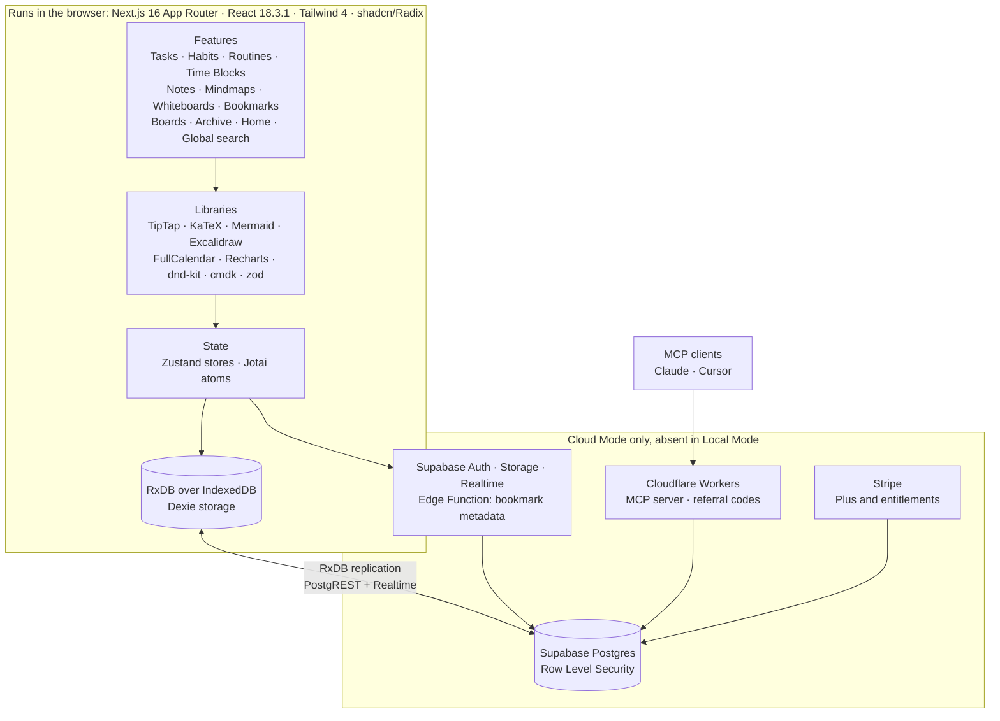

# Buobu: A local-first productivity app


  


Kanban tasks, habits, routines, time blocks, notes, mindmaps, whiteboards and bookmarks. Every browser holds a complete copy of your data, and a remote backend is optional. Clone it, run it, and it works with no account, no service to create and no network calls at all.

## Tech Stack

**App**
      

**Data**
   

**Views and editors**
     

**Cloud, optional**
   

**Tooling**
  

## Preview

<https://buobu.com> — try the live app there before you clone anything.



[Screenshots](docs/assets/) — the other five: [habits](docs/assets/buobu-habits.png), [mindmaps](docs/assets/buobu-mindmaps.png), [notes](docs/assets/buobu-notes.png), [whiteboards](docs/assets/buobu-whiteboards.png) and the [mobile tasks view](docs/assets/buobu-tasks-mobile.png).

## What you get

| | |
|---|---|
| **Tasks** | Kanban board with swimlanes and reorderable columns, plus list, calendar and cash-flow views. Backlog, pomodoro timer, time-boxed estimates, worklogs and per-task transactions. |
| **Habits** | Daily completion levels, streaks over a 365-day window, and explicit skip days that do not break a streak. |
| **Routines** | Recurring task, event and payment routines with a daily briefing, and approve/skip logging per run. |
| **Time blocks** | Recurring time containers that group habits and routines, and override their own recurrence while linked. |
| **Notes** | TipTap editor with Markdown import and export, YAML frontmatter, typed custom metadata, wiki links, math, Mermaid diagrams, tables and highlight colours. |
| **Mindmaps** | Hierarchical node editor for thinking on a canvas. |
| **Whiteboards** | Excalidraw canvas, with each drawing saved as a vision board item. |
| **Bookmarks** | Saved links with server-fetched previews, comments and per-bookmark links. |
| **Archive** | One archive across boards, swimlanes and every child entity, with a read-only browser and restore. |
| **Search** | A `⌘K` palette that searches across every entity. |
| **Data ownership** | Export and import the whole workspace as JSON or a zip. Nothing is locked in. |

Everything above runs identically with or without a backend. The backend only adds the integrations below.

## Integrations

All of these are **Cloud Mode only** and each is optional. Local Mode has none of them and needs no service.

| Integration | What it adds | Needs |
|---|---|---|
| **Supabase Auth** | Accounts: email and password, Google sign-in, password reset, PKCE sessions. Email templates live in `supabase/templates`. | `NEXT_PUBLIC_SUPABASE_URL`, `..._PUBLISHABLE_KEY` |
| **Supabase Postgres** | The server-side copy of every entity, with Row Level Security keyed on `auth.uid()`. Schema lives in 26 migrations. | the migrations applied |
| **Supabase Realtime + PostgREST** | The transport under sync: a change websocket for remote edits, PostgREST for push and pull. | a sync entitlement |
| **Supabase Storage** | Avatar images. | the avatars bucket |
| **Supabase Edge Function** | `fetch-bookmark-metadata`, which fetches link previews for bookmarks. Without it, previews fall back to values derived from the URL. | the function deployed |
| **Cloudflare Worker (MCP)** | A Model Context Protocol server, so Claude, Cursor and any MCP host can read and write your data. API keys are hashed in `public.api_keys` and limited to 60 requests per minute. | `workers/mcp` |
| **Cloudflare Worker (referrals)** | Referral codes, invite codes and campaign codes. | `workers/referral` |
| **Stripe** | The Plus subscription: Checkout, the Customer Portal and webhooks that maintain the `subscriptions` table. Entitlements from it decide whether sync runs. | `NEXT_PUBLIC_BILLING_ENABLED`, `STRIPE_*` |
| **Cloudflare Turnstile** | Captcha on registration, sign-in and password reset. Unset means no captcha is rendered. | `NEXT_PUBLIC_TURNSTILE_SITE_KEY` |
| **Invite and campaign codes** | A registration gate and promotional campaigns, both driven by Supabase RPCs. | on by default in Cloud Mode |

Stripe is covered in [`docs/setup/billing.md`](./docs/setup/billing.md), including [test card numbers](./docs/testing/stripe-test-cards.md) for exercising Checkout locally. The Workers are in [`docs/setup/workers.md`](./docs/setup/workers.md), and the rest of the backend in [`docs/setup/supabase.md`](./docs/setup/supabase.md).

## How it fits together



The **Runs in the browser** box is the entire application in Local Mode: writes go to RxDB over IndexedDB and nothing leaves the machine. The **Cloud Mode only** box is what Local Mode omits. In Cloud Mode the same store is replicated to Postgres over PostgREST, with a Realtime change websocket carrying remote edits, gated behind a sync entitlement.

- Next.js App Router, statically exported. There is no application server in the deployed artifact; `src/app/api/**` route handlers run only under `pnpm dev`.
- The database name derives from the identity: `buobu-db-local` in Local Mode, `buobu-db-<account-id>` in Cloud Mode.
- The Stripe webhook that maintains entitlements is one of those dev-only routes, so a deployment that needs billing must host that work elsewhere. See [`docs/setup/billing.md`](./docs/setup/billing.md).
- Deeper: [`docs/architecture/`](./docs/architecture/) and [`docs/tech-stack/`](./docs/tech-stack/).

## Run it

```bash
pnpm install
cp .env.example .env.local
pnpm dev
```

Open <http://localhost:3000>. The copied file sets `NEXT_PUBLIC_LOCAL_MODE=true`, so the app runs in **Local Mode**: no account, no sign-up, no service to create, and no network calls to any backend. Your data lives in this browser's IndexedDB and nowhere else. Remove that line to run in Cloud Mode instead.

Prerequisites: Node 20–24 and pnpm. Node 26 currently breaks the unit test environment: its experimental global `localStorage` shadows the one jsdom provides. Use an LTS release, or run the tests with `NODE_OPTIONS=--no-experimental-webstorage`.

## The two modes

Local Mode is opted into with `NEXT_PUBLIC_LOCAL_MODE=true`. Every other value, including leaving it unset, means Cloud Mode, so a deploy that is missing its configuration fails loudly instead of quietly serving a local-only app to real users.

| | Local Mode | Cloud Mode |
|---|---|---|
| Selected by | `NEXT_PUBLIC_LOCAL_MODE=true` | anything else, including unset |
| Identity | a single Local User, no credentials | real accounts, email/password and Google |
| Data | this browser only | this browser, synced to your Supabase project |
| Tasks, habits, routines, notes, bookmarks, mindmaps, whiteboards, time blocks | yes | yes |
| Multi-device sync | no | yes |
| Billing, invite and referral codes, MCP and API keys, avatars | no | yes |

Because mode is resolved at build time, with public environment values inlined into the static export, setting variables on an already-built artifact does nothing. Change your configuration and rebuild, or restart the dev server.

[`docs/setup/local-mode.md`](./docs/setup/local-mode.md) covers the local path in full, including what is unavailable and how to move data into an account later.

### Deploying

Deployed builds are Cloud Mode. A deployed build must never be given `NEXT_PUBLIC_LOCAL_MODE`: a stray `true` there would ship a local-only app, which is the failure this flag exists to prevent.

A deploy needs `NEXT_PUBLIC_SUPABASE_URL` and `NEXT_PUBLIC_SUPABASE_PUBLISHABLE_KEY`. If either is missing the build stops with an error naming both remedies, and it never quietly falls back to Local Mode. [`docs/setup/deployment.md`](./docs/setup/deployment.md) covers hosting the static export, the CI that runs on every pull request, and the deploy templates that ship disabled.

### Keeping a backup in Local Mode

Nothing is synced and nothing is backed up for you. The header shows a permanent **Local only** indicator; click it to export everything to a single file. **Export Data** and **Import Data** are also in the account menu.

If you clear your browser storage, switch browser profiles, or use a private window, that data is gone.

## Cloud Mode

To run against your own backend:

```bash
cp .env.example .env.local
```

Then comment out `NEXT_PUBLIC_LOCAL_MODE` and fill in `NEXT_PUBLIC_SUPABASE_URL` and `NEXT_PUBLIC_SUPABASE_PUBLISHABLE_KEY`. Both are required: with `NEXT_PUBLIC_LOCAL_MODE` off and either value missing, the app stops at startup and names both remedies rather than starting half-configured. Restart the dev server afterwards.

Your Supabase project needs the schema in [`supabase/migrations`](./supabase/migrations) applied and the `fetch-bookmark-metadata` edge function deployed. Billing, invite codes, referrals, MCP and captcha are additional optional features, each behind its own variable. [`docs/setup/supabase.md`](./docs/setup/supabase.md) walks through the project, the migrations and the auth configuration, and [`.env.example`](./.env.example) lists every variable with its default.

### Moving data from Local Mode into an account

The two modes keep separate databases and there is no automatic migration. To move across:

1. In Local Mode, **Export Data**.
2. Turn off `NEXT_PUBLIC_LOCAL_MODE`, set your Supabase configuration, and restart.
3. Sign in, then **Import Data** at the first-login prompt.

Your Local Mode database is left untouched rather than deleted, so you can go back to it.

## Tech stack

| Layer | Technology | Role here |
|---|---|---|
| **App shell** | Next.js 16, App Router | Routing and the static export that becomes `out/` |
| | React 18.3.1 | The UI |
| | TypeScript 5, strict | Types, with `@/*` mapped to `src/*` |
| | Tailwind CSS 4, shadcn/Radix | Styling and accessible primitives |
| **Local data** | RxDB | The database of record in the browser: reactive queries and replication |
| | IndexedDB via Dexie | The storage engine underneath RxDB |
| | Zustand | UI state stores, in `src/stores/` |
| | Jotai | Reactive atoms fed by RxDB subscriptions, bridged in `src/stores/hooks/` |
| | zod, react-hook-form | Form and input validation |
| **Editors and views** | TipTap 3 | The notes editor, with extensions in `src/components/notes/extensions/` |
| | KaTeX, Mermaid, lowlight | Math, diagrams and code highlighting inside notes |
| | marked, DOMPurify | Rendering and sanitising Markdown |
| | Excalidraw | Whiteboards |
| | FullCalendar | The task calendar view |
| | Recharts | The cash-flow view |
| | dnd-kit | Dragging cards, reordering boards and columns |
| | cmdk | The `⌘K` search palette |
| **Cloud, optional** | Supabase | Auth, Postgres, Storage and Realtime |
| | PostgreSQL + Row Level Security | The server-side schema, 26 migrations |
| | Cloudflare Workers, Wrangler | The MCP and referral workers |
| | Stripe | Plus subscriptions and entitlements |
| | `@modelcontextprotocol/sdk` | The MCP server implementation |
| | `@marsidev/react-turnstile` | Captcha on the auth pages |
| **Tooling** | Vitest 4, Testing Library, jsdom, `fake-indexeddb`, MSW | Unit and component tests |
| | Playwright 1.58 | End-to-end tests |
| | ESLint 9, `eslint-config-next` | Linting |
| | pnpm 10 | Package manager |
| | Terraform | Optional: provisions Cloudflare and Supabase, in `infra/terraform` |

## Development

| Command | What it does |
|---|---|
| `pnpm dev` | Dev server on <http://localhost:3000> |
| `pnpm build` | Static export into `out/` |
| `pnpm typecheck` | `tsc --noEmit` |
| `pnpm test:run` | Unit and component tests (Vitest) |
| `pnpm lint` | ESLint |
| `pnpm test:e2e` | Playwright end-to-end tests |
| `pnpm dev:mcp`, `pnpm dev:referral` | The Cloudflare Workers, locally |

The end-to-end suite signs in with a real account, so it needs `E2E_TEST_EMAIL` and `E2E_TEST_PASSWORD` in `.env.local` and skips itself without them. See [`docs/setup/testing.md`](./docs/setup/testing.md).

`pnpm start` does not work here: `next.config.ts` sets `output: "export"`, so `next build` produces static files in `out/` with no server to start. Serve `out/` with any static host.

## Documentation

| Where | What |
|---|---|
| [`CONTRIBUTING.md`](./CONTRIBUTING.md) | Setup, the checks CI runs, the test and commit conventions, the pull request flow |
| [`docs/setup/`](./docs/setup/) | Local mode, Supabase, the Cloudflare Workers, billing, testing, deployment |
| [`docs/architecture/`](./docs/architecture/) | System overview, the storage and replication model, data flow, per-module code maps |
| [`docs/adr/`](./docs/adr/) | Decision records. Start with [ADR-014](./docs/adr/014-local-mode.md) on the two modes |
| [`docs/domain/`](./docs/domain/) | The vocabulary and the entity model |
| [`docs/tech-stack/`](./docs/tech-stack/) | The libraries and services in use, and how |
| [`docs/features/`](./docs/features/) | Feature inventory and per-feature design notes |
| [`docs/testing/stripe-test-cards.md`](./docs/testing/stripe-test-cards.md) | Card numbers for testing Checkout |

## License

[AGPL-3.0](./LICENSE). You are free to run, modify and share this software. If you run a modified version as a network service, you must offer its source to the people using it.

Commercial use is permitted under the AGPL. If those terms do not work for you — embedding the code in a closed product, for instance — a commercial license is available: <hasan@ozgan.net>. The **Buobu** name and logo are not licensed for commercial use.
