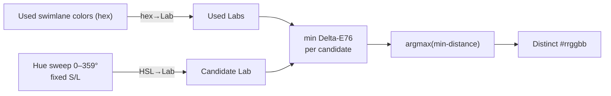

# ADR — Distinct Color Selection for Swimlanes

**Status:** Accepted
**Date:** 2026-07-09
**Deciders:** AI-assisted
**Implementation:** `src/lib/colors.ts` · wired in `src/components/ui/swimlane-dialog.tsx` (also used from `src/components/ui/BoardModal.tsx` when it creates a swimlane)
**Related:** [ADR-004: Simplified Sidebar with Board Filter](./004-simplified-sidebar-with-board-filter.md), [ADR index](./000-adr-index.md)

---

## Context

When a user creates a new swimlane, the board assigns it a color. Previously every new
swimlane defaulted to the same hardcoded indigo (`#6366F1`), so adjacent swimlanes on the
kanban board were visually indistinguishable until the user manually recolored each one.

We want the default color for a **new** swimlane to be **visually distinct from the colors
already used by the board's other swimlanes**, while still letting the user override it.
The user posed this as the classic **maximum-minimum perceptual color dispersion** problem:
*"if the board already has red and blue, the next swimlane should default to green, brown,
etc. — pick the most ideal color."*

Constraint that shapes the decision: the swimlane color UI is a **free color picker**
(native `<input type="color">` + hex field). There is **no fixed palette** to select from —
so the solution must *generate* a distinct color, not choose one from a list.

## Decision

Generate the default color by **greedy max-min dispersion over the hue circle at fixed
saturation/lightness**, measuring distance in **CIELAB using Delta-E76 (CIE76)**.

In short: among candidate hues, pick the one whose *nearest already-used color* is
*farthest away*.

### Algorithm

1. Convert every used swimlane color (hex → sRGB → CIELAB, D65 white point).
2. For each candidate hue `h ∈ [0°, 360°)` at fixed `S = 0.62`, `L = 0.55`, convert
   `HSL(h, S, L) → sRGB → CIELAB`.
3. Score each candidate = minimum Delta-E76 to any used color.
4. Keep the candidate with the **maximum** score (farthest from its nearest neighbor).
   Ties broken by lowest hue → deterministic.
5. Convert the winning hue back to `#rrggbb`.
6. If no used colors (or all invalid), return `DEFAULT_SWIMLANE_COLOR` (`#6366F1`) for
   backward compatibility.

**Why CIELAB + Delta-E76:** CIELAB is approximately perceptually uniform, so Euclidean
distance in Lab (Delta-E76) is a meaningful "how different do these look" metric — far
better than naive RGB Euclidean distance. Delta-E76 is simple and dependency-free; for
*selecting* a distinct color (not measuring tiny differences) its accuracy is sufficient.

**Why fixed S/L:** restricting the search to vivid, constant-saturation/lightness colors
guarantees the result is a usable swimlane/accent color with consistent visual weight, and
reduces the problem to a 1-D hue search that is cheap (360 candidates) and always well-behaved.

**Complexity:** `O(360 · n)` per default, `n` = number of used colors. Negligible (runs once
when the new-swimlane dialog opens).

## Alternatives Considered

| Alternative | Why rejected |
|---|---|
| **Fixed curated palette + max-min selection** | The UI is a free color picker with no palette; introducing one would constrain users and duplicate color-modeling. |
| **Golden-angle hue stepping** (`h = n × 137.5°`) | Even hue distribution, but it **ignores the actual used colors** — a user who manually set red+blue could be defaulted to a near-duplicate. Requirement is explicitly to avoid *current* swimlane colors. |
| **Naive RGB Euclidean distance** | RGB distance is not perceptually uniform (greens dominate, cyans compress) → poor "distinctness" choices. |
| **CIEDE2000 (Delta-E 2000)** | More perceptually accurate for *small* differences, but heavier and not needed for picking far-apart colors at swimlane scale. CIE76 is good enough and dependency-free. |
| **Full continuous optimization / search across S, L, and H** | Overkill; fixed-S/L hue search is simpler, deterministic, and produces aesthetically consistent results. |

## Consequences

**Positive**

- New swimlanes default to a color genuinely distinct from existing ones → boards read
  better immediately, less manual recoloring.
- Works with the existing free-color UI; no palette or schema change.
- Deterministic and dependency-free (pure math, `src/lib/colors.ts`).
- Invalid/blank used colors are tolerated (skipped), so corrupt data can't break it.

**Negative / Trade-offs**

- All generated colors share the same S/L, so there is little **lightness variety** (you
  won't get a true "brown"); distinctness comes from hue alone. Acceptable for swimlanes.
- After ~8–10 swimlanes the hue circle is well-covered and new picks become progressively
  less distinct (diminishing returns). **Mitigation:** the user can still override any color;
  a future enhancement could add lightness tiers once hue is saturated.
- Delta-E76 is an approximation; for accessibility-critical pairings, a WCAG contrast check
  against the board background is a **future improvement**, not part of this decision.

## Testing

`src/lib/__tests__/colors.test.ts` covers: empty/invalid → default, valid-hex output,
distinctness thresholds (Delta-E ≥ 20–30 from used), determinism, continued dispersion as
colors accumulate, and `colorDistanceHex` symmetry/null-handling.

## References

- CIELAB & Delta-E: *CIE 1976 (L\*a\*b\*) color space*, ISO/CIE 11664-4.
- Max-min dispersion: the "maximin facility location" / farthest-point greedy heuristic.
- Repo ADR rules: [ADR index](./000-adr-index.md) (decisions name rejected
  alternatives and identify consequences).
