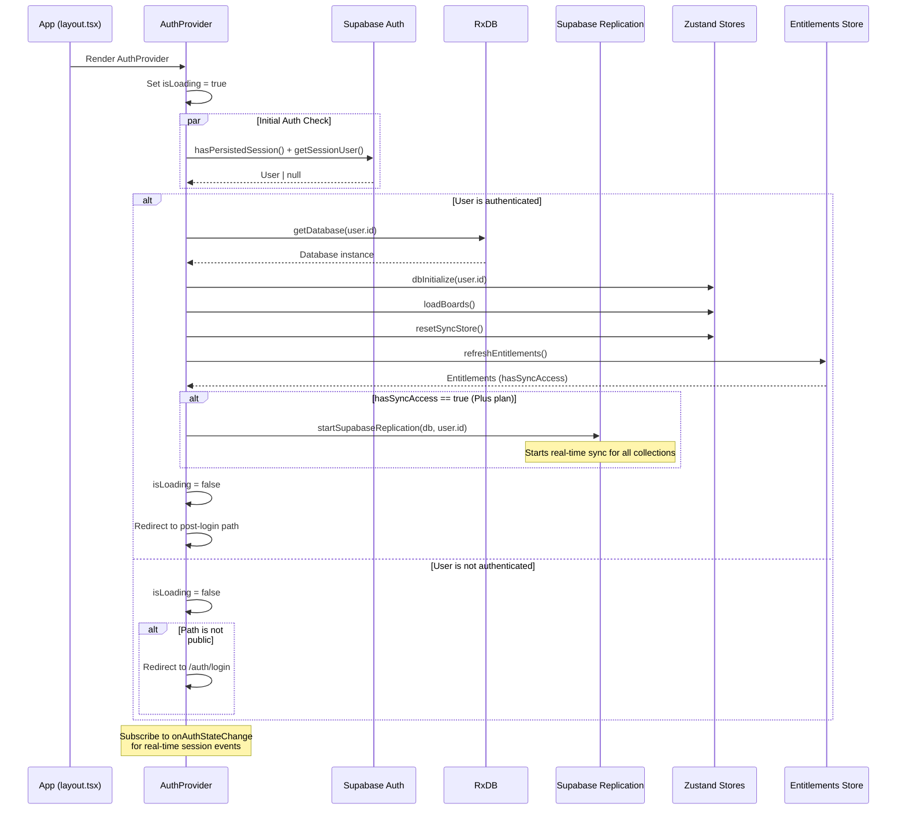
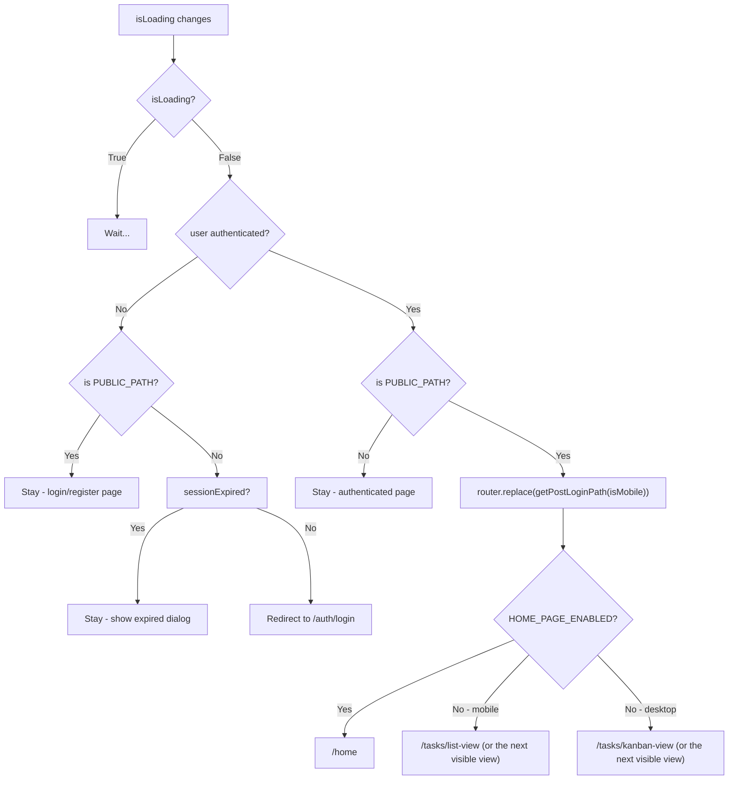
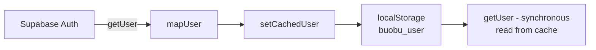
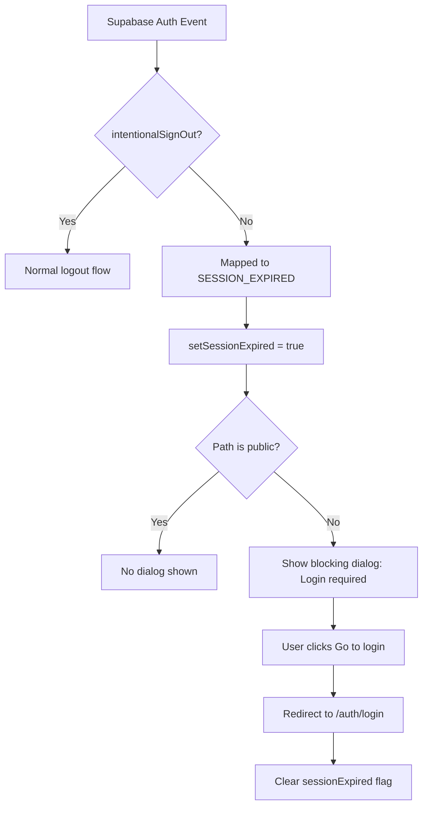

# AuthProvider Module

This document maps module `src/components/auth/AuthProvider.tsx`; the source is authoritative.

## Overview

The `AuthProvider` module is the **central authentication gateway** for the buobu application. It wraps the entire React component tree, managing user session lifecycle, database initialization, data synchronization, and entitlement checks. It ensures that unauthenticated users are redirected to login and that authenticated users have their local database and remote sync fully initialized before they can interact with the application.

### Core Responsibilities

1. **Session Management** — Detect, restore, and monitor authentication sessions via Supabase Auth
2. **Database Bootstrapping** — Initialize the local RxDB database for each authenticated user
3. **Data Synchronization** — Start/stop Supabase replication based on user entitlements
4. **Entitlement Enforcement** — Refresh and react to entitlement changes (Free vs Plus plan)
5. **Route Protection** — Redirect unauthenticated users to login, redirect authenticated users away from public pages
6. **Session Expiry Handling** — Detect expired sessions and show a blocking login modal
7. **Global State Synchronization** — Keep Zustand stores (auth, db, boards, sync, entitlements) in sync with the auth lifecycle

---

## Architecture

```mermaid
graph TD
    subgraph "Application Root (app/layout.tsx → AppProviders.tsx)"
        ErrorBoundary --> ThemeProvider
        ThemeProvider --> AuthProvider
        AuthProvider --> OnboardingGate
        OnboardingGate --> DailyBriefingProvider
        DailyBriefingProvider --> Children
    end

    subgraph "AuthProvider Internals"
        AP[AuthProvider Component]
        AC[AuthContext.Provider]
        SED[Session Expired Dialog]
    end

    subgraph "Core Dependencies"
        SA[Supabase Auth Service<br/>lib/auth/service.ts]
        RX[RxDB Database<br/>lib/rxdb.ts]
        SR[Supabase Replication<br/>lib/supabase-replication.ts]
        EH[useAuth Hook<br/>lib/auth/hooks.ts]
        PL[Post-Login Path<br/>lib/navigation/post-login-path.ts]
    end

    subgraph "Zustand Stores"
        AS[AuthStore<br/>stores/auth-store.ts]
        DS[DbStore<br/>stores/db-store.ts]
        BS[BoardStore<br/>stores/board-store.ts]
        SS[SyncStore<br/>stores/sync-store.ts]
        ES[EntitlementsStore<br/>stores/entitlements-store.ts]
    end

    subgraph "Hooks"
        SG[useSyncGate<br/>hooks/useSyncGate.ts]
        BS_HOOK[useBoardsSubscription<br/>stores/hooks/use-boards.ts]
        IM[useIsMobile<br/>hooks/useIsMobile.ts]
    end

    AP --> AC
    AP --> SED
    AP --> SA
    AP --> RX
    AP --> SR
    AP --> PL
    AP --> IM
    
    AP --> AS
    AP --> DS
    AP --> BS
    AP --> SS
    AP --> ES

    AP --> SG
    AP --> BS_HOOK

    SG --> ES
    SG --> DS
    SG --> AS
    SG --> SR

    BS_HOOK --> DS
    BS_HOOK --> BS
```

AuthProvider sits near the **root of the component tree**. `src/app/layout.tsx` renders `<AppProviders>`, and `src/components/AppProviders.tsx` nests:



---

## Core Components

### `AuthContextType` (Interface)

Defines the shape of the authentication context exposed to all descendants:

```typescript
interface AuthContextType {
  user: User | null;         // Currently authenticated user, or null
  isLoading: boolean;        // True while initial auth state is being resolved
  isAuthenticated: boolean;  // Convenience boolean (!!user)
  logout: () => Promise<void>; // Sign out and clean up all stores
}
```

### `AuthProvider` (Component)

The main component at `src/components/auth/AuthProvider.tsx`. It performs the following sequence on mount:

#### Initialization Flow



**Local Mode short-circuit:** when `LOCAL_MODE` is true, `initAuth()` stops after `dbInitialize` / `loadBoards` / `resetSyncStore`. It never calls `refreshEntitlements()` and never starts replication — there are no entitlements to fetch and nothing to sync to. The `SIGNED_IN` / `SIGNED_OUT` branches inside `onAuthStateChange` do the same.

#### Auth State Change Handler

The provider subscribes to Supabase's `onAuthStateChange` to react to:

| Event | Action |
|---|---|
| `SIGNED_IN` | Initialize database, load boards, check entitlements, start replication |
| `SIGNED_OUT` | Stop replication, close database, reset all Zustand stores |
| `TOKEN_REFRESHED` | Update cached user (no additional initialization) |
| `INITIAL_SESSION` | Handled by the initial `getSessionUser()` call |
| `SESSION_EXPIRED` | Show session expired dialog, clear all stores |

> **Note:** The `SIGNED_OUT` event is mapped to `SESSION_EXPIRED` when the sign-out is **not** intentional (i.e., not triggered by the `logout()` function). This is controlled by the `_intentionalSignOut` flag in `lib/auth/service.ts`.

#### Route Protection Logic



Public paths are defined as a `Set`:

```typescript
const PUBLIC_PATHS = new Set([
  '/',
  '/auth/login',
  '/auth/register',
  '/auth/forgot-password',
  '/auth/reset-password',
]);
```

`getPostLoginPath(isMobile)` (`src/lib/navigation/post-login-path.ts`) prefers the last visited section stored in localStorage, falls back to `/home` when the home page is enabled, and otherwise resolves to `/tasks/list-view` on mobile or `/tasks/kanban-view` on desktop. An authenticated user may stay on `/auth/reset-password` in Cloud Mode — that is the one public path exempt from the redirect; entering any public path also clears `sessionExpired`.

### `useAuthContext` (Hook)

A convenience hook to access the `AuthContextType` from any child component:

```typescript
function useAuthContext(): AuthContextType
```

Throws an error if used outside of an `AuthProvider`.

---

## Authentication Service (`lib/auth/service.ts`)

The underlying authentication service wraps Supabase Auth and manages:

### User Caching

A lightweight user cache is maintained in `localStorage` (key: `buobu_user`) to provide instant access to the current user's `id` and `avatarUrl` without a Supabase round-trip.



### Key Functions

| Function | Description |
|---|---|
| `getUser()` | Synchronously reads cached user from localStorage |
| `isAuthenticated()` | Returns `true` if cached user exists |
| `hasPersistedSession()` | Checks for a Supabase auth token in localStorage |
| `getSessionUser()` | Fetches user from Supabase and updates cache |
| `onAuthStateChange(callback)` | Subscribes to Supabase auth state changes |
| `register(email, password, campaignCode?, captchaToken?)` | Creates a new account with optional invite/referral code |
| `login(email, password, captchaToken?)` | Email/password login |
| `loginWithOAuth(provider)` | Google or GitHub OAuth login |
| `logout()` | Signs out and clears cached user |
| `updatePassword(newPassword)` | Updates user password |
| `updateEmail(newEmail)` | Updates user email |
| `uploadAvatar(userId, file)` | Uploads avatar to Supabase Storage |
| `removeAvatar(userId)` | Removes avatar from Supabase Storage |

### Invite/Referral Code System

During registration, if `INVITE_CODES_ENABLED` is true, the service validates and consumes invite or referral codes via Supabase RPCs:

1. Normalize code (trim, uppercase)
2. Validate against campaign codes via `validate_campaign_code` RPC
3. If invalid, check referral codes via `validate_referral_code` RPC
4. On success, consume the code and apply campaign benefits (e.g., free Plus days, Stripe promo code)

---

## Zustand Stores

The AuthProvider synchronizes its state with several Zustand stores for global access:

### [AuthStore](Stores.md#authstore)

```typescript
interface AuthState {
  user: User | null;
  isLoading: boolean;
  isAuthenticated: boolean;
  setAuthState: (next: { user: User | null; isLoading: boolean }) => void;
  resetAuthState: () => void;
}
```

Synced via `useEffect` at the end of each auth state change.

### [DbStore](Stores.md#dbstore)

Manages the RxDB database lifecycle:
- `initialize(userId)` — Opens RxDB, checks for data migration, sets the database reference
- `reset()` — Clears the database reference

### [BoardStore](Stores.md#boardstore)

- `loadBoards()` — Fetches boards and swimlanes from RxDB into Zustand state
- `cleanup()` — Resets board state on logout

### [SyncStore](Stores.md#syncstore)

- `reset()` — Resets sync status to idle/offline
- Used to track sync state and trigger `queueSync()` calls

### [EntitlementsStore](Stores.md#entitlementsstore)

Manages user plan entitlements (Free vs Plus):
- `refreshEntitlements()` — Fetches from Supabase `entitlements` view, caches in localStorage
- `resetEntitlements()` — Clears entitlements on sign-out
- `hasSyncAccess` — Determines whether replication should start

> **Offline behavior**: When offline, the store falls back to cached values from localStorage. This prevents a flash of Free-tier UI when the network is unavailable.

---

## Supporting Hooks

### `useSyncGate`

Monitors entitlement changes **mid-session** and manages replication accordingly:

| Transition | Action |
|---|---|
| Free → Plus (upgrade) | Call `activateSync()` to push all local data, then start replication |
| Plus → Free (downgrade) | Stop replication (cloud data is preserved) |

> **Note**: Initial replication start on login is handled by AuthProvider directly. `useSyncGate` only reacts to changes after the initial render.

### `useBoardsSubscription`

Subscribes to RxDB `boards` and `swimlanes` collections reactively, updating the Zustand board store whenever data changes (e.g., from Supabase sync). This ensures the UI stays fresh without manual reloads.

### `useIsMobile`

SSR-safe hook that detects mobile viewport (< 768px) for responsive routing decisions.

---

## Session Expiry Handling

When a session expires (detected via Supabase's `SIGNED_OUT` event without intentional logout):



The dialog:
- Cannot be dismissed (no close button, pointer-down-outside is prevented, escape key is prevented)
- Provides a single "Go to login" button that navigates to `/auth/login`

---

## Data Flow Summary

```mermaid
flowchart TD
    subgraph "Login Flow"
        A["User Login"] --> B["AuthProvider detects SIGNED_IN"]
        B --> C["getDatabase(user.id)"]
        C --> D["Initialize Zustand stores"]
        D --> E["Refresh entitlements"]
        E --> F{"hasSyncAccess?"}
        F -->|"Yes"| G["Start Supabase Replication"]
        F -->|"No"| H["Local-only mode"]
        G --> I["Redirect to getPostLoginPath(isMobile)"]
        H --> I
    end

    subgraph "Logout Flow"
        J["User clicks logout"] --> K["Stop replication for user"]
        K --> L["Close RxDB database"]
        L --> M["Reset all Zustand stores"]
        M --> N["Supabase auth.signOut"]
        N --> O["Redirect to /auth/login"]
    end

    subgraph "Session Expiry Flow"
        P["Token expired"] --> Q["SIGNED_OUT event"]
        Q --> R["SESSION_EXPIRED mapped"]
        R --> S["Show blocking dialog"]
        S --> T["User re-authenticates"]
    end
```



In Local Mode the `logout()` handler returns immediately: there is no account to sign out of, and closing the database would strand the user on an empty page.

---

## Dependency Graph

```mermaid
graph TD
    subgraph "AuthProvider"
        AP[AuthProvider.tsx]
        AP --> AC[AuthContext]
        AP --> SAC["useAuthContext() hook"]
    end

    subgraph "lib/auth"
        INDEX[index.ts]
        SERVICE[service.ts]
        HOOKS[hooks.ts]
        SERVICE --> SUPABASE["lib/supabase.ts"]
        SERVICE --> CONSTANTS["lib/constants.ts"]
        SERVICE --> FEATURE_FLAGS["lib/feature-flags.ts"]
        HOOKS --> SERVICE
        INDEX --> SERVICE
    end

    subgraph "External Dependencies"
        RXDB["lib/rxdb.ts"]
        REPLICATION["lib/supabase-replication.ts"]
        NAV["lib/navigation/post-login-path.ts"]
        MIGRATION["lib/migration.ts"]
        ACTIVATE_SYNC["lib/subscriptions/activate-sync.ts"]
    end

    subgraph "Stores"
        AUTH_STORE["stores/auth-store.ts"]
        DB_STORE["stores/db-store.ts"]
        BOARD_STORE["stores/board-store.ts"]
        SYNC_STORE["stores/sync-store.ts"]
        ENTITLEMENTS["stores/entitlements-store.ts"]
    end

    subgraph "Hooks"
        SYNC_GATE["hooks/useSyncGate.ts"]
        IS_MOBILE["hooks/useIsMobile.ts"]
        BOARDS_SUB["stores/hooks/use-boards.ts"]
    end

    AP --> SERVICE
    AP --> HOOKS
    AP --> RXDB
    AP --> REPLICATION
    AP --> NAV
    AP --> IS_MOBILE
    AP --> AUTH_STORE
    AP --> DB_STORE
    AP --> BOARD_STORE
    AP --> SYNC_STORE
    AP --> ENTITLEMENTS
    AP --> SYNC_GATE
    AP --> BOARDS_SUB

    SYNC_GATE --> ENTITLEMENTS
    SYNC_GATE --> DB_STORE
    SYNC_GATE --> AUTH_STORE
    SYNC_GATE --> REPLICATION
    SYNC_GATE --> ACTIVATE_SYNC

    BOARDS_SUB --> DB_STORE
    BOARDS_SUB --> BOARD_STORE

    DB_STORE --> RXDB
    DB_STORE --> MIGRATION
```



---

## Usage Guide

### As a Context Provider

Wrap your application (already done in `src/components/AppProviders.tsx`, which `src/app/layout.tsx` renders):

```tsx
<AuthProvider>
  <YourApp />
</AuthProvider>
```

### Accessing Auth State in Components

```tsx
import { useAuthContext } from '@/components/auth/AuthProvider';

function MyComponent() {
  const { user, isLoading, isAuthenticated, logout } = useAuthContext();

  if (isLoading) return <Spinner />;
  if (!isAuthenticated) return <LoginPrompt />;

  return (
    <div>
      <p>Welcome, {user.email}</p>
      <button onClick={logout}>Sign Out</button>
    </div>
  );
}
```

### Using the Auth Hook for Login/Register

```tsx
import { useAuth } from '@/lib/auth/hooks';

function LoginForm() {
  const { login, loginWithOAuth, register, isLoading, error } = useAuth();

  const handleLogin = async () => {
    try {
      const user = await login('email@example.com', 'password');
      // redirected by AuthProvider
    } catch (err) {
      // error is available via `error` state
    }
  };
}
```

### Using Zustand Auth Store

For components that need auth state without the context (e.g., deep in the tree, or in hooks):

```tsx
import { useAuthStore } from '@/stores/auth-store';

function DeepComponent() {
  const user = useAuthStore((s) => s.user);
  // ...
}
```

---

## Error Handling

| Scenario | Handling |
|---|---|
| Database initialization failure | Error logged to console; store sets `error` field |
| Supabase auth fetch failure | Error logged; user treated as unauthenticated |
| Replication failure | Handled by `useSyncGate` and sync store |
| Network offline during entitlement fetch | Falls back to cached entitlements with `isOffline: true` |
| Storage quota exceeded | Entitlement cache write fails silently |

---

## References

- [Stores Module](stores.md) — Detailed documentation for all Zustand stores
- [Notes Extensions Module](notes-extensions.md) — Related editor extensions
- [useBoardRenderProfiler Module](use-board-render-profiler.md) — Performance profiling for board rendering
- [MCP Worker Module](mcp-worker.md) — Cloudflare Worker for MCP operations
