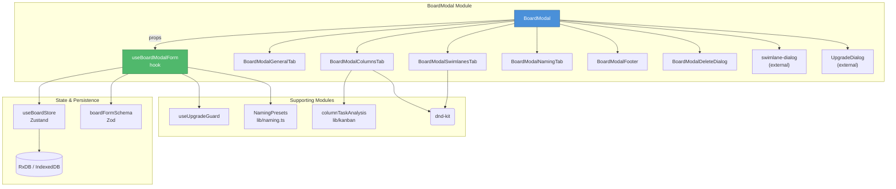
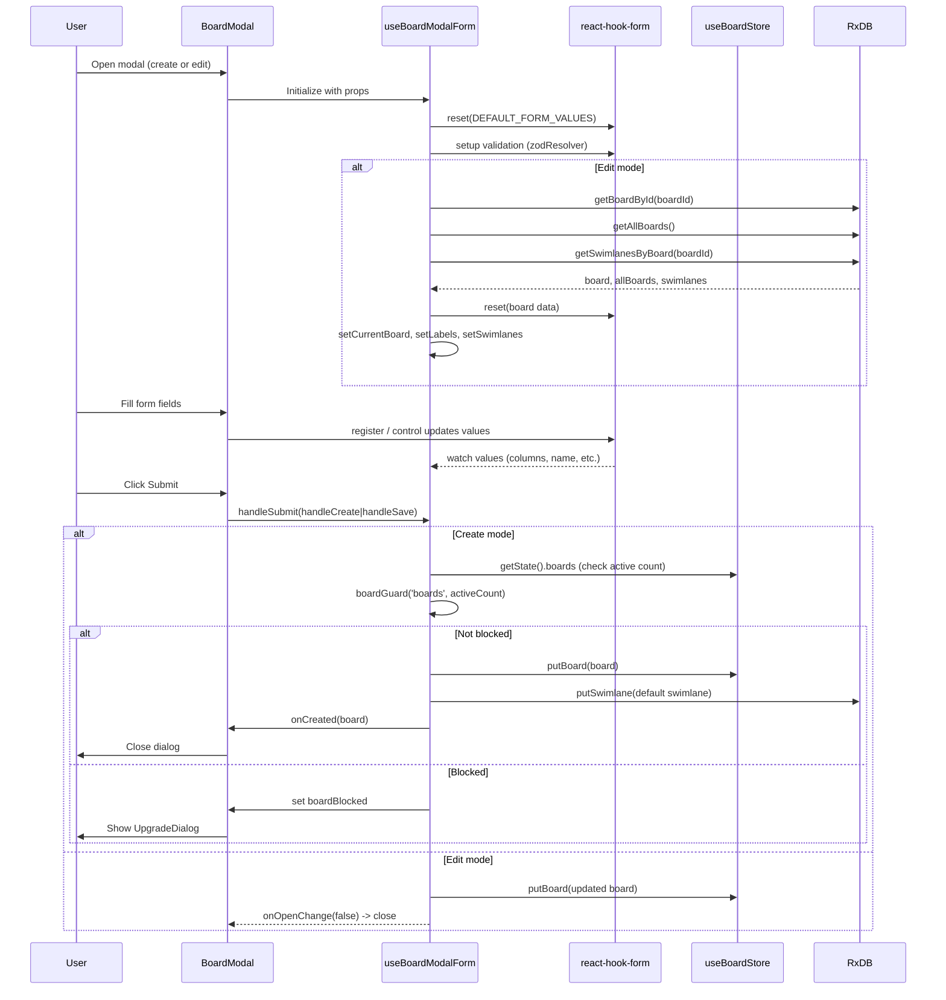
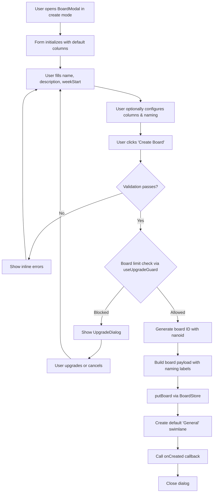
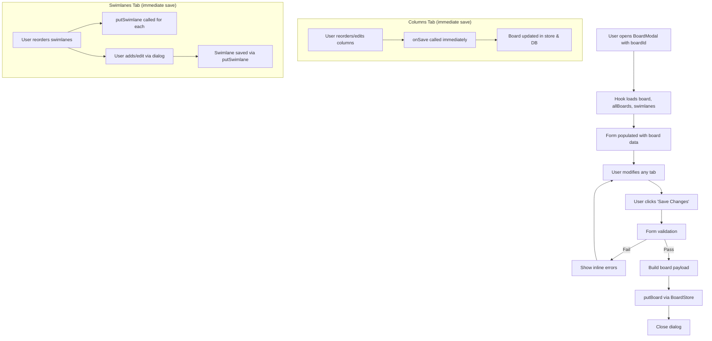
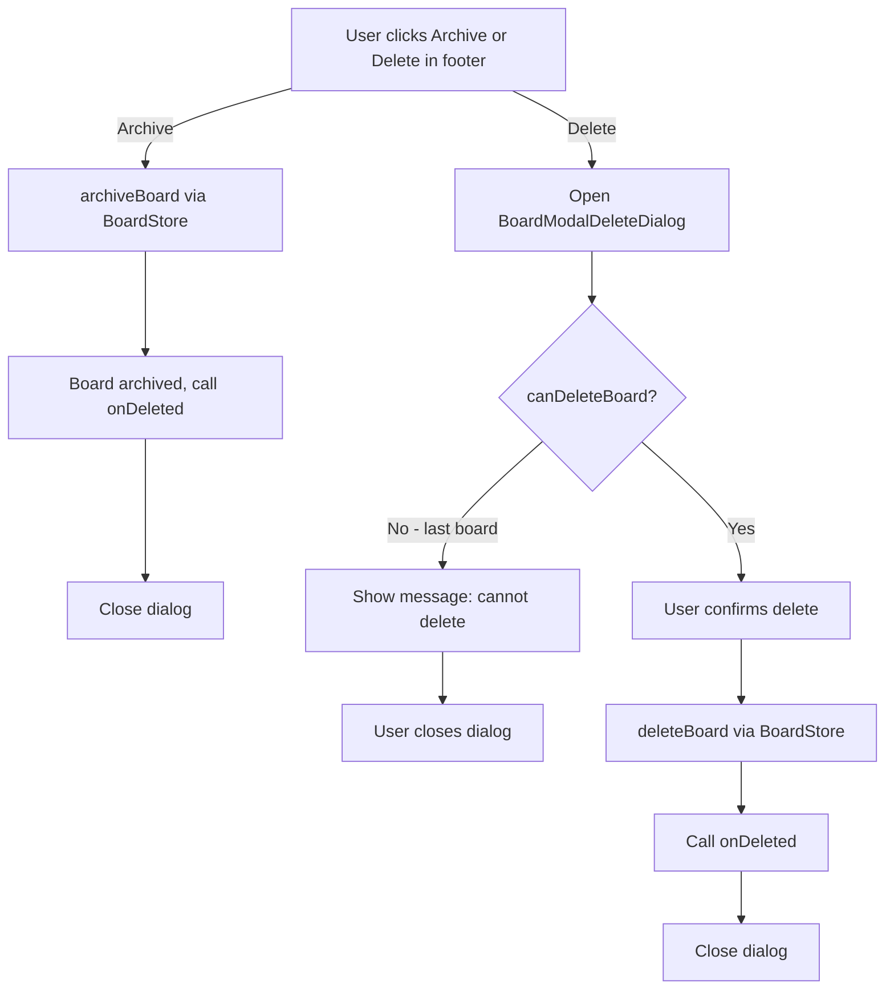

# BoardModal

This document maps module `src/components/ui/BoardModal.tsx` and its tab subcomponents under `src/components/ui/`; the source is authoritative.

## Table of Contents
1. [Introduction](#introduction)
2. [Architecture Overview](#architecture-overview)
3. [Component Tree](#component-tree)
4. [Detailed Component Breakdown](#detailed-component-breakdown)
   - [BoardModal](#boardmodal)
   - [BoardModalGeneralTab](#boardmodalgeneraltab)
   - [BoardModalColumnsTab](#boardmodalcolumnstab)
   - [BoardModalSwimlanesTab](#boardmodalswimlanestab)
   - [BoardModalNamingTab](#boardmodalnamingtab)
   - [BoardModalFooter](#boardmodalfooter)
   - [BoardModalDeleteDialog](#boardmodaldeletedialog)
5. [Data Flow & State Management](#data-flow--state-management)
6. [Validation](#validation)
7. [Entitlements & Upgrade Guard](#entitlements--upgrade-guard)
8. [Process Flows](#process-flows)
9. [Dependencies & References](#dependencies--references)

---

## Introduction

The **BoardModal** module provides the primary user interface for **creating**, **editing**, **archiving**, and **deleting** boards (kanban boards) in the application. It is a tabbed dialog that surfaces configuration for:

- General board settings (name, description, week start day)
- Columns management (add, edit, reorder, delete columns; archive column configuration)
- Swimlanes management (add, edit, reorder swimlanes)
- Naming strategy customization (presets or custom labels for "Board" / "Swimlane" terminology)

The modal operates in two modes: **create** (no `boardId` provided) and **edit** (a `boardId` is passed), with the edit mode exposing additional tabs and actions (archive/delete).

---

## Architecture Overview



### Key Relationships

| Component / Hook | Role | Connects to |
|---|---|---|
| `BoardModal` | Orchestrator — renders the dialog, tabs, and sub-components | `useBoardModalForm`, `Dialog`, `Tabs` |
| `useBoardModalForm` | Business-logic hook — form state, CRUD operations, naming logic | `useForm` (react-hook-form), `useBoardStore`, `db` functions, `useUpgradeGuard` |
| `BoardModalGeneralTab` | Renders board name, description, week-start selector | `react-hook-form` Controller & register |
| `BoardModalColumnsTab` | Kanban column CRUD + archive column config | `ColumnDialog`, `ColumnListItem`, `@dnd-kit`, `columnTaskAnalysis` |
| `BoardModalSwimlanesTab` | Swimlane CRUD with drag-to-reorder | `SwimlaneListItem`, `@dnd-kit`, `putSwimlane` |
| `BoardModalNamingTab` | Naming preset/custom label editor | `NamingPresets` (lib/naming.ts) |
| `BoardModalFooter` | Action buttons (Cancel, Create/Save, Archive, Delete) | — |
| `BoardModalDeleteDialog` | Confirmation dialog before board deletion | — |

---

## Component Tree

```mermaid
graph TD
    BoardModal["BoardModal<br/>(Dialog outer)"]
    BoardModal --> SwimlaneDialog["SwimlaneDialog<br/>(conditional, edit mode)"]
    BoardModal --> DeleteDialog["BoardModalDeleteDialog<br/>(conditional, edit mode)"]
    BoardModal --> UpgradeDialog1["UpgradeDialog<br/>(boardBlocked)"]
    BoardModal --> UpgradeDialog2["UpgradeDialog<br/>(swimlaneBlocked)"]

    subgraph DialogContent
        DialogHeader["DialogHeader<br/>Title + Description"]
        Tabs["Tabs (default: general)"]
        DialogContent --> DialogHeader
        DialogContent --> Tabs
        DialogContent --> Footer[BoardModalFooter]
    end

    Tabs --> TabsList["TabsList (3 or 4 triggers)"]
    Tabs --> TabGeneral["TabsContent value='general'"]
    Tabs --> TabNaming["TabsContent value='naming'"]
    Tabs --> TabSwimlanes["TabsContent value='swimlanes'<br/>(edit mode only)"]
    Tabs --> TabColumns["TabsContent value='columns'"]

    TabGeneral --> GeneralTab[BoardModalGeneralTab]
    TabNaming --> NamingTab[BoardModalNamingTab]
    TabSwimlanes --> SwimlanesTab[BoardModalSwimlanesTab]
    TabColumns --> ColumnsTab[BoardModalColumnsTab]
```

---

## Detailed Component Breakdown

### BoardModal

**File**: `src/components/ui/BoardModal.tsx`

The root component is a `Dialog` (from `@/components/ui/dialog`) that wraps:

1. A `DialogHeader` with contextual title/description (switches between "New Board" and "Edit Board")
2. A loading skeleton (when `isLoading` is true during board data fetch)
3. A `Tabs` component with up to **4 tabs**:
   - **General** (always shown) — basic settings
   - **Naming** (always shown) — naming preset/labels
   - **Swimlanes** (edit mode only) — swimlane management
   - **Columns** (always shown) — column management
4. A `BoardModalFooter` with action buttons
5. Conditional overlays: `SwimlaneDialog`, `BoardModalDeleteDialog`, `UpgradeDialog` (×2)

**Props** (`BoardModalProps`):

| Prop | Type | Description |
|---|---|---|
| `open` | `boolean` | Dialog visibility |
| `onOpenChange` | `(open: boolean) => void` | Dialog close handler |
| `boardId` | `string \| null \| undefined` | Omit/null for create; string for edit |
| `onCreated` | `(board: Board) => void` | Callback after successful creation |
| `onDeleted` | `() => void` | Callback after successful deletion/archival |

**Key behavior**:
- In **create mode**, only 3 tabs are shown (no Swimlanes tab); the submit button reads "Create Board"
- In **edit mode**, 4 tabs are shown; the submit button reads "Save Changes"; Archive and Delete buttons appear in the footer
- When `boardId` is provided, the modal loads the board and its swimlanes on open via `useBoardModalForm.loadBoard()`
- If loading fails or board is not found, the modal closes itself

---

### BoardModalGeneralTab

**File**: `src/components/ui/BoardModalGeneralTab.tsx`

A simple `Card` rendering three fields:

| Field | Type | Description |
|---|---|---|
| **Board Name** | Text input (`register("name")`) | Required; validated by Zod |
| **Description** | Textarea (`register("description")`) | Optional |
| **Week Starts On** | Select (`Controller`, `control`) | Values "0" (Sun) through "6" (Sat); default "1" (Mon) |

Uses `displayLabels` (`NamingLabels`) to dynamically label fields according to the active naming strategy (e.g., "Journey Name" instead of "Board Name").

---

### BoardModalColumnsTab

**File**: `src/components/ui/BoardModalColumnsTab.tsx`

**Props** (`ColumnsTabContentProps`):

| Prop | Type | Description |
|---|---|---|
| `boardId` | `string \| null` | Board ID for task analysis |
| `isEditMode` | `boolean` | Whether in edit mode |
| `columns` | `BoardColumn[]` | Current column list |
| `archiveColumnId` | `string` | Which column is the archive target |
| `showArchiveColumn` | `boolean` | Whether archive column is visible |
| `columnsError` | `string \| undefined` | Validation error for columns |
| `archiveColumnError` | `string \| undefined` | Validation error for archive column |
| `onColumnsChange` | `(columns: BoardColumn[]) => void` | Update columns in form |
| `onArchiveColumnIdChange` | `(id: string) => void` | Change archive column |
| `onShowArchiveColumnChange` | `(show: boolean) => void` | Toggle archive column visibility |
| `onSave` | `(overrides?) => Promise<void>` | Persist changes immediately (edit mode) |

**Key features**:
- **Archive Settings Card**: Configure which column is the "archive" (done/completed) column and whether to show it
- **Column List**: Sortable list of columns using `@dnd-kit` (drag-to-reorder)
- **Add/Edit**: Opens a `ColumnDialog` (external component)
- **Delete**: Opens a confirmation dialog that:
  - Analyzes tasks in the column via `analyzeColumnTasksForBoard` to show a breakdown by swimlane
  - If tasks exist, offers a "Force Delete" option that deletes all associated tasks first
  - Prevents deletion of the archive column or if only one column remains
- **Immediate Persistence**: In edit mode, column changes are saved immediately via `onSave` (bypassing the main form submit)

---

### BoardModalSwimlanesTab

**File**: `src/components/ui/BoardModalSwimlanesTab.tsx`

**Props** (`SwimlanesTabContentProps`):

| Prop | Type | Description |
|---|---|---|
| `boardId` | `string \| null` | Board ID |
| `swimlanes` | `Swimlane[]` | Current swimlane list |
| `labels` | `NamingLabels` | Labels for dynamic naming |
| `onSwimlanesChange` | `(swimlanes: Swimlane[]) => void` | Update swimlane list |
| `onEditSwimlane` | `(swimlane: Swimlane) => void` | Open edit dialog for a swimlane |
| `onNewSwimlane` | `() => void` | Open create dialog for a new swimlane |

**Key features**:
- Sortable list via `@dnd-kit` with immediate persistence (calls `putSwimlane` for each reordered item)
- Empty state message if no swimlanes exist
- Forward-looking "click to edit" via `SwimlaneListItem`
- "New Swimlane" button that triggers the parent's `openNewSwimlaneDialog`

---

### BoardModalNamingTab

**File**: `src/components/ui/BoardModalNamingTab.tsx`

**Props** (`BoardModalNamingTabProps`):

| Prop | Type | Description |
|---|---|---|
| `displayLabels` | `NamingLabels` | Labels for display |
| `currentNamingPreset` | `string` | Currently selected preset key |
| `currentNamingLabels` | `NamingLabels` | Currently active labels |
| `namingPreviewLabels` | `NamingLabels` | Labels for preview rendering |
| `isEditMode` | `boolean` | Edit mode flag |
| `isNamingSaving` | `boolean` | Loading state for naming save |
| `onNamingPresetChange` | `(value: string) => void` | Change preset |
| `onCustomNamingChange` | `(field, value) => void` | Update custom label field |
| `onSaveCustomNaming` | `() => void` | Persist custom labels |

**Key features**:
- **Preset Selector**: One of the `PRESET_OPTIONS` (default, journey, goal, project, custom)
- **Custom Labels**: Only rendered when "custom" preset is selected; grid of four inputs (board singular/plural, swimlane singular/plural)
- **Preview**: Always visible box showing how the active labels appear in context
- **Save**: In edit mode, custom labels can be saved to the board; in create mode, labels are applied on board creation

**Naming Presets** (from `lib/naming.ts`):

| Key | Board | Swimlane |
|---|---|---|
| `default` | Board / Boards | Swimlane / Swimlanes |
| `journey` | Journey / Journeys | Milestone / Milestones |
| `goal` | Goal / Goals | Objective / Objectives |
| `project` | Project / Projects | Phase / Phases |
| `custom` | (user-defined) | (user-defined) |

---

### BoardModalFooter

**File**: `src/components/ui/BoardModalFooter.tsx`

**Props**: See `BoardModalFooterProps` in source.

Renders a flex container with:

- **Left side** (edit mode only):
  - **Archive button**: Amber-colored, calls `onArchive`
  - **Delete button**: Red/destructive, calls `onOpenDeleteDialog`; disabled if `canDeleteBoard` is false (last board)
- **Right side**:
  - **Cancel button**: Calls `onCancel` (closes dialog)
  - **Submit button**: Label depends on mode — "Create Board" or "Save Changes"; disabled during submission

---

### BoardModalDeleteDialog

**File**: `src/components/ui/BoardModalDeleteDialog.tsx`

A confirmation dialog displayed when the user clicks "Delete" in the footer.

- **When `canDeleteBoard` is true**: Warns that all associated swimlanes, tasks, and data will be permanently removed
- **When `canDeleteBoard` is false** (last remaining board): Shows message that deletion is not allowed until another board is created
- **Delete button**: Disabled if `canDeleteBoard` is false

---

## Data Flow & State Management

### Form State Flow



### State Ownership

| State | Owner | Description |
|---|---|---|
| Form values (`name`, `description`, `weekStart`, `columns`, etc.) | `react-hook-form` (via `useForm`) | Managed internally by RHF with Zod validation |
| `currentBoard` | `useBoardModalForm` | The full board entity (edit mode) |
| `swimlanes` | `useBoardModalForm` | Array of swimlanes for the current board |
| `labels` / `namingPreset` / `customNamingLabels` | `useBoardModalForm` | Naming label state |
| `isLoading`, `isSubmitting`, `isArchiving` | `useBoardModalForm` | UI loading states |
| `deleteDialogOpen`, `swimlaneDialogOpen` | `useBoardModalForm` | Dialog visibility toggles |
| `boardBlocked`, `swimlaneBlocked` | `useUpgradeGuard` hook | Entitlement guard state |
| Boards and swimlanes (persistent) | `useBoardStore` (Zustand) | Global board/swimlane state synced with RxDB |

---

## Validation

The form uses **Zod** schema validation defined in `src/lib/validation/boardForm.ts`:

### `boardFormSchema`

```typescript
boardFormSchema = z.object({
  name: z.string().trim().min(1, 'Board name is required'),
  description: z.string().trim().optional(),
  weekStart: z.enum(['0', '1', '2', '3', '4', '5', '6']),
  columns: z.array(boardColumnSchema).min(1, 'At least one column is required'),
  archiveColumnId: z.string().trim().min(1, 'Archive column is required'),
  showArchiveColumn: z.boolean(),
}).superRefine(...)
```

### Custom Refinements (`.superRefine`)

1. **Duplicate Column IDs**: Checks all columns for unique IDs
2. **Duplicate Column Titles**: Case-insensitive check for unique titles
3. **Archive Column Validity**: Ensures `archiveColumnId` matches one of the existing column IDs

### Individual Column Schema (`boardColumnSchema`)

```typescript
boardColumnSchema = z.object({
  id: z.string().trim().min(1),
  title: z.string().trim().min(1, 'Column title is required'),
  order: z.number().int().nonnegative().optional(),
});
```

### Error Display

Errors are passed to the tab components via `errors` from RHF:
- **Name error** — shown below the name input in the General tab
- **Columns error** — shown below the column list in the Columns tab
- **Archive column error** — shown below the archive column selector

---

## Entitlements & Upgrade Guard

The BoardModal uses `useUpgradeGuard` (from `src/hooks/useUpgradeGuard.ts`) to enforce plan limits for two capped features. `useUpgradeGuard()` takes no arguments; it returns `{ guard, blocked, dismissDialog }`, and `guard(feature, current)` returns `true` when the create is allowed. `useBoardModalForm` instantiates it twice — once for boards and once for swimlanes — so each blocked case renders its own `UpgradeDialog`.

1. **Board count** (`'boards'`): checked in `handleCreate` against the number of non-archived, non-deleted boards before creating a new one
2. **Swimlanes per board** (`'swimlanesPerBoard'`): checked in `handleSaveSwimlane` against the board's non-archived swimlanes before adding a new one

If a feature limit is exceeded:
- The creation action is prevented
- A `blocked` state object is set with `{ feature, current, limit }`
- An `UpgradeDialog` (from `@/components/subscriptions/UpgradeDialog`) is rendered

The guard respects the `BILLING_ENABLED` feature flag: if disabled, the guard always returns `true`.

---

## Process Flows

### Flow 1: Board Creation



### Flow 2: Board Editing



### Flow 3: Board Deletion / Archival



---

## Dependencies & References

### Internal Dependencies

| Module | Usage | Documentation |
|---|---|---|
| **`useBoardStore`** (Zustand) | Persistent board & swimlane state management | [stores.md](stores.md) |
| **`useBoardModalForm`** (hook) | Business logic for form state and CRUD | `src/hooks/useBoardModalForm.ts` |
| **`useUpgradeGuard`** (hook) | Entitlement cap enforcement | `src/hooks/useUpgradeGuard.ts` |
| **`BoardFormValues` / `boardFormSchema`** | Zod validation schema | reference in `src/lib/validation/boardForm.ts` |
| **`Board`, `Swimlane`, `BoardColumn`, `NamingLabels`** | Domain types | `src/lib/types.ts` |
| **`columnTaskAnalysis`** | Analyzes tasks for column deletion | `src/lib/kanban/columnTaskAnalysis.ts` |
| **`NAMING_PRESETS`, `PRESET_OPTIONS`, `getPresetKey`** | Naming preset configuration | `src/lib/naming.ts` |
| **`DEFAULT_NAMING`** | Fallback naming labels | `src/lib/naming.ts` |
| **`DEFAULT_ARCHIVE_COLUMN_ID`** | Default archive column ID (`"done"`) | `src/lib/constants.ts` |
| **`useDefaultCurrencyStore`** | Default currency applied to new swimlanes | `src/stores/default-currency-store.ts` |
| **`putSwimlane`, `deleteTask`** | DB operations | `src/lib/db.ts` |

### External Libraries

| Library | Usage |
|---|---|
| **react-hook-form** | Form state management with `useForm`, `Controller` |
| **@hookform/resolvers/zod** | Form validation via Zod schema |
| **zod** | Schema validation (`boardFormSchema`) |
| **@dnd-kit/core & @dnd-kit/sortable** | Drag-and-drop reordering of columns and swimlanes |
| **nanoid** | Unique ID generation for new boards |
| **lucide-react** | Icons (Kanban, Columns, Tag, Layers, Archive, Trash2, Plus, Save) |

### UI Component Dependencies

| Component | Source |
|---|---|
| `Dialog`, `DialogContent`, `DialogHeader`, `DialogTitle`, `DialogDescription`, `DialogFooter` | `@/components/ui/dialog` |
| `Tabs`, `TabsList`, `TabsTrigger`, `TabsContent` | `@/components/ui/tabs` |
| `Card`, `CardHeader`, `CardContent`, `CardDescription`, `CardTitle` | `@/components/ui/card` |
| `Button` | `@/components/ui/button` |
| `Input`, `Textarea` | `@/components/ui/input`, `@/components/ui/textarea` |
| `Select`, `SelectTrigger`, `SelectContent`, `SelectItem`, `SelectValue` | `@/components/ui/select` |
| `Label` | `@/components/ui/label` |
| `Checkbox` | `@/components/ui/checkbox` |
| `Separator` | `@/components/ui/separator` |
| `ColumnDialog` | `@/components/ui/column-dialog` |
| `ColumnListItem` | `@/components/ui/column-list-item` |
| `SwimlaneListItem` | `@/components/ui/swimlane-list-item` |
| `SwimlaneDialog` | `@/components/ui/swimlane-dialog` |
| `UpgradeDialog` | `@/components/subscriptions/UpgradeDialog` |

### Module Tree References

- [auth-provider.md](auth-provider.md)
- [stores.md](stores.md)
- [use-board-render-profiler.md](use-board-render-profiler.md)
- [rate-limit.md](rate-limit.md)
- [notes-extensions.md](notes-extensions.md)
- [mobile-fab.md](mobile-fab.md)
- [mcp-worker.md](mcp-worker.md)
