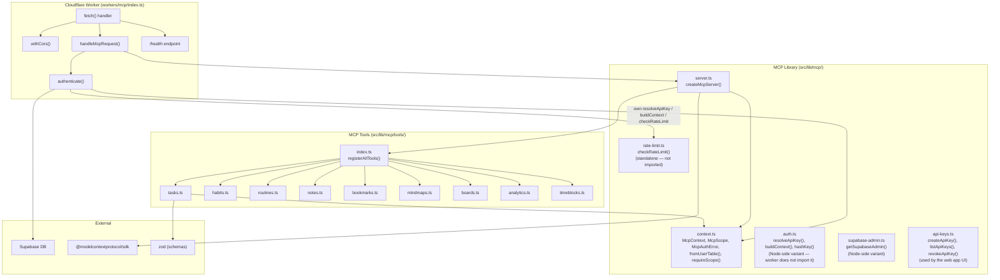
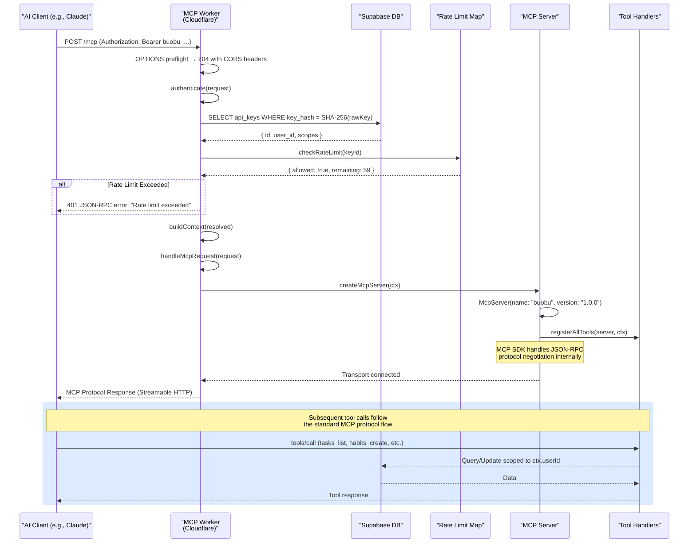
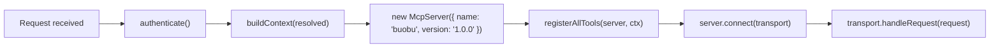
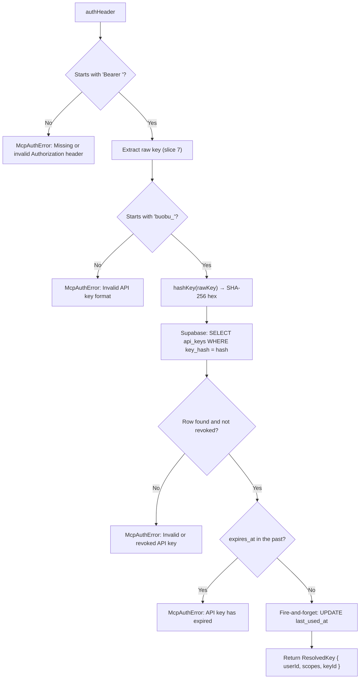
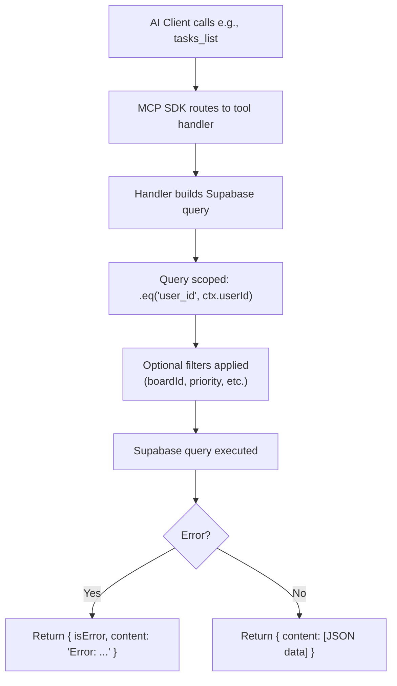
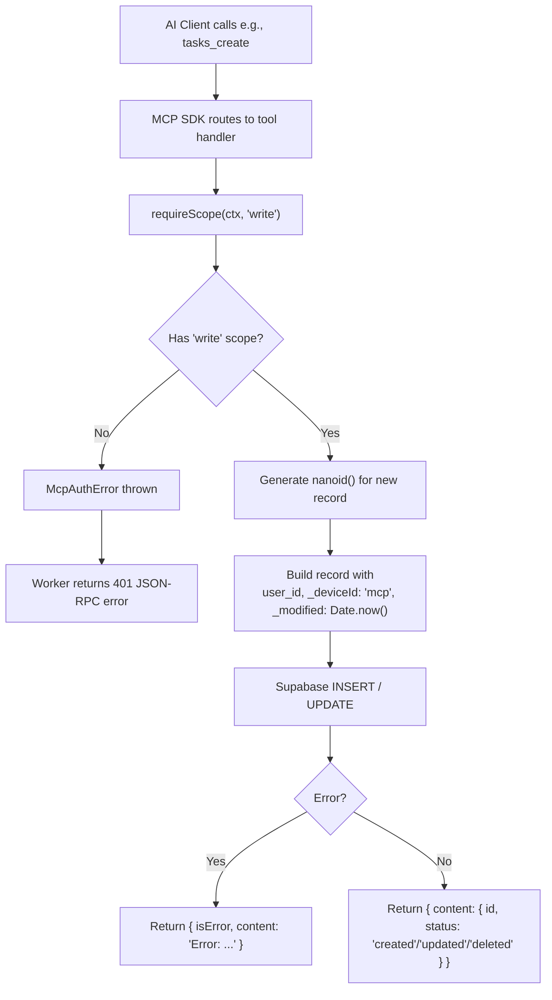

# MCPWorker Module

This document maps module `workers/mcp/index.ts` and the `src/lib/mcp/` library it uses; the source is authoritative.

## Overview

The **MCPWorker** module implements the **Model Context Protocol (MCP) API** for buobu, enabling AI assistants (such as Claude) to programmatically interact with a user's buobu data. It runs as a **Cloudflare Worker** that authenticates requests via API keys, enforces rate limits, and exposes tools across the buobu domains: tasks, habits, routines, notes, bookmarks, mindmaps, whiteboards (vision board items), boards, time blocks, and analytics.

### Core Responsibilities

1. **MCP API Hosting** — Serve the MCP protocol over HTTP/Streamable HTTP, allowing AI clients to discover and call tools
2. **API Key Authentication** — Validate Bearer tokens by looking up SHA-256 hashed keys in Supabase
3. **Rate Limiting** — Enforce per-key sliding window rate limits (60 requests/min by default)
4. **Scope Enforcement** — Gate write operations behind a `write` scope check
5. **Multi-Domain Tool Exposure** — Register 50 tools across nine tool modules
6. **CORS Handling** — Allow configurable cross-origin requests with proper headers
7. **Data Isolation** — All queries are scoped to the authenticated user's `user_id` to prevent cross-user data leakage

---

## Architecture

The MCPWorker is deployed as a **Cloudflare Worker** (`workers/mcp/index.ts`) that orchestrates several library modules from `src/lib/mcp/`:



### Request Lifecycle



---

## Core Components

### `Definition` (`workers/mcp/index.ts`)

The primary Cloudflare Worker entry point. Exports a default `fetch` handler that:

1. **CORS Preflight** — Responds to `OPTIONS` requests with proper CORS headers
2. **Health Check** — Returns `{ status: "ok" }` for `/health` requests
3. **MCP Request Routing** — Routes `/` and `/mcp` paths to the MCP server
4. **Error Handling** — Catches `McpAuthError` for auth issues and generic errors for internal failures

#### Environment Variables (`Env` Interface)

| Variable | Required | Description |
|---|---|---|
| `MCP_ALLOWED_ORIGIN` | No | Restrict CORS to a specific origin. If unset, echoes the request's origin (or `*` if none). |
| `NEXT_PUBLIC_SUPABASE_URL` | Yes | Supabase project URL |
| `SUPABASE_SERVICE_ROLE_KEY` | Yes | Supabase service role key for admin access |

#### Worker State (`WorkerState`)

Persisted in `globalThis.__buobuMcpWorkerState` across requests within the same isolate:

```typescript
interface WorkerState {
  rateLimitWindows: Map<string, number[]>;   // keyId → timestamps
  supabaseClients: Map<string, SupabaseClient>;  // URL+key → cached client
}
```

### `McpContext` (`src/lib/mcp/context.ts`)

The authentication context passed to every tool handler, ensuring data isolation:

```typescript
interface McpContext {
  userId: string;          // Authenticated user's UUID
  scopes: McpScope[];      // ["read"] or ["read", "write"]
  keyId: string;           // API key database ID
  supabase: SupabaseClient; // Admin client scoped to service role
}

type McpScope = "read" | "write";
```

#### Key Utilities

| Function | Description |
|---|---|
| `fromUserTable(ctx, table)` | Returns a Supabase query builder with `.eq("user_id", ctx.userId)` already applied |
| `requireScope(ctx, scope)` | Throws `McpAuthError` if the required scope is not present |
| `McpAuthError` | Custom error class for authentication/authorization failures |

### `createMcpServer(ctx)` (`src/lib/mcp/server.ts`)

Creates a new `McpServer` instance per request (since each request has a different context):



### Authentication Flow (`workers/mcp/index.ts`, mirroring `src/lib/mcp/auth.ts`)



### Rate Limiting (`checkRateLimit` in `workers/mcp/index.ts`)

For detailed documentation on the rate limiter, see [RateLimit](rate-limit.md).

The worker carries its own `checkRateLimit()` and calls it from `authenticate()`:

```typescript
async function authenticate(request: Request, env: Env): Promise<McpContext> {
  const resolved = await resolveApiKey(request.headers.get("authorization"), env);
  const { allowed } = checkRateLimit(resolved.keyId);

  if (!allowed) {
    throw new McpAuthError("Rate limit exceeded");
  }

  return buildContext(resolved, env);
}
```

### API Key Management (Client-Side) (`src/lib/mcp/api-keys.ts`)

Used by the buobu web application to allow users to manage their own MCP API keys:

| Function | Description | Scope Required |
|---|---|---|
| `createApiKey(userId, name, scopes, expiresInDays)` | Generate a new API key with a random 24-byte hex secret. Stores SHA-256 hash in Supabase. Returns the raw key **once**. | Authenticated user |
| `listApiKeys(userId)` | List all non-revoked API keys for the user (excludes the raw key hash for security) | Authenticated user |
| `revokeApiKey(userId, keyId)` | Soft-revoke an API key by setting `revoked_at` | Authenticated user |

> **Security Note:** The raw API key is returned only at creation time and cannot be retrieved later. Users must store it securely. The database only stores `key_hash` (SHA-256) and a `key_prefix` (first 16 chars) for display purposes.

---

## MCP Tools

A total of **50 tools** are registered across **nine tool modules** in `src/lib/mcp/tools/` — `tasks.ts` (6), `habits.ts` (5), `routines.ts` (4), `notes.ts` (5), `bookmarks.ts` (4), `mindmaps.ts` (9: five mindmap tools plus four `whiteboards_*` tools), `boards.ts` (5), `analytics.ts` (5), `timeblocks.ts` (7). `registerAllTools()` in `src/lib/mcp/tools/index.ts` wires all nine up. Each tool follows a consistent pattern:

- **Read tools** (list, get) — Available with `read` scope only
- **Write tools** (create, update, delete, move, log) — Require `write` scope via `requireScope(ctx, "write")`
- **Data isolation** — All queries include `.eq("user_id", ctx.userId)`
- **Soft deletes** — All deletions set `_deleted: true` and `_modified: Date.now()`

### Tasks (`tasks.ts`)

| Tool | Description | Write? |
|---|---|---|
| `tasks_list` | List tasks filtered by board, swimlane, column, priority, due date, or archived status | No |
| `tasks_get` | Get a single task by ID | No |
| `tasks_create` | Create a new task with title, description, labels, priority, date, deadline, time | Yes |
| `tasks_update` | Update task fields (title, description, column, labels, priority, dates, archived) | Yes |
| `tasks_delete` | Soft-delete a task | Yes |
| `tasks_move` | Move a task to a different column, swimlane, or board | Yes |

### Habits (`habits.ts`)

| Tool | Description | Write? |
|---|---|---|
| `habits_list` | List habits filtered by board, swimlane, or archived status | No |
| `habits_logs` | Get habit completion logs for a date range | No |
| `habits_create` | Create a new habit with frequency days and color | Yes |
| `habits_log` | Log a habit completion for a specific date | Yes |
| `habits_unlog` | Remove a habit log for a specific date (soft-delete) | Yes |

### Routines (`routines.ts`)

| Tool | Description | Write? |
|---|---|---|
| `routines_list` | List routines filtered by board, swimlane, type (task/event/payment), or archived | No |
| `routines_logs` | Get routine execution logs for a date range | No |
| `routines_create` | Create a routine with recurrence rule, type, and optional payment/event fields | Yes |
| `routines_run_now` | Log a routine execution (approved/skipped) for a date | Yes |

### Notes (`notes.ts`)

| Tool | Description | Write? |
|---|---|---|
| `notes_list` | List notes filtered by board, swimlane, search, or archived | No |
| `notes_get` | Get a single note with full content | No |
| `notes_create` | Create a new note with content, tags, and pin status | Yes |
| `notes_update` | Update note fields (title, content, tags, pinned, archived) | Yes |
| `notes_delete` | Soft-delete a note | Yes |

### Bookmarks (`bookmarks.ts`)

| Tool | Description | Write? |
|---|---|---|
| `bookmarks_list` | List bookmarks filtered by board, swimlane, status, domain, or search | No |
| `bookmarks_create` | Create a bookmark with URL auto-normalization and domain extraction | Yes |
| `bookmarks_update` | Update bookmark fields (title, description, status, rating, tags, archived) | Yes |
| `bookmarks_delete` | Soft-delete a bookmark | Yes |

### Mindmaps & Whiteboards (`mindmaps.ts`)

| Tool | Description | Write? |
|---|---|---|
| `mindmaps_list` | List mindmaps filtered by board, swimlane, or archived | No |
| `mindmaps_get` | Get a mindmap with all nodes | No |
| `mindmaps_create` | Create a mindmap with optional initial nodes | Yes |
| `mindmaps_update` | Update mindmap title or replace all nodes | Yes |
| `mindmaps_delete` | Soft-delete a mindmap | Yes |
| `whiteboards_list` | List whiteboards (vision board items) | No |
| `whiteboards_get` | Get a whiteboard with excalidraw data | No |
| `whiteboards_create` | Create a whiteboard with optional excalidraw JSON | Yes |
| `whiteboards_delete` | Soft-delete a whiteboard | Yes |

### Boards & Swimlanes (`boards.ts`)

| Tool | Description | Write? |
|---|---|---|
| `boards_list` | List all boards for the user | No |
| `boards_get` | Get a single board with its columns | No |
| `swimlanes_list` | List swimlanes, optionally filtered by board | No |
| `swimlanes_move_to_board` | Move a swimlane (and all its tasks, habits, routines, notes, bookmarks, mindmaps, vision items) to a different board. Column IDs are remapped to the target board's first column. | Yes |
| `transactions_list` | List task transactions (income/expense) embedded as JSONB in tasks, optionally filtered by date or board | No |

### Analytics (`analytics.ts`)

| Tool | Description | Write? |
|---|---|---|
| `analytics_habit_streaks` | Calculate current and longest streaks for one or all habits | No |
| `analytics_task_velocity` | Task completion vs creation velocity per week for the last N weeks | No |
| `analytics_routine_completion` | Routine completion rate (approved + auto vs skipped) over the last N days | No |
| `analytics_spending_summary` | Spending summary from task transactions, grouped by currency and month | No |
| `analytics_daily_summary` | Get a daily summary: tasks due today, habits to complete, routines pending | No |

### Time Blocks (`timeblocks.ts`)

| Tool | Description | Write? |
|---|---|---|
| `timeblocks_list` | List time blocks filtered by board, swimlane, or archived | No |
| `timeblocks_get` | Get a single time block by ID | No |
| `timeblocks_create` | Create a time block with start/end times and recurrence rule | Yes |
| `timeblocks_update` | Update time block fields (title, description, color, times, recurrence, board, swimlane) | Yes |
| `timeblocks_archive` | Archive or unarchive a time block | Yes |
| `timeblocks_delete` | Soft-delete a time block | Yes |
| `timeblocks_linked_items` | Get habits and routines linked to a time block | No |

---

## Data Flow

### Read Operations



### Write Operations



### Swimlane Move Operation (Atomic-ish)

The `swimlanes_move_to_board` tool performs a multi-table update:

1. Fetch swimlane (ownership check)
2. Fetch target board's columns and archive column
3. Map source column IDs to target columns (first column for non-archived, archive column for archived)
4. Update swimlane's `boardId`
5. Update all tasks — `boardId` + remapped `columnId`
6. Update all routines — `boardId` + remapped `columnId`
7. Update flat resources (habits, notes, bookmarks, mindmaps, visionItems) — `boardId` only

> **Note:** This is not wrapped in a database transaction. In case of partial failure, some resources may remain on the original board while others have moved.

---

## Deployment & Configuration

The worker is configured via `workers/mcp/wrangler.jsonc`:

| Environment | Worker Name | Domain |
|---|---|---|
| Development | `buobu-mcp-dev` | `dev` (via `wrangler dev`) |
| Staging | `buobu-mcp-staging` | `mcp-staging.example.com` |
| Production | `buobu-mcp` | `mcp.example.com` |

### Secrets (Required in production/staging)

```bash
wrangler secret put NEXT_PUBLIC_SUPABASE_URL --env production
wrangler secret put SUPABASE_SERVICE_ROLE_KEY --env production
```

### Running Locally

```bash
pnpm dev:mcp
```

### Deploying

```bash
pnpm deploy:mcp    # Deploys to production
```

---

## Tool Registration Pattern

All tools follow a consistent registration pattern using the MCP SDK:

```typescript
server.tool(
  "tool_name",                    // Tool name (snake_case)
  "Tool description",             // Human-readable description
  {                              // Zod schema for parameters
    param1: z.string().describe("Description"),
    param2: z.number().optional().default(0),
  },
  async (params) => {            // Handler function
    // 1. Require write scope if needed
    const { requireScope } = await import("../context");
    requireScope(ctx, "write");

    // 2. Build query scoped to user
    let query = ctx.supabase
      .from("table")
      .select("*")
      .eq("user_id", ctx.userId)
      .eq("_deleted", false);

    // 3. Apply filters
    if (params.filter) query = query.eq("field", params.filter);

    // 4. Execute
    const { data, error } = await query;
    if (error) return { content: [{ type: "text", text: `Error: ${error.message}` }], isError: true };

    // 5. Return result
    return { content: [{ type: "text", text: JSON.stringify(data, null, 2) }] };
  }
);
```

> **Note:** Dynamic imports (`await import("../context")`) are used in write handlers to avoid bundling the `requireScope` function into every tool file. This is an optimization detail — functionally equivalent to a static import.

---

## Security Model

### Authentication

1. API keys are prefixed with `buobu_` for easy identification
2. Keys are hashed with SHA-256 before storage — raw keys are never persisted
3. Keys can have expiration dates and can be revoked (soft-delete via `revoked_at`)
4. The worker uses a Supabase **service role key** (admin) to authenticate requests, bypassing Row-Level Security (RLS) and relying on application-level data scoping instead

### Authorization (Scope Enforcement)

| Scope | Allowed Operations |
|---|---|
| `read` | All `_list`, `_get`, `_logs`, and `analytics_*` tools |
| `write` | All `_create`, `_update`, `_delete`, `_move`, `_log`, `_unlog`, `_archive`, and `swimlanes_move_to_board` |

### Data Isolation

Every database query in every tool handler includes `.eq("user_id", ctx.userId)` to ensure:
- User A cannot read User B's data
- User A cannot modify User B's data
- The `fromUserTable()` helper simplifies this pattern

### CORS Protection

- Configurable via `MCP_ALLOWED_ORIGIN` environment variable
- If set, requests from non-matching origins are rejected with `McpAuthError("Origin not allowed")` → HTTP 403
- If unset, the worker echoes the request's `Origin` header (or `*` for direct requests without an origin)

---

## Dependency Graph

```mermaid
graph TD
    subgraph "MCPWorker (Entry Point)"
        WORKER["workers/mcp/index.ts"]
    end

    subgraph "MCP Library"
        SERVER["src/lib/mcp/server.ts"]
        CONTEXT["src/lib/mcp/context.ts"]
        AUTH["src/lib/mcp/auth.ts"]
        RATE_LIMIT["src/lib/mcp/rate-limit.ts<br/>(standalone, not imported)"]
        SA["src/lib/mcp/supabase-admin.ts"]
        API_KEYS["src/lib/mcp/api-keys.ts"]
    end

    subgraph "MCP Tools"
        TINDEX["src/lib/mcp/tools/index.ts"]
        TASKS["src/lib/mcp/tools/tasks.ts"]
        HABITS["src/lib/mcp/tools/habits.ts"]
        ROUTINES["src/lib/mcp/tools/routines.ts"]
        NOTES["src/lib/mcp/tools/notes.ts"]
        BOOKMARKS["src/lib/mcp/tools/bookmarks.ts"]
        MINDMAPS["src/lib/mcp/tools/mindmaps.ts"]
        BOARDS["src/lib/mcp/tools/boards.ts"]
        ANALYTICS["src/lib/mcp/tools/analytics.ts"]
        TIMEBLOCKS["src/lib/mcp/tools/timeblocks.ts"]
    end

    subgraph "External"
        SDK["@modelcontextprotocol/sdk"]
        SUPABASE_LIB["@supabase/supabase-js"]
        NANOID["nanoid"]
        ZOD["zod"]
    end

    subgraph "Related Modules"
        RL_MODULE["RateLimit"]
    end

    WORKER --> SERVER
    WORKER --> CONTEXT
    WORKER --> SDK
    WORKER -.->|"inline copy, not an import"| RATE_LIMIT
    
    SERVER --> TINDEX
    SERVER --> SDK
    TINDEX --> TASKS
    TINDEX --> HABITS
    TINDEX --> ROUTINES
    TINDEX --> NOTES
    TINDEX --> BOOKMARKS
    TINDEX --> MINDMAPS
    TINDEX --> BOARDS
    TINDEX --> ANALYTICS
    TINDEX --> TIMEBLOCKS
    
    TASKS --> CONTEXT
    TASKS --> ZOD
    TASKS --> SUPABASE_LIB
    TASKS --> NANOID
    
    HABITS --> CONTEXT
    HABITS --> ZOD
    HABITS --> SUPABASE_LIB
    HABITS --> NANOID
    
    ROUTINES --> CONTEXT
    ROUTINES --> ZOD
    ROUTINES --> SUPABASE_LIB
    ROUTINES --> NANOID
    
    NOTES --> CONTEXT
    NOTES --> ZOD
    NOTES --> SUPABASE_LIB
    NOTES --> NANOID
    
    BOOKMARKS --> CONTEXT
    BOOKMARKS --> ZOD
    BOOKMARKS --> SUPABASE_LIB
    BOOKMARKS --> NANOID
    
    MINDMAPS --> CONTEXT
    MINDMAPS --> ZOD
    MINDMAPS --> SUPABASE_LIB
    MINDMAPS --> NANOID
    
    BOARDS --> CONTEXT
    BOARDS --> ZOD
    BOARDS --> SUPABASE_LIB
    BOARDS --> NANOID
    
    ANALYTICS --> CONTEXT
    ANALYTICS --> ZOD
    ANALYTICS --> SUPABASE_LIB
    
    TIMEBLOCKS --> CONTEXT
    TIMEBLOCKS --> ZOD
    TIMEBLOCKS --> SUPABASE_LIB
    TIMEBLOCKS --> NANOID
    
    AUTH --> SA
    AUTH --> CONTEXT
    
    RATE_LIMIT -.-> RL_MODULE
    
    SA --> SUPABASE_LIB
    API_KEYS --> SUPABASE_LIB
    API_KEYS --> NANOID

    style WORKER fill:#f8d7da
    style SERVER fill:#d4edda
    style CONTEXT fill:#d4edda
    style RL_MODULE fill:#e1f5e1
```



---

## Usage Examples

### Connecting Claude to buobu MCP

1. **Generate an API key** from the buobu web app settings
2. **Configure Claude Desktop** (or another MCP client):

```json
{
  "mcpServers": {
    "buobu": {
      "url": "https://mcp.example.com/mcp",
      "headers": {
        "Authorization": "Bearer buobu_live_..."
      }
    }
  }
}
```

### Example AI Interactions

**User:** "What tasks do I have due today?"
**AI:** *(calls `analytics_daily_summary` with default date)*
→ Returns tasks with `date` or `deadline` matching today, habits active today, and routines past due.

**User:** "Create a new task for the project planning board"
**AI:** *(calls `boards_list` to find the board, then `tasks_create` with the board/swimlane/column IDs)*

**User:** "How is my habit streak looking?"
**AI:** *(calls `analytics_habit_streaks`)*
→ Returns current and longest streaks for all active habits.

---

## Related Modules

| Module | Relationship |
|---|---|
| [RateLimit](rate-limit.md) | The rate limiter used by MCPWorker during authentication. Provides sliding-window request throttling per API key. |
| [AuthProvider](auth-provider.md) | Manages user authentication in the web application — MCP API keys are created/revoked via the authenticated web UI using `lib/mcp/api-keys.ts`. |
| [Stores](stores.md) | Zustand stores that manage the application state. MCPWorker bypasses these and directly queries Supabase for data operations. |

---

## Error Handling

| Scenario | HTTP Status | JSON-RPC Error | Behavior |
|---|---|---|---|
| Missing/Invalid Authorization header | 401 | `{ code: -32001, message }` | Returns JSON-RPC error |
| Invalid API key format (no `buobu_` prefix) | 401 | `{ code: -32001, message }` | Returns JSON-RPC error |
| Invalid or revoked API key | 401 | `{ code: -32001, message }` | Returns JSON-RPC error |
| Expired API key | 401 | `{ code: -32001, message }` | Returns JSON-RPC error |
| Rate limit exceeded | 401 | `{ code: -32001, message }` | Returns JSON-RPC error |
| Origin not allowed (CORS) | 403 | `{ code: -32001, message }` | Returns JSON-RPC error |
| Database query error | 200 | N/A | `{ isError: true, content: [{ text: "Error: ..." }] }` |
| Internal server error | 500 | `{ code: -32603, message }` | Caught in top-level try/catch |
| Path not found | 404 | N/A | Plain text "Not found" |

---

## Future Considerations

- **Distributed rate limiting** — Replace in-memory `Map` with Upstash Ratelimit for multi-worker deployments
- **Database transactions** — Wrap multi-table operations (e.g., `swimlanes_move_to_board`) in actual database transactions
- **Tool categories** — Add `board_management`, `swimlane_management`, and `column_management` tools for full board CRUD
- **Bulk operations** — Add batch create/update/delete tools for high-throughput scenarios
- **Pagination** — Add offset/cursor-based pagination to `_list` tools for large datasets
- **User-specific rate limits** — Currently per-key; could add aggregate per-user limits combining multiple keys
- **MCP resources** — Add resource endpoints for exposing buobu data as MCP resources (not just tools)
- **Prompts** — Add MCP prompt templates for common AI interactions (daily briefing, project status, etc.)
