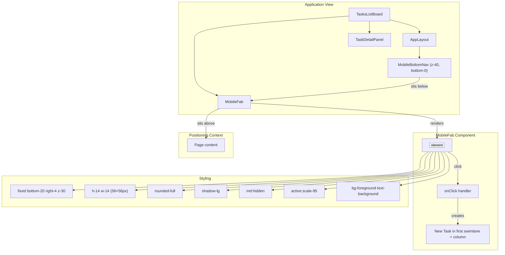
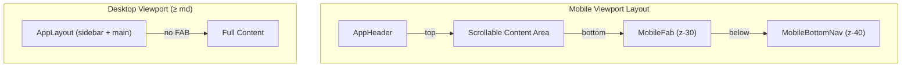
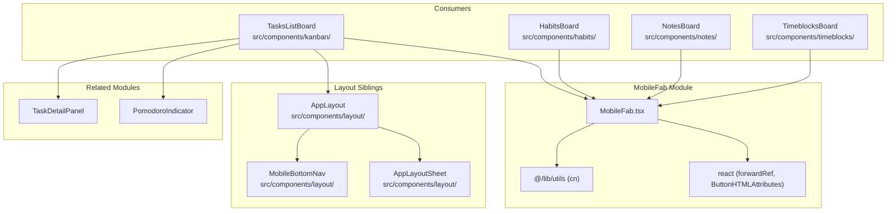
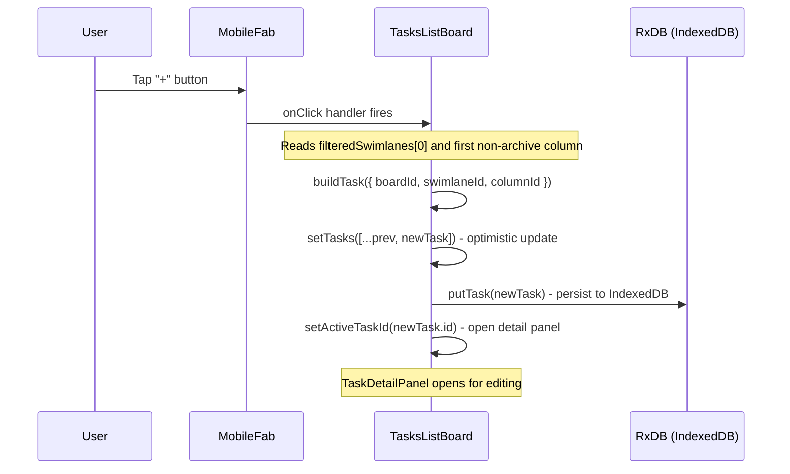

# MobileFab Module

This document maps module `src/components/layout/MobileFab.tsx`; the source is authoritative.

## Overview

The `MobileFab` module provides a **Floating Action Button (FAB)** component designed exclusively for mobile viewports. It renders a round, shadow-enhanced button fixed at the bottom-right corner of the screen, positioned just above the mobile bottom navigation bar. The component serves as a quick-action trigger; four board views mount it with a view-specific `aria-label` and action:

| Board | `aria-label` | Action |
|---|---|---|
| `TasksListBoard` | `Add new task` | Create a task in the first visible swimlane and the first non-archive column |
| `HabitsBoard` | `Add new habit` | Open the add-habit dialog for the first visible swimlane |
| `NotesBoard` | `Add new note` | Create a note in the first visible swimlane |
| `TimeblocksBoard` | `Add new time block` | Open the new-time-block dialog |

### Core Responsibilities

1. **Mobile-Only Visibility** — Renders only on screens below the `md` (768px) breakpoint via the `md:hidden` Tailwind class
2. **Accessible Action Button** — Requires an explicit `aria-label` for screen readers
3. **Icon Rendering** — Accepts any `React.ReactNode` as the icon (typically a `+` symbol or Lucide icon)
4. **Positioning** — Fixed to bottom-20 (80px from bottom edge) above the `MobileBottomNav` (z-40) at z-30, right-aligned with right-4
5. **Press Feedback** — Applies `active:scale-95` for a tactile press-down animation

---

## Architecture

MobileFab is a lightweight presentational component with no internal state or complex logic. It extends the standard HTML button element and fits into the layout layer of the application.



---

## Core Component

### `MobileFabProps` (Interface)

```typescript
interface MobileFabProps extends ButtonHTMLAttributes<HTMLButtonElement> {
  /** Accessible label describing the action */
  "aria-label": string;
  icon: React.ReactNode;
}
```

| Prop | Type | Required | Description |
|------|------|----------|-------------|
| `aria-label` | `string` | **Yes** | Accessible label required for screen readers to describe the button's action |
| `icon` | `React.ReactNode` | **Yes** | The icon/visual element rendered inside the button |
| All other HTML button props | `ButtonHTMLAttributes` | No | Any valid HTML button attribute (e.g., `onClick`, `className`, `disabled`, `type`) |

### `MobileFab` (Component)

```typescript
export const MobileFab = forwardRef<HTMLButtonElement, MobileFabProps>(
  function MobileFab({ icon, className, ...props }, ref) {
    return (
      <button
        ref={ref}
        type="button"
        className={cn(
          "fixed bottom-20 right-4 z-30",
          "flex h-14 w-14 items-center justify-center rounded-full shadow-lg",
          "bg-foreground text-background",
          "transition-transform active:scale-95",
          "md:hidden",
          className,
        )}
        {...props}
      >
        {icon}
      </button>
    );
  },
);
```

#### Styling Breakdown

| Tailwind Class | Purpose |
|---|---|
| `fixed bottom-20 right-4` | Fixed positioning 80px from bottom, 16px from right edge |
| `z-30` | Z-index layer (below MobileBottomNav's z-40, above page content) |
| `h-14 w-14` | 56×56 pixel button (comfortable touch target ≥ 44px) |
| `rounded-full` | Circular shape |
| `shadow-lg` | Large box-shadow for elevation |
| `bg-foreground text-background` | High-contrast — uses foreground color for background, background color for text/icon |
| `transition-transform active:scale-95` | Subtle press-down animation on touch/click |
| `md:hidden` | **Hidden on desktop** — only visible on mobile (< 768px) |
| `flex items-center justify-center` | Centers the icon within the button |

---

## Usage

### In the Tasks List View

`TasksListBoard` (`src/components/kanban/TasksListBoard.tsx`) mounts the FAB to provide a quick "Add Task" action on mobile devices:

```tsx
import { MobileFab } from "@/components/layout/MobileFab";

function TasksListBoard() {
  // ... board state and handlers ...

  return (
    <>
      <AppLayout
        sidebarConfig={sidebarConfig}
        middlePanel={middlePanel}
        rightPanel={rightPanel}
      />

      <MobileFab
        aria-label="Add new task"
        icon={<span className="text-2xl leading-none" aria-hidden>+</span>}
        onClick={() => {
          const swimlane = filteredSwimlanes[0];
          const column = boardColumns.find((c) => c.id !== archiveColumnId) ?? boardColumns[0];
          if (swimlane && column) handleAddTask(swimlane.id, column.id);
        }}
      />

      <TaskDetailPanel
        // ... task detail props ...
      />
      <PomodoroIndicator
        // ... pomodoro props ...
      />
    </>
  );
}
```

### General Usage Pattern

```tsx
<MobileFab
  aria-label="Descriptive action label"
  icon={<YourIcon className="h-5 w-5" />}
  onClick={handleAction}
/>
```

---

## Layout Integration

The MobileFab is part of the mobile layout system and interacts with two key sibling components:



### MobileBottomNav

- **z-index**: 40
- **Position**: `fixed inset-x-0 bottom-0`
- **Height**: `h-16` + `env(safe-area-inset-bottom)` padding
- **Visibility**: `md:hidden`

The MobileFab sits **above** the bottom nav (z-30 vs z-40) with 80px gap (`bottom-20`) so it doesn't overlap the navigation bar. The nav is at z-40 so it renders on top of the FAB, but the FAB's `bottom-20` positions it above the nav bar area.

### AppLayoutSheet

The mobile sheet panel (slide-in from left) uses the same `Sheet` component and can overlap the FAB when open, but since the FAB is at z-30 and the sheet overlay is at a higher z-index, the sheet covers the FAB appropriately.

---

## Dependency Graph



---

## Related Modules

| Module | Relationship |
|--------|------------|
| AppLayout | The main layout wrapper that provides the sidebar + content structure; MobileFab is rendered *outside* AppLayout but within the same parent |
| MobileBottomNav | Sibling component — the 5-tab bottom navigation bar that the FAB floats above |
| TaskDetailPanel | The task editing panel opened when a task is tapped (not related to FAB directly but co-located in TasksListBoard) |
| useBoardBase | The hook providing filtered swimlane/board state that determines where new tasks are created |
| [AuthProvider](auth-provider.md) | Root-level auth provider that guards all authenticated pages |

---

## Data Flow

When the user taps the MobileFab in the Tasks List View:



---

## Error Handling & Edge Cases

| Scenario | Behavior |
|---|---|
| No swimlanes available | The `onClick` guard (`if (swimlane && column)`) silently prevents creation — no error |
| No valid column (all columns are archive) | Falls back to `boardColumns[0]` — column creation proceeds |
| Multiple boards selected ("All Boards" mode) | Uses the first active swimlane and first board's columns |
| Desktop viewport (≥768px) | `md:hidden` hides the button entirely — use the sidebar "Add" buttons instead |
| Fast double-tap | Each tap creates a new task; no debouncing is applied (intentional for rapid task entry) |
| Touch screen on desktop | The button is hidden on desktop, so mobile-only behavior is preserved |

---

## Design Rationale

- **Mobile-first UX**: Task creation on mobile is a common action that should be easily reachable with one thumb (bottom-right zone)
- **Position above nav**: The `bottom-20` value (80px) accounts for the 64px MobileBottomNav height plus 16px padding
- **No desktop equivalent**: Desktop users create tasks via sidebar buttons or column-level "+" buttons; a floating button would conflict with the sidebar layout
- **Accessible by design**: The `aria-label` is a required prop, preventing developers from omitting screen reader support
- **Lightweight**: No state, no effects, no context — pure presentational component with < 20 lines of logic

---

## Testing Considerations

- **Visibility**: Verify the button is present on viewports < 768px and absent on ≥ 768px
- **Click handler**: Verify `onClick` fires correctly with the button's native event
- **Aria label**: Verify the `aria-label` is applied to the `<button>` element
- **Forwarded ref**: Verify `ref.current` points to the underlying button element
- **Custom className**: Verify additional classes merge correctly via `cn()`
