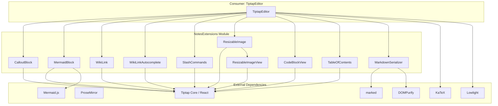
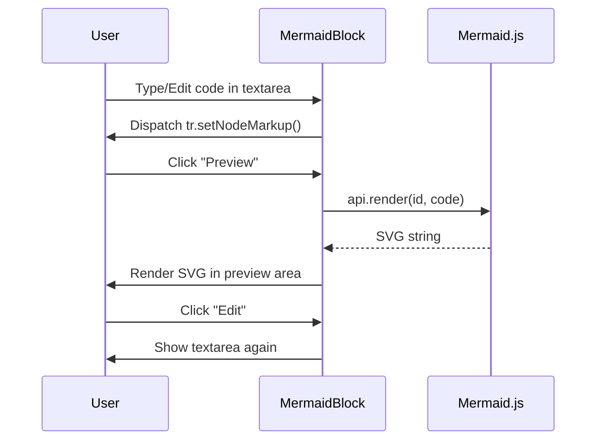
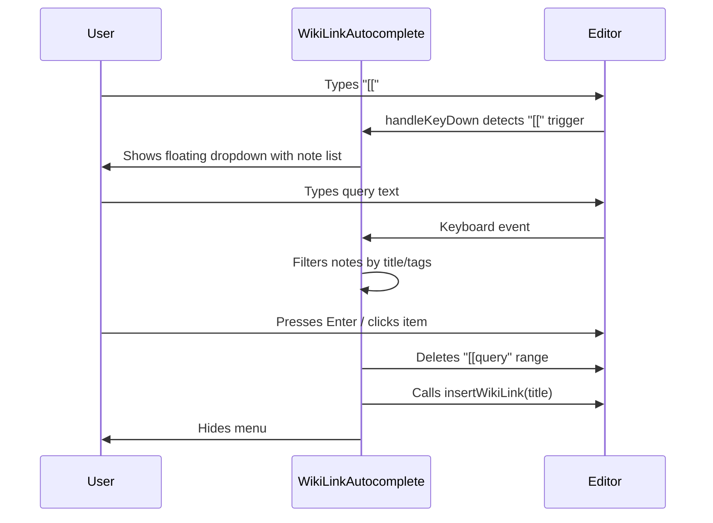
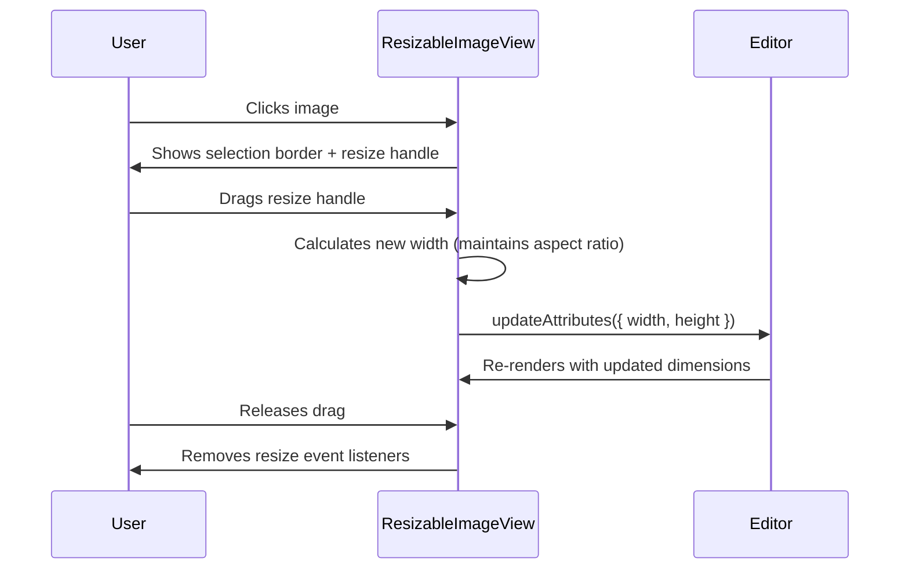
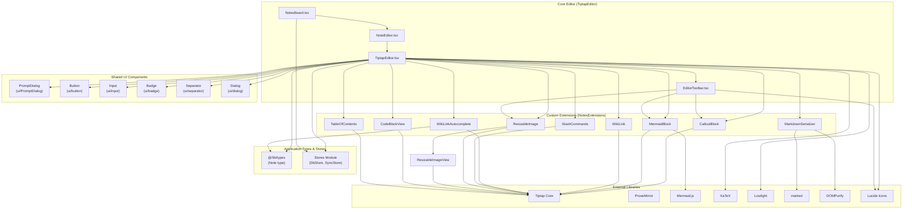
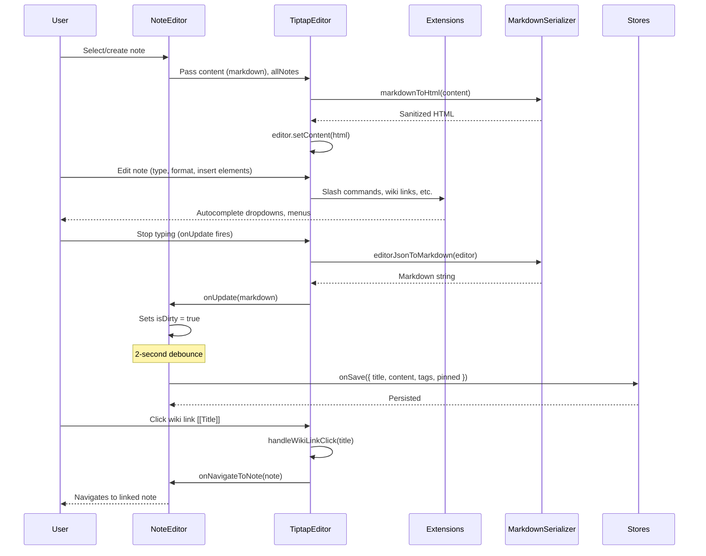

# NotesExtensions Module

This document maps module `src/components/notes/extensions/` and its consumer `src/components/notes/TiptapEditor.tsx`; the source is authoritative.

## Introduction

The **NotesExtensions** module is a set of custom [Tiptap](https://tiptap.dev/) editor extensions that power the rich-text note editing experience within buobu. These extensions extend the base ProseMirror/Tiptap editor with advanced content types including callout blocks, Mermaid diagrams, wiki-style links with autocomplete, slash commands, resizable images, custom code blocks, LaTeX math, and a table of contents panel.

The module lives at `src/components/notes/extensions/` and is consumed primarily by the `TiptapEditor` component (`src/components/notes/TiptapEditor.tsx`), which composes all extensions together into a fully featured note editor.

---

## Architecture & Composition



### Extension Registration

All custom extensions are registered in `TiptapEditor.tsx` within the `useEditor` hook. The extensions compose with standard Tiptap community extensions:

| Category | Extensions |
|---|---|
| **Base** | StarterKit, Placeholder, Link, TextAlign, Highlight |
| **Tables** | Table, TableRow, TableCell, TableHeader |
| **Lists** | TaskList, TaskItem |
| **Code** | CodeBlockLowlight (with custom CodeBlockView) |
| **Custom** | CalloutBlock, MermaidBlock, WikiLink, WikiLinkAutocomplete, SlashCommands, ResizableImage, MathExtension |
| **UI** | TableOfContents |

---

## Component Documentation

### 1. CalloutBlock

**File:** `callout-block.tsx`

A block-level node extension that renders styled callout/admonition boxes. Supports five types: `note`, `tip`, `warning`, `caution`, and `important`.

**Interface:**

```typescript
export interface CalloutBlockOptions {
  HTMLAttributes: Record<string, unknown>;
}

export type CalloutType = "tip" | "warning" | "caution" | "important" | "note";
```

**Module Augmentation:**

```typescript
declare module "@tiptap/core" {
  interface Commands<ReturnType> {
    calloutBlock: {
      insertCallout: (options?: { type?: CalloutType; content?: string }) => ReturnType;
      setCalloutType: (type: CalloutType) => ReturnType;
    };
  }
}
```

**Features:**
- Renders with a colored left border and icon based on type
- In edit mode, shows a dropdown menu to switch callout types
- In read-only mode, displays a static label
- Supports nested block content inside the callout body
- Parsing from HTML via `div[data-type="callout-block"]` or `.callout-block`

**Visual Configuration:**

| Type | Icon | Color (Light) |
|---|---|---|
| tip | Lightbulb | Emerald (green) |
| warning | AlertTriangle | Amber (yellow) |
| caution | AlertOctagon | Red |
| important | Megaphone | Blue |
| note | StickyNote | Slate (gray) |

### 2. MermaidBlock

**File:** `mermaid-block.ts`

An atom block node extension that embeds [Mermaid.js](https://mermaid.js.org/) diagrams. The node is treated as a single opaque block with its own internal editing UI (textarea + preview toggle).

**Interface:**

```typescript
export interface MermaidBlockOptions {
  HTMLAttributes: Record<string, unknown>;
}
```

**Module Augmentation:**

```typescript
declare module "@tiptap/core" {
  interface Commands<ReturnType> {
    mermaidBlock: {
      insertMermaidBlock: (content?: string) => ReturnType;
    };
  }
}
```

**Key Implementation Details:**
- **Atom node** — no ProseMirror content editing inside; content is stored as a `code` attribute
- **Lazy Mermaid initialization** — the mermaid library is dynamically imported on first use and cached module-globally
- **Dual-mode UI:** Code editor (textarea) ↔ Preview (rendered SVG)
- Supports undo/redo via `update` lifecycle which syncs textarea value
- Error handling: invalid syntax shows "Invalid Mermaid syntax" message and cleans up orphan DOM elements
- Select/deselect visual feedback with ring highlight
- Namespaced render IDs (`mmd-${timestamp}-${counter}`) to avoid conflicts

**Data Flow:**



### 3. WikiLink

**File:** `wiki-link.ts`

An inline atom node that renders `[[Wiki-style links]]` for cross-note navigation. Clicking a wiki link triggers a configurable callback (`onWikiLinkClick`).

**Interface:**

```typescript
export interface WikiLinkOptions {
  HTMLAttributes: Record<string, unknown>;
  onWikiLinkClick?: (title: string) => void;
}
```

**Module Augmentation:**

```typescript
declare module "@tiptap/core" {
  interface Commands<ReturnType> {
    wikiLink: {
      insertWikiLink: (title: string) => ReturnType;
    };
  }
}
```

**Features:**
- Stores page title in `data-title` attribute
- Visual style: dotted underline, blue color, hover → solid underline
- Parsed from `span[data-type="wiki-link"]`
- Commands: `insertWikiLink(title)` to programmatically insert a link

### 4. WikiLinkAutocomplete

**File:** `wiki-link-autocomplete.tsx`

A ProseMirror plugin (Tiptap Extension) that provides an autocomplete dropdown when the user types `[[` — enabling quick linking to existing notes by title.

**Interface:**

```typescript
export interface WikiLinkAutocompleteOptions {
  notes: Note[];
  onInsertWikiLink?: (title: string) => void;
}
```

**Plugin State:**

```typescript
// Internal plugin state
{ active: boolean, query: string, from: number }
```

**Interaction Flow:**



**Features:**
- Real-time filtering by note title and tags
- Arrow key navigation with visual highlight
- Click outside to dismiss
- Escape to cancel
- Graceful fallback — hides menu if `[[` is deleted

### 5. SlashCommands

**File:** `slash-commands.tsx`

A ProseMirror plugin (Tiptap Extension) that shows a command palette when the user types `/` at the beginning of a line or after whitespace.

**Interfaces:**

```typescript
export interface SlashCommandItem {
  title: string;
  description: string;
  icon: string;
  command: (editor: Editor) => void;
}

export interface SlashCommandPromptHandlers {
  requestImageUrl?: () => Promise<string | null>;
  requestLatex?: () => Promise<string | null>;
}
```

**Default Command Items:**

| Title | Description | Action |
|---|---|---|
| Heading 1/2/3 | Large/Medium/Small heading | `toggleHeading({ level })` |
| Bullet List | Unordered list | `toggleBulletList()` |
| Numbered List | Ordered list | `toggleOrderedList()` |
| Task List | Checklist | `toggleTaskList()` |
| Blockquote | Quote block | `toggleBlockquote()` |
| Code Block | Code with syntax highlighting | `toggleCodeBlock()` |
| Table | Insert a table | `insertTable()` |
| Horizontal Rule | Divider line | `setHorizontalRule()` |
| Image | Insert image from URL | Prompts for URL via `requestImageUrl` |
| Mermaid Diagram | Insert Mermaid diagram | `insertMermaidBlock()` |
| Callout (5 types) | Insert callout blocks | `insertCallout({ type })` |
| Highlight | Highlight text | `toggleHighlight()` |
| Math (LaTeX) | Insert LaTeX formula | Prompts via `requestLatex` |

**Prompt Handler Injection:**

The `TiptapEditor` component injects custom prompt handlers via `setSlashCommandPromptHandlers()` that connect to React dialog components, rather than using native `window.prompt()`.

### 6. ResizableImage

**File:** `resizable-image.ts` + `resizable-image-view.tsx`

An extension extending the base Tiptap `Image` extension with interactive resize handles.

**File:** `resizable-image.ts`
Extends `@tiptap/extension-image` with:
- `width` and `height` attributes parsed from HTML attributes and inline styles
- A custom `ReactNodeViewRenderer` using `ResizableImageView`

**File:** `resizable-image-view.tsx`
A React node view component that:
- Renders an `` element with optional width/height from node attributes
- When selected, shows a resize handle (circle) at the bottom-right corner
- Implements drag-to-resize with aspect ratio lock
- Supports both mouse and touch events
- Minimum width: 50px

**Interaction Flow:**



### 7. CodeBlockView

**File:** `code-block-view.tsx`

A custom React node view for code blocks that replaces the default Tiptap code block rendering.

**Features:**
- Language selector dropdown with 27 languages plus an "Auto" option
- "Copy" button to copy code content to clipboard
- Clean header bar with language selector on the left and copy button on the right
- Scrollable code area with monospace font
- The `TiptapEditor` integrates this via `CodeBlockLowlight.extend({ addNodeView() })` overriding the default node view

### 8. TableOfContents

**File:** `table-of-contents.tsx`

A React component (not a Tiptap extension) that dynamically extracts headings from the editor document and renders a navigable table of contents.

**Interfaces:**

```typescript
interface TocItem {
  level: number;
  text: string;
  pos: number;
  id: string;
}
```

**Features:**
- Uses `useSyncExternalStore` for efficient re-rendering only when headings change
- Collapsible panel (toggle button)
- Scroll-to-heading on click (smooth scroll, center alignment)
- Indentation based on heading level
- Heading count badge
- Returns `null` when there are no headings or no editor

**Performance Optimization:**
- Uses `areHeadingsEqual()` to prevent unnecessary re-renders
- Caches headings in a `useRef` to maintain referential stability
- Subscribes to editor `"update"` event for reactive updates

### 9. MarkdownSerializer

**File:** `markdown-serializer.ts`

A bidirectional converter between Tiptap JSON content and Markdown strings. Not a Tiptap extension, but a utility library used by `TiptapEditor` for import/export.

**Functions:**

| Function | Description |
|---|---|
| `editorJsonToMarkdown(editor)` | Serializes current editor content to Markdown |
| `markdownToHtml(markdown)` | Converts Markdown → sanitized HTML for Tiptap consumption |

**Supported Node Types in JSON → Markdown:**

| Tiptap Node Type | Markdown Output |
|---|---|
| heading | `# H1`, `## H2`, etc. |
| bold | `**text**` |
| italic | `*text*` |
| strike | `~~text~~` |
| code | `` `code` `` |
| link | `[text](url)` |
| highlight | `==text==` |
| bulletList / listItem | `- item` |
| orderedList | `1. item` |
| taskList / taskItem | `- [x] done` / `- [ ] todo` |
| blockquote | `> quote` |
| codeBlock | ````language\ncode```` |
| mermaidBlock | ````mermaid\ncode```` |
| calloutBlock | `> [!TYPE]\n> content` |
| horizontalRule | `---` |
| image | `` or `` tag (when width/height set) |
| table | `\| col1 \| col2 \|` with `\| --- \| --- \|` separator |
| wikiLink | `[[title]]` |
| mathInline | `$latex$` |
| mathBlock / math_display | `$$latex$$` |

**Markdown → HTML Processing Pipeline:**

```mermaid
flowchart LR
    A[Markdown] --> B[Pre-process task items]
    B --> C[Pre-process wiki-links]
    C --> D[Pre-process mermaid blocks]
    D --> E[Pre-process highlights]
    E --> F[Pre-process LaTeX blocks/inline]
    F --> G[Pre-process callout blocks - GitHub alerts]
    G --> H[marked.parse]
    H --> I[Restore callout blocks]
    I --> J[Restore mermaid blocks]
    J --> K[Restore LaTeX blocks/inline]
    K --> L[Restore task items]
    L --> M[DOMPurify sanitize]
    M --> N[Final HTML]
```



**Security:**
- Uses `DOMPurify.sanitize()` with a restricted `ALLOWED_URI_REGEXP` allowing only HTTPS URLs
- Explicitly allows custom data attributes (`data-type`, `data-callout-type`, `data-title`, `data-latex`, `data-checked`, `data-code`, etc.)
- Prevents SVG injection and restricts external image requests

---

## Dependency Graph



---

## Data Flow: End-to-End Note Editing



---

## Module Interactions with Other Modules

| Module | Relationship |
|---|---|
| [**Stores**](stores.md) | Notes are read through the `use-notes` entity hooks / `notesAtom` and written through `noteActions`. |
| [**AuthProvider**](auth-provider.md) | Guards the authenticated routes; notes are only reachable once the session and database are initialized. |
| [**BoardModal**](board-modal.md) | Notes carry a `boardId`/`swimlaneId`, and the board/swimlane configuration managed in the modal determines where notes are filed. |
| [**MobileFab**](mobile-fab.md) | `NotesBoard` mounts the FAB with `aria-label="Add new note"` to create a note on mobile. |
| [**MCP Worker**](mcp-worker.md) | Exposes `notes_list`, `notes_get`, `notes_create`, `notes_update` and `notes_delete` over MCP. |

---

## TypeScript Type Augmentations

The module extends Tiptap's `Commands` interface globally to add custom commands. This pattern is used by:

- **CalloutBlock:** Adds `insertCallout()` and `setCalloutType()` commands
- **MermaidBlock:** Adds `insertMermaidBlock()` command
- **WikiLink:** Adds `insertWikiLink()` command

These augmentations are declared at module scope using:

```typescript
declare module "@tiptap/core" {
  interface Commands<ReturnType> {
    [extensionName]: {
      [commandName]: (...args) => ReturnType;
    };
  }
}
```

---

## Testing

Test files for the notes module are located at:

- `src/components/notes/__tests__/TableOfContents.test.tsx`
- `src/components/notes/__tests__/NotesBoard.test.tsx`

These cover the `TableOfContents` component and the `NotesBoard` integration respectively.

---

## Key Design Decisions

1. **Atom nodes for complex blocks** — MermaidBlock and WikiLink are atom nodes to prevent ProseMirror from managing their internal content, allowing custom DOM-based editing UIs.
2. **Module-level caching** — The Mermaid.js API is initialized once and cached globally across all MermaidBlock instances to avoid redundant imports.
3. **Bidirectional Markdown conversion** — Rather than storing Tiptap JSON, notes are stored as Markdown. The `MarkdownSerializer` handles conversion in both directions, enabling easy interoperability with other tools.
4. **Security-first HTML sanitization** — `DOMPurify` with restricted URI regex prevents XSS attacks while allowing custom data attributes needed for Tiptap node parsing.
5. **Debounced autosave** — The `NoteEditor` implements a 2-second debounce on content changes to balance responsiveness with persistence overhead.
6. **Plugin-based autocomplete** — Both slash commands and wiki-link autocomplete use ProseMirror plugins with custom key handlers and floating DOM menus, avoiding reliance on React state for menu positioning.
