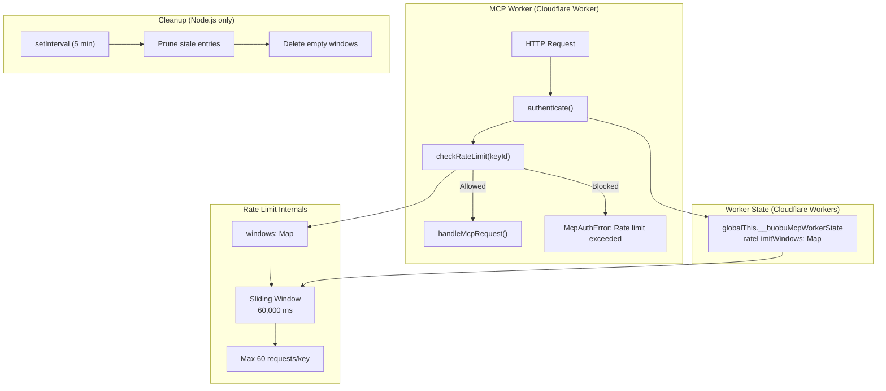
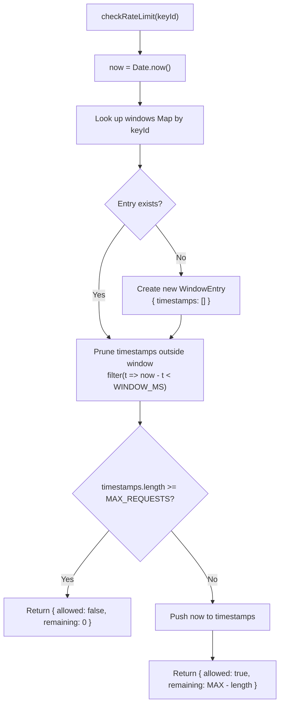
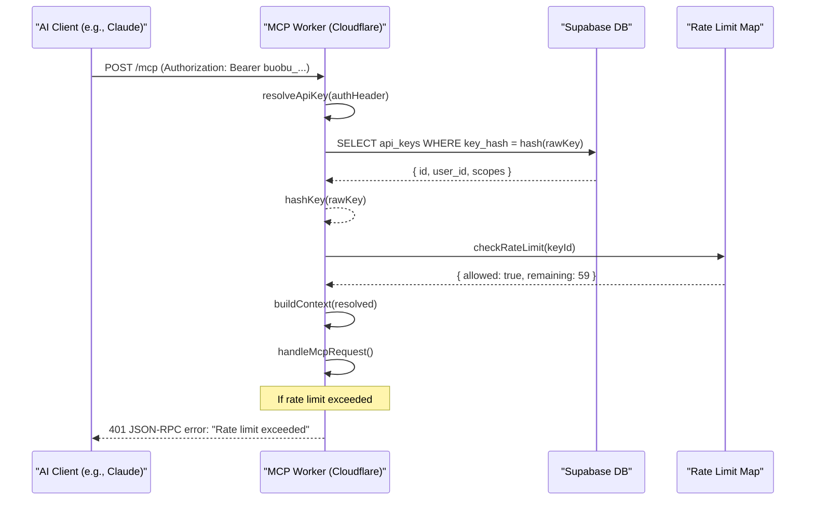
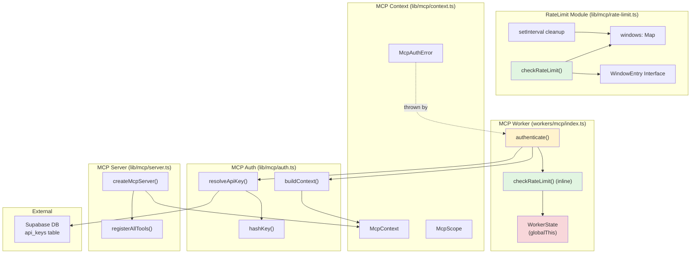

# RateLimit Module

This document maps the rate-limiting code in `src/lib/mcp/rate-limit.ts` and its inline copy in `workers/mcp/index.ts`; the source is authoritative.

## Overview

The `RateLimit` module provides a **simple in-memory sliding-window rate limiter** for the buobu MCP (Model Context Protocol) API. It protects the MCP worker endpoints from abuse by limiting the number of requests a single API key can make within a defined time window.

### Core Responsibilities

1. **Request Throttling** — Enforce a maximum number of requests per API key within a rolling 60-second window
2. **Window Maintenance** — Automatically prune expired timestamps and clean up stale entries to prevent memory leaks
3. **Backpressure Signaling** — Return clear `allowed` and `remaining` counters so callers can respond appropriately (e.g., return 429 Too Many Requests)

---

## Architecture

The rate limiter exists in two locations:

1. **`src/lib/mcp/rate-limit.ts`** — a standalone reference implementation. It exports `checkRateLimit(keyId)` and keeps its own `Map`. Nothing in the repository imports it today; the deployed worker does not use it.
2. **`workers/mcp/index.ts`** — the copy that actually runs. It restates `checkRateLimit()` over `workerState.rateLimitWindows` (a `Map<string, number[]>`) and drives it from `authenticate()`.



### Key Design Decisions

| Decision | Rationale |
|---|---|
| **In-memory storage** | Simple, fast, no external dependencies. Suitable for single-instance deployments. |
| **Sliding window** | More equitable than fixed windows — burst of requests at the end of one window doesn't penalize the next window. |
| **60 req / 60 sec** | Default threshold chosen as a reasonable starting point for MCP API usage. |
| **Map keyed by `keyId`** | Rate limits are per-API-key, ensuring one user's usage doesn't affect another. |
| **Inline copy in worker** | Cloudflare Workers have no `setInterval().unref()` and use a different global scope. The worker carries its own implementation to avoid bundling Node.js-specific code. |

---

## Core Components

### `WindowEntry` (Interface)

Defines the structure for tracking request timestamps for a single API key:

```typescript
interface WindowEntry {
  timestamps: number[];  // Monotonically increasing millisecond epoch timestamps
}
```

Each entry stores an array of `Date.now()` values for every request made within the current sliding window.

### `checkRateLimit(keyId: string)`

The primary function that checks and records a request attempt:

```typescript
function checkRateLimit(keyId: string): {
  allowed: boolean;
  remaining: number;
}
```

#### Algorithm



#### Parameters

| Parameter | Type | Description |
|---|---|---|
| `keyId` | `string` | The unique identifier of the API key (its database `id` field) |

#### Return Value

| Field | Type | Description |
|---|---|---|
| `allowed` | `boolean` | `true` if the request is within the rate limit, `false` if exceeded |
| `remaining` | `number` | Number of requests remaining in the current window (0 when `allowed` is false) |

#### Usage Example

```typescript
import { checkRateLimit } from "@/lib/mcp/rate-limit";

function authenticate(request: Request): McpContext {
  const { keyId } = await resolveApiKey(request.headers.get("authorization"));
  const { allowed, remaining } = checkRateLimit(keyId);

  if (!allowed) {
    throw new McpAuthError("Rate limit exceeded");
  }

  // Attach remaining to response headers elsewhere...
  return buildContext({ userId, scopes, keyId });
}
```

---

## Window Maintenance (Garbage Collection)

### Node.js Environment (`lib/mcp/rate-limit.ts`)

A periodic cleanup interval runs every **5 minutes** to:

1. Iterate over all entries in the `windows` Map
2. Remove timestamps older than `WINDOW_MS` (60 seconds)
3. Delete entries whose timestamp array is empty (no longer tracking any active requests)

```typescript
setInterval(() => {
  const cutoff = Date.now() - WINDOW_MS;
  for (const [key, entry] of windows) {
    entry.timestamps = entry.timestamps.filter((t) => t > cutoff);
    if (entry.timestamps.length === 0) windows.delete(key);
  }
}, 300_000).unref?.();  // .unref() prevents the timer from keeping the process alive
```

The `.unref()` call ensures the timer does **not** prevent the Node.js process from exiting if it's the only remaining active timer.

### Cloudflare Workers (`workers/mcp/index.ts`)

No separate cleanup is needed because:
- Cloudflare Workers are ephemeral — the `globalThis` state persists across requests but is recycled when the isolate is terminated
- Each request already prunes expired timestamps via the filter in `checkRateLimit()`
- Memory pressure is naturally limited by the worker's short lifespan and per-key pruning

---

## Integration with MCP Worker

### Authentication and Rate Limiting Flow



### Rate Limit in Worker Context

In `workers/mcp/index.ts`, the rate limiter is invoked within the `authenticate()` function:

```typescript
async function authenticate(request: Request, env: Env): Promise<McpContext> {
  const resolved = await resolveApiKey(request.headers.get("authorization"), env);
  const { allowed } = checkRateLimit(resolved.keyId);  // <-- rate check

  if (!allowed) {
    throw new McpAuthError("Rate limit exceeded");  // → 401 response
  }

  return buildContext(resolved, env);
}
```

### Worker State Persistence

The Cloudflare Worker version stores the rate limit windows in a global scope:

```typescript
interface WorkerState {
  rateLimitWindows: Map<string, number[]>;  // keyId → timestamps
  supabaseClients: Map<string, SupabaseClient>;
}

const workerState = getWorkerState();

function getWorkerState(): WorkerState {
  const globalState = globalThis as typeof globalThis & {
    __buobuMcpWorkerState?: WorkerState;
  };

  if (!globalState.__buobuMcpWorkerState) {
    globalState.__buobuMcpWorkerState = {
      rateLimitWindows: new Map<string, number[]>(),
      supabaseClients: new Map<string, SupabaseClient>(),
    };
  }

  return globalState.__buobuMcpWorkerState;
}
```

> **Note:** The worker's `rateLimitWindows` uses `number[]` directly instead of `WindowEntry` since the worker entry is simpler and doesn't need the interface abstraction.

---

## Dependency Graph



---

## Configuration

### Default Constants

| Constant | Value | Description |
|---|---|---|
| `WINDOW_MS` | `60_000` (60 seconds) | Sliding window duration in milliseconds |
| `MAX_REQUESTS` | `60` | Maximum requests allowed per window per API key |

### Tuning Guidelines

| Use Case | Suggested `MAX_REQUESTS` | Rationale |
|---|---|---|
| **Default (general MCP)** | 60 | Balanced for typical AI assistant usage |
| **High-volume automation** | 120–300 | For automated scripts with moderate throughput |
| **Batch processing** | 600+ | For non-interactive bulk operations (requires review) |

> **Warning:** In-memory rate limiting is lost on process restart or worker recycle. For distributed, persistent rate limiting across multiple instances, replace with [Upstash Ratelimit](https://upstash.com/docs/redis/sdks/ratelimit-ts/overview) or a database-backed approach.

---

## Related Modules

| Module | Relationship |
|---|---|
| [MCP Worker](mcp-worker.md) | The Cloudflare Worker that consumes the rate limiter during authentication |
| [AuthProvider](auth-provider.md) | Manages user authentication — rate limits apply post-authentication for MCP API key usage |

---

## Error Handling

| Scenario | Behavior |
|---|---|
| **Rate limit exceeded** | Returns `{ allowed: false, remaining: 0 }`. The worker's `authenticate()` turns that into `McpAuthError("Rate limit exceeded")`, which `handleMcpRequest()` renders as a **401** JSON-RPC response with code `-32001` |
| **First request for a key** | Creates a new `WindowEntry` automatically. Always allowed (1 of 60). |
| **Concurrent requests** | Each call to `checkRateLimit()` is synchronous. Calls are processed sequentially in the event loop (no async interleaving). |
| **Process restart** | All windows are lost. Rate limits reset on restart. This is acceptable for single-instance deployments. |

---

## Future Considerations

- **Distributed rate limiting** — Replace `Map<string, WindowEntry>` with Upstash Ratelimit or Redis for multi-worker deployments
- **User-level limits** — Currently scoped per API key. Could add per-user aggregate limits combining multiple keys
- **Exponential backoff** — Return `Retry-After` header with suggested wait time when rate limit is exceeded
- **Configurable limits** — Expose `MAX_REQUESTS` and `WINDOW_MS` as environment variables or per-key database configuration
- **Rate limit headers** — Add `X-RateLimit-Limit`, `X-RateLimit-Remaining`, and `X-RateLimit-Reset` to HTTP responses for transparency
