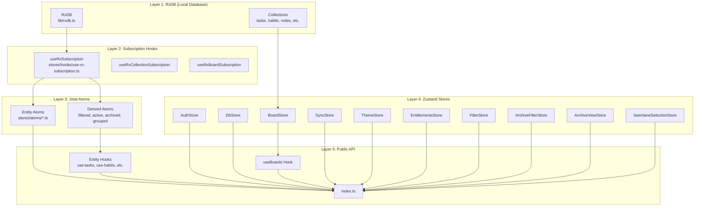
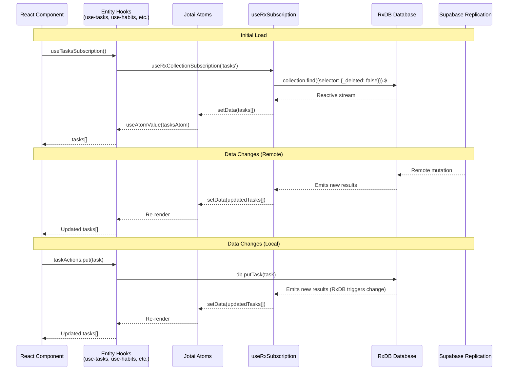
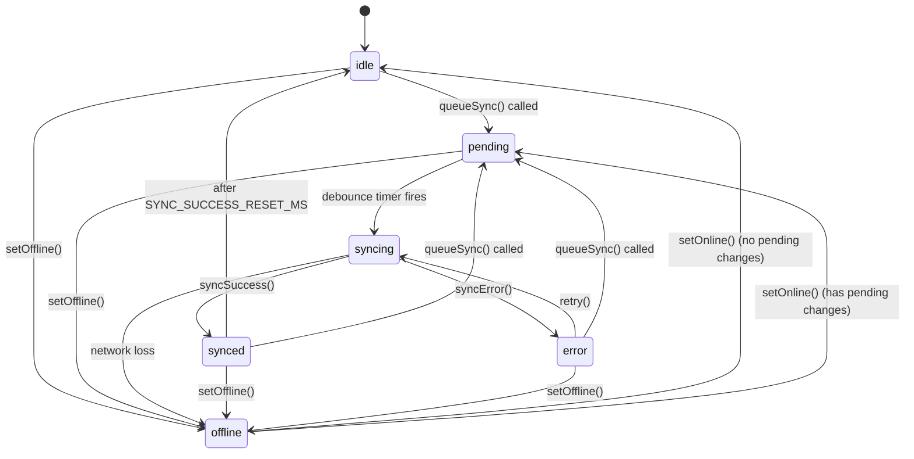

# Stores Module

This document maps module `src/stores/` (Zustand stores, Jotai atoms, entity hooks); the source is authoritative.

## Overview

The **Stores** module is the **central state management layer** of the buobu application. It provides a dual-pronged approach to client-side state:

1. **Zustand Stores** — Global, cross-cutting state such as authentication, database lifecycle, board/swimlane data, synchronization status, theme preferences, entitlements, and UI filter/selection state.
2. **Jotai Atoms** — Fine-grained, domain-specific state for each entity type (tasks, habits, notes, bookmarks, mindmaps, vision items, routines, timeblocks, backlog items), derived atoms for filtering and grouping, and loading states.
3. **RxDB Subscription Hooks** — React hooks that bridge RxDB reactive queries to Jotai atoms via `useRxSubscription`, automatically keeping the UI in sync with local database mutations and remote sync.

This architecture replaces the older pattern of one-shot `useEffect` + `exec()` queries with **reactive data subscriptions** that continuously update the UI as data changes (local edits, sync from Supabase, imports, etc.).

### Core Responsibilities

1. **Global State Management** — Provide Zustand stores for cross-cutting concerns (auth, db, boards, sync, theme, entitlements, filters, selections)
2. **Entity State Management** — Define Jotai atoms for each entity type with derived atoms for filtered/active/archived views
3. **Reactive Data Binding** — Bridge RxDB reactive queries to Jotai atoms so the UI automatically reflects data changes
4. **Swimlane Selection** — Manage multi-board/swimlane selection state with persistence and filter utilities
5. **Data Synchronization Tracking** — Track sync status (idle, pending, syncing, synced, error, offline) with debounced queueing
6. **Archive/Filter UI State** — Manage archive view mode, archive filter toggles, and Kanban filter state with persistence

---

## Architecture

The Stores module employs a **layered state architecture**:



### Data Flow



---

## Zustand Stores

### AuthStore

See also: [AuthProvider documentation](auth-provider.md)

```typescript
// stores/auth-store.ts
interface AuthState {
  user: User | null;               // Current authenticated user
  isLoading: boolean;               // True while auth state is resolving
  isAuthenticated: boolean;         // Convenience boolean (!!user)

  // Actions
  setAuthState: (next: { user: User | null; isLoading: boolean }) => void;
  resetAuthState: () => void;
}

export const useAuthStore = create<AuthState>(...)
```

**Purpose**: Provides global access to authentication state without requiring the `AuthContext`. Used by components deep in the tree and by hooks like `useSyncGate`.

**Initial State**: `{ user: null, isLoading: true, isAuthenticated: false }`

---

### DbStore

See also: [AuthProvider documentation](auth-provider.md)

```typescript
// stores/db-store.ts
interface DbState {
  db: Database | null;             // RxDB database instance
  isLoading: boolean;               // True while database is initializing
  error: Error | null;              // Initialization error, if any

  // Actions
  initialize: (userId: string) => Promise<void>;  // Open RxDB, check migration
  reset: () => void;                               // Clear database reference
}

export const useDbStore = create<DbState>(...)
```

**Purpose**: Manages the lifecycle of the RxDB database instance. All other stores and hooks depend on `db` being available.

**Key Behaviors**:
- On `initialize(userId)`: checks for data migration from an older RxDB version (`checkMigrationNeeded` → `migrateFromOldDB`), then opens the database via `getDatabase(userId)`
- On database name conflicts (`DB8` or `duplicate` error messages): logs a warning suggesting browser storage clear
- `reset()`: clears the database reference (used on logout)

---

### BoardStore

```typescript
// stores/board-store.ts
interface BoardState {
  boards: Board[];                  // All boards (including archived)
  swimlanes: Swimlane[];            // All swimlanes (including archived)
  isLoading: boolean;               // True while loading
  _unsubscribers: (() => void)[];   // Cleanup callbacks

  // Board CRUD
  loadBoards: () => Promise<void>;
  putBoard: (board: Partial<Board>) => Promise<Board | void>;
  deleteBoard: (boardId: string) => Promise<void>;
  archiveBoard: (boardId: string) => Promise<void>;
  unarchiveBoard: (boardId: string) => Promise<void>;
  permanentDeleteBoard: (boardId: string) => Promise<void>;
  setBoards: (boards: Board[]) => void;

  // Swimlane CRUD
  putSwimlane: (swimlane: Partial<Swimlane>) => Promise<Swimlane>;
  deleteSwimlane: (swimlaneId: string) => Promise<void>;
  archiveSwimlane: (swimlaneId: string) => Promise<void>;
  unarchiveSwimlane: (swimlaneId: string) => Promise<void>;
  permanentDeleteSwimlane: (swimlaneId: string) => Promise<void>;
  setSwimlanes: (swimlanes: Swimlane[]) => void;
  reloadSwimlanes: () => Promise<void>;
  moveSwimlane: (swimlaneId: string, targetBoardId: string) => Promise<void>;

  // Reordering
  reorderBoards: (orderedIds: string[]) => Promise<void>;
  reorderSwimlanes: (orderedIds: string[]) => Promise<void>;
  reorderColumns: (boardId: string, orderedColumnIds: string[]) => Promise<void>;

  // Data
  getSwimlaneResources: (swimlaneId: string) => Promise<SwimlaneResources>;

  // Lifecycle
  cleanup: () => void;
}
```

**Purpose**: Central store for boards and swimlanes data. Used by the `useBoards` hook to provide filtered, selection-aware data to all components.

**Key Behaviors**:
- `loadBoards()` fetches boards and swimlanes from RxDB via `db.getAllBoards()` and `db.getSwimlanesByBoard(boardId)` in parallel
- All CRUD operations perform the write via `lib/db` then reload to refresh state
- `reorderBoards` and `reorderSwimlanes` use **optimistic updates** — they update local state immediately, then persist each item's new `order` index
- `moveSwimlane` transfers a swimlane and all its resources (tasks, habits, routines, notes, bookmarks, mindmaps, vision items) to a target board, mapping column IDs appropriately
- `getSwimlaneResources` aggregates all entity types for a given swimlane
- `cleanup()` unsubscribes all RxDB subscriptions and resets state

**SwimlaneResources**:
```typescript
type SwimlaneResources = {
  tasks: Task[];
  habits: Habit[];
  routines: Routine[];
  notes: Note[];
  bookmarks: Bookmark[];
  mindmaps: Mindmap[];
  visionItems: VisionBoardItem[];
};
```

---

### SyncStore

```typescript
// stores/sync-store.ts
type SyncStatus = 'idle' | 'pending' | 'syncing' | 'synced' | 'error' | 'offline';

interface SyncState {
  status: SyncStatus;
  lastSyncedAt: Date | null;
  errorMessage: string | null;
  hasPendingChanges: boolean;

  // Actions
  startSync: () => void;
  syncSuccess: () => void;
  syncError: (message: string) => void;
  setPending: () => void;
  setOffline: () => void;
  setOnline: () => void;
  retry: () => void;
  reset: () => void;
}

export const useSyncStore = create<SyncState>(...)
export function queueSync(): void  // Public API to trigger a debounced sync
```

**Purpose**: Tracks the status of Supabase replication synchronization. Components use this to show sync indicators, error messages, and retry buttons.

**Sync Status Machine**:



**Key Constants**:
| Constant | Value | Purpose |
|---|---|---|
| `SYNC_DEBOUNCE_MS` | 1500ms | Debounce delay before triggering a sync |
| `SYNC_SUCCESS_RESET_MS` | 3000ms | Time after 'synced' before returning to 'idle' |
| `SYNC_SETTLE_MS` | 800ms | Wait time after triggering resync before checking success |

**Key Behaviors**:
- `queueSync()` is the main public entry point — sets status to 'pending' and schedules a debounced sync
- The sync function checks online status, authenticates, checks replication pause state, calls `triggerSupabaseResync`, waits for settle time, then checks success
- If offline, the store reports 'offline' status and any pending changes are tracked for retry when online
- `setOnline()` automatically re-queues a sync if there are pending changes
- Sync is paused when `isSupabaseReplicationPaused(user.id)` returns true (e.g., Free tier users)
- In **Local Mode** both `queueSync()` and the internal `runSync()` return immediately: there is nothing to sync to, so the store stays `idle` rather than showing a perpetual "pending" badge

---

### ThemeStore

```typescript
// stores/theme-store.ts
type Theme = 'light' | 'dark' | 'system';

interface ThemeState {
  theme: Theme;                      // User preference (light, dark, system)
  resolvedTheme: 'light' | 'dark';   // Actual resolved theme

  // Actions
  setTheme: (theme: Theme) => void;
  toggleTheme: () => void;           // Cycles: light → dark → system → light
  initTheme: () => void;             // Initialize from localStorage
}

export const useThemeStore = create<ThemeState>(...)
```

**Purpose**: Manages the application theme preference with persistence in localStorage. Supports light, dark, and system (follow OS preference) modes.

**Key Behaviors**:
- `initTheme()` reads from `localStorage` key defined in `STORAGE_KEYS.THEME`; falls back to 'system'
- `resolveTheme()` converts 'system' to actual 'light' or 'dark' using `window.matchMedia('(prefers-color-scheme: dark)')`
- `setTheme()` persists to localStorage and updates both `theme` and `resolvedTheme`
- `toggleTheme()` cycles through `['light', 'dark', 'system']`

---

### FilterStore

```typescript
// stores/filter-store.ts
type KanbanFilterState = {
  searchText: string;
  date: string;
  deadline: string;
  priorities: string[];
  labels: string[];
};

interface FilterStore {
  filters: KanbanFilterState;
  setFilters: (filters: KanbanFilterState) => void;
  resetFilters: () => void;
}

export const useFilterStore = create<FilterStore>()(persist(..., { name: "goals-kanban-filters-v2" }))
```

**Purpose**: Maintains Kanban board filter state (search text, date range, deadlines, priorities, labels) with localStorage persistence for session continuity.

---

### ArchiveFilterStore

```typescript
// stores/archive-filter-store.ts
interface ArchiveFilterState {
  showArchivedItems: boolean;
  setShowArchivedItems: (value: boolean) => void;
  isLockedBySelection: boolean;      // True when archived board/swimlane forces archived mode
  setLockedBySelection: (value: boolean) => void;
}

export const useArchiveFilterStore = create<ArchiveFilterState>(...)
```

**Purpose**: Controls whether archived items are visible in the UI. The `isLockedBySelection` flag is set when the user selects an archived board or swimlane, forcing archive mode ON and preventing the user from toggling it off.

---

### ArchiveViewStore

```typescript
// stores/archive-view-store.ts
interface ArchiveViewTarget {
  boardId: string;
  swimlaneId?: string;
  entityType?: string;
  entityId?: string;
}

interface ArchiveViewState {
  target: ArchiveViewTarget | null;  // Current archive view target
  enter: (target: ArchiveViewTarget) => void;   // Enter read-only archive mode
  exit: () => void;                              // Exit archive mode
}

export const useArchiveViewStore = create<ArchiveViewState>(...)
```

**Purpose**: Manages the **read-only archive view mode**. When set, the app displays archived content for a specific board/swimlane/entity in a read-only viewer, rather than the normal interactive mode.

---

### EntitlementsStore

See also: [AuthProvider documentation](auth-provider.md)

```typescript
// stores/entitlements-store.ts
type EntitlementsCache = {
  isPlus: boolean;
  hasSyncAccess: boolean;
  plan: 'free' | 'plus';
  status: string;
  currentPeriodEnd: string | null;
  cancelAtPeriodEnd: boolean;
  trialEnd: string | null;
  cohort: 'founder' | 'early' | 'standard';
};

interface EntitlementsState extends EntitlementsCache {
  isLoading: boolean;
  isOffline: boolean;
  refreshEntitlements: () => Promise<void>;   // Fetch from Supabase
  resetEntitlements: () => void;               // Clear on sign-out
}

export const useEntitlementsStore = create<EntitlementsState>(...)
export function useEntitlements()  // Convenience selector
```

**Purpose**: Fetches and caches user subscription entitlements from the Supabase `entitlements` view. Provides `isPlus` and `hasSyncAccess` flags that gate features like cloud sync.

**Key Behaviors**:
- When `BILLING_ENABLED` is false (development/local), all users get Plus-tier access with no Supabase fetch
- When billing is enabled, initializes from localStorage cache to avoid a flash of Free-tier UI on reload
- `refreshEntitlements()` fetches from Supabase, caches result in localStorage on success
- On network failure: falls back to cached values with `isOffline: true`; if no cache exists, defaults to Free tier
- `resetEntitlements()` clears cache and resets to free defaults (called on sign-out)

---

### SwimlaneSelectionStore

```typescript
// stores/swimlane-selection-store.ts
type Selection = string;  // Format: "boardId:swimlaneId" | "boardId:*" | "*:*"

interface ParsedSelection {
  boardId: string;
  swimlaneId: string;
}

interface SwimlaneSelectionState {
  selections: Selection[];
  selectAll: () => void;
  selectBoard: (boardId: string) => void;
  toggleSwimlane: (boardId: string, swimlaneId: string) => void;
  clearSelection: () => void;
}
```

**Derived Hook**:
```typescript
export function useSwimlaneSelectionDerived() {
  // Returns computed values:
  //   selections, isAllSelected, selectedSwimlaneIds, selectedBoardIds,
  //   primaryBoardId, hasSelections, isSwimlaneSelected(id), isBoardSelected(id)
}
```

**Filter Utilities**:
```typescript
export function filterSwimlanes<T extends { id: string; boardId: string }>(
  swimlanes: T[], selections: Selection[]
): T[]

export function filterItems<T extends { swimlaneId: string; boardId: string }>(
  items: T[], selections: Selection[]
): T[]
```

**Purpose**: Manages which boards and swimlanes are currently selected/viewed. Supports three selection modes:

| Selection Format | Meaning | Example |
|---|---|---|
| `*:*` | All boards and swimlanes | Select All |
| `boardId:*` | All swimlanes in a specific board | Select Board |
| `boardId:swimlaneId` | A specific swimlane | Toggle Swimlane |

Multiple individual swimlane selections can coexist. Persisted to localStorage under key `buobu-swimlane-selections`.

**Selection Fallback**: When all individual swimlane selections are removed, the store falls back to the board-level selection (`boardId:*`) so the UI doesn't reset to the first board.

**Helper Functions**:
| Function | Description |
|---|---|
| `parseSelection(sel: Selection): ParsedSelection` | Parses "boardId:swimlaneId" into `{ boardId, swimlaneId }` |
| `createSelection(boardId: string, swimlaneId: string): Selection` | Creates selection string from parts |
| `filterSwimlanes(swimlanes, selections)` | Filters swimlanes array based on current selections |
| `filterItems(items, selections)` | Filters entity items array based on current selections |

---

## Jotai Atoms

The Stores module defines Jotai atoms for each entity type following a consistent pattern:

### Base Atom Pattern

```
{entity}Atom           → Entity[]      # All documents (including archived)
{entity}LoadingAtom    → boolean       # Loading state
```

### Derived Atom Pattern

```
filtered{Entity}Atom        → Entity[]  # Filtered by swimlane selection
active{Entity}Atom          → Entity[]  # Non-archived only
archived{Entity}Atom        → Entity[]  # Archived only
board{Entity}AtomFamily     → (boardId) => Entity[]  # Per-board
```

### Entity-Specific Atoms

| Entity | Base Atoms | Derived Atoms | Extra Atoms |
|---|---|---|---|
| **Tasks** | `tasksAtom`, `tasksLoadingAtom` | `filteredTasksAtom`, `activeTasksAtom`, `archivedTasksAtom`, `deadlineTasksAtom` | `tasksByColumnAtom`, `boardTasksAtomFamily` |
| **Habits** | `habitsAtom`, `habitsLoadingAtom`, `habitLogsAtom`, `habitLogsLoadingAtom` | `filteredHabitsAtom`, `activeHabitsAtom`, `archivedHabitsAtom` | `boardHabitsAtomFamily`, `logsByHabitAtom` |
| **Notes** | `notesAtom`, `notesLoadingAtom` | `filteredNotesAtom`, `activeNotesAtom`, `archivedNotesAtom`, `pinnedNotesAtom` | `boardNotesAtomFamily` |
| **Bookmarks** | `bookmarksAtom`, `bookmarksLoadingAtom` | `filteredBookmarksAtom`, `activeBookmarksAtom`, `archivedBookmarksAtom`, `pinnedBookmarksAtom` | — |
| **Mindmaps** | `mindmapsAtom`, `mindmapsLoadingAtom` | `filteredMindmapsAtom`, `activeMindmapsAtom`, `archivedMindmapsAtom` | `boardMindmapsAtomFamily` |
| **Vision Items** | `visionItemsAtom`, `visionItemsLoadingAtom` | `filteredVisionItemsAtom`, `activeVisionItemsAtom`, `archivedVisionItemsAtom` | `boardVisionItemsAtomFamily` |
| **Routines** | `routinesAtom`, `routinesLoadingAtom`, `routineLogsAtom`, `routineLogsLoadingAtom` | `activeRoutinesAtom`, `archivedRoutinesAtom`, `dueRoutinesAtom`, `approvalRequiredRoutinesAtom`, `autoProcessRoutinesAtom` | `logsByRoutineAtom` |
| **Timeblocks** | `timeblocksAtom`, `timeblocksLoadingAtom` | `activeTimeblocksAtom`, `archivedTimeblocksAtom` | — |
| **Backlog** | `backlogItemsAtom`, `backlogLoadingAtom` | `activeBacklogItemsAtom`, `archivedBacklogItemsAtom` | `swimlaneBacklogAtomFamily`, `backlogCountsAtom` |

### Swimlane Selection Integration

All entity atoms use the `filterItems()` utility from `swimlane-selection-store` in their derived filtered atoms:

```typescript
// stores/atoms/tasks.ts
export const filteredTasksAtom = atom<Task[]>((get) => {
  const tasks = get(tasksAtom);
  const selections = useSwimlaneSelectionStore.getState().selections;
  return filterItems(tasks, selections);
});
```

Note: These access the store directly via `getState()` rather than through a hook subscription to avoid circular dependency issues with Jotai.

---

## RxDB Subscription Hooks

### `useRxSubscription`

The core bridge hook that connects RxDB reactive queries to Jotai atoms:

```typescript
function useRxSubscription<TName extends CollectionName>(
  collectionName: TName,                                          // e.g., 'tasks', 'habits'
  query: MangoQuery<CollectionDoc<TName>>,                         // RxDB query (selector)
  targetAtom: WritableAtom<CollectionDoc<TName>[], [CollectionDoc<TName>[]], void>,  // Jotai atom to sync into
  loadingAtom?: WritableAtom<boolean, [boolean], void>             // Optional loading atom
): void
```

**Key Behaviors**:
- Subscribes to `collection.find(query).$` — a reactive RxDB stream that emits whenever matching documents change
- On each emission, maps documents to plain JSON via `doc.toMutableJSON()` and sets the target atom
- Sets loading state to `true` on subscription start, `false` on first emission or error
- Automatically cleans up subscription on unmount or when `db`/`query` changes
- Uses `useMemo` on `JSON.stringify(query)` to avoid unnecessary re-subscriptions when query object reference changes but content is the same

### `useRxCollectionSubscription`

Convenience hook for subscribing to all non-deleted documents in a collection:

```typescript
function useRxCollectionSubscription<TName extends CollectionName>(
  collectionName: TName,
  targetAtom: WritableAtom<...>,
  loadingAtom?: WritableAtom<boolean, [boolean], void>
): void
```

Equivalent to: `useRxSubscription(collectionName, { selector: { _deleted: false } }, targetAtom, loadingAtom)`

### `useRxBoardSubscription`

Convenience hook for subscribing to documents filtered by `boardId`:

```typescript
function useRxBoardSubscription<TName extends CollectionName>(
  collectionName: TName,
  boardId: string | null | undefined,
  targetAtom: WritableAtom<...>,
  loadingAtom?: WritableAtom<boolean, [boolean], void>
): void
```

- If `boardId` is truthy: subscribes with `{ selector: { boardId, _deleted: false } }`
- If `boardId` is falsy: subscribes with `{ selector: { _deleted: false } }` (falls back to all)

---

## Entity Hooks

Each entity type has a corresponding hook file in `stores/hooks/` that provides:

1. **Subscription hooks** — To be mounted at page or provider level (e.g., `useTasksSubscription()`)
2. **Read hooks** — To read from Jotai atoms (e.g., `useTasks()`, `useFilteredTasks()`)
3. **Action objects** — Write-through mutation actions (e.g., `taskActions.put()`)

### Hook Pattern

```typescript
// Example: stores/hooks/use-tasks.ts
'use client';

import { useAtomValue } from 'jotai';
import { useRxCollectionSubscription, useRxBoardSubscription } from './use-rx-subscription';
import { tasksAtom, tasksLoadingAtom, filteredTasksAtom, ... } from '../atoms/tasks';
import * as db from '@/lib/db';

// 1. Subscription hook (mount at provider level)
export function useTasksSubscription() {
  useRxCollectionSubscription('tasks', tasksAtom, tasksLoadingAtom);
}

// 2. Board-scoped subscription hook
export function useBoardTasksSubscription(boardId: string | null | undefined) {
  useRxBoardSubscription('tasks', boardId, tasksAtom, tasksLoadingAtom);
}

// 3. Read hooks
export function useTasks() { return useAtomValue(tasksAtom); }
export function useFilteredTasks() { return useAtomValue(filteredTasksAtom); }
export function useActiveTasks() { return useAtomValue(activeTasksAtom); }
export function useArchivedTasks() { return useAtomValue(archivedTasksAtom); }
export function useTasksLoading() { return useAtomValue(tasksLoadingAtom); }

// 4. Action object (write-through to RxDB)
export const taskActions = {
  put: db.putTask,
  delete: db.deleteTask,
};
```

### Available Hooks Summary

| Hook File | Subscription Hooks | Read Hooks | Actions |
|---|---|---|---|
| `use-tasks.ts` | `useTasksSubscription`, `useBoardTasksSubscription` | `useTasks`, `useFilteredTasks`, `useActiveTasks`, `useArchivedTasks`, `useTasksLoading` | `taskActions.put`, `taskActions.delete` |
| `use-habits.ts` | `useHabitsSubscription`, `useBoardHabitsSubscription`, `useHabitLogsSubscription` | `useHabits`, `useFilteredHabits`, `useActiveHabits`, `useArchivedHabits`, `useHabitLogs`, `useLogsByHabit` | `habitActions.put`, `habitActions.delete`, `habitActions.putLog`, `habitActions.deleteLog` |
| `use-notes.ts` | `useNotesSubscription`, `useBoardNotesSubscription` | `useNotes`, `useFilteredNotes`, `useActiveNotes`, `useArchivedNotes`, `usePinnedNotes` | `noteActions.put`, `noteActions.delete` |
| `use-bookmarks.ts` | `useBookmarksSubscription`, `useBoardBookmarksSubscription` | `useBookmarks`, `useFilteredBookmarks`, `useActiveBookmarks`, `useArchivedBookmarks`, `usePinnedBookmarks` | `bookmarkActions.put`, `bookmarkActions.delete` |
| `use-mindmaps.ts` | `useMindmapsSubscription`, `useBoardMindmapsSubscription` | `useMindmaps`, `useFilteredMindmaps`, `useActiveMindmaps`, `useArchivedMindmaps` | `mindmapActions.put`, `mindmapActions.delete` |
| `use-vision.ts` | `useVisionItemsSubscription`, `useBoardVisionItemsSubscription` | `useVisionItems`, `useFilteredVisionItems`, `useActiveVisionItems`, `useArchivedVisionItems` | `visionItemActions.put`, `visionItemActions.delete` |
| `use-routines.ts` | `useRoutinesSubscription`, `useRoutineLogsSubscription` | `useRoutines`, `useActiveRoutines`, `useArchivedRoutines`, `useDueRoutines`, `useApprovalRequiredRoutines`, `useAutoProcessRoutines`, `useRoutineLogs`, `useLogsByRoutine` | `routineActions.put`, `routineActions.archive`, `routineActions.delete`, `routineActions.putLog` |
| `use-timeblocks.ts` | `useTimeblocksSubscription` | `useAllTimeblocks`, `useActiveTimeblocks`, `useArchivedTimeblocks`, `useTimeblocksLoading` | `timeblockActions.put`, `timeblockActions.archive`, `timeblockActions.unarchive`, `timeblockActions.permanentDelete`, `timeblockActions.detach` |
| `use-boards.ts` | `useBoardsSubscription` | `useBoards` (comprehensive) | (via store actions) |

### `useBoards` Hook

The `useBoards` hook is the most complex — it combines data from multiple stores:

```typescript
export function useBoards() {
  // Board/swimlane data from BoardStore
  const boards = useBoardStore((s) => s.boards);
  const swimlanes = useBoardStore((s) => s.swimlanes);
  const isLoading = useBoardStore((s) => s.isLoading);
  // ... CRUD actions from board store
  
  // Selection state from SwimlaneSelectionStore
  const { selections, isAllSelected, selectedSwimlaneIds, ... } = useSwimlaneSelectionDerived();
  const { selectAll, selectBoard, toggleSwimlane, clearSelection } = useSwimlaneSelectionStore();
  
  // Computed values
  const activeBoards = useMemo(() => boards.filter((b) => !b.archived), [boards]);
  const activeSwimlanes = useMemo(() => swimlanes.filter((s) => !s.archived), [swimlanes]);
  const board = useMemo(() => resolvePrimaryBoard(...), [boards, activeBoards, primaryBoardId]);
  const labels = useMemo(() => board?.naming ?? DEFAULT_NAMING, [board?.naming]);
  
  // Filter swimlanes by selection + archive filter
  const filteredSwimlanes = useMemo(() => {
    const swList = swimlanes.filter((s) => !!s.boardId);
    const result = filterSwimlanes(swList, selections);
    if (!board?.archived && !hasExplicitSwimlaneIds && !showArchivedItems) {
      return result.filter((s) => !s.archived);
    }
    return result;
  }, [swimlanes, board, selections, showArchivedItems]);
  
  // Archive mode detection
  const isArchivedFromSelection = ...;
  const isArchivedSelectionMode = showArchivedItems || isArchivedFromSelection;
  
  // Sync archive filter state with selection
  useEffect(() => {
    if (isArchivedFromSelection) {
      setShowArchivedItems(true);
      setLockedBySelection(true);
    } else {
      setShowArchivedItems(false);
      setLockedBySelection(false);
    }
  }, [isArchivedFromSelection]);
  
  return {
    boards, swimlanes, activeBoards, activeSwimlanes, filteredSwimlanes,
    board, labels, isLoading, isArchivedSelectionMode,
    selections, isAllSelected, selectedSwimlaneIds, selectedBoardIds,
    primaryBoardId, hasSelections, isSwimlaneSelected, isBoardSelected,
    selectAll, selectBoard, toggleSwimlane, clearSelection,
    putBoard, deleteBoard, putSwimlane, deleteSwimlane, loadBoards, reloadSwimlanes,
  };
}
```

**Returns**: A comprehensive object combining board/swimlane data, selection state, archive mode state, and CRUD actions — designed to replace the duplicate board loading pattern that existed in every component.

### `useBoardsSubscription`

Subscribes to RxDB `boards` and `swimlanes` collections reactively and updates the Zustand BoardStore. This is critical because boards/swimlanes loaded from Supabase sync are written into RxDB, but without this subscription, the Zustand store would never be notified and the UI would stay stale.

```typescript
export function useBoardsSubscription() {
  const db = useDbStore((s) => s.db);
  const setBoards = useBoardStore((s) => s.setBoards);
  const setSwimlanes = useBoardStore((s) => s.setSwimlanes);

  useEffect(() => {
    if (!db) return;
    // Subscribe to boards collection and swimlanes collection
    // On each emission: sort by order then name, update Zustand state
    return () => { /* unsubscribe */ };
  }, [db, setBoards, setSwimlanes]);
}
```

Mount this once in a top-level layout component (e.g., `AppLayout`) that is always rendered while the user is authenticated.

---

## Public API (`stores/index.ts`)

```typescript
'use client';

// --- Zustand Stores ---
export { useDbStore } from './db-store';
export { useAuthStore } from './auth-store';
export { useBoardStore } from './board-store';
export { 
  useSwimlaneSelectionStore, 
  useSwimlaneSelectionDerived,
  filterSwimlanes,
  filterItems,
  parseSelection,
  createSelection,
  type Selection,
  type ParsedSelection,
} from './swimlane-selection-store';
export { useSyncStore } from './sync-store';
export { useArchiveViewStore, type ArchiveViewTarget } from './archive-view-store';

// --- Hooks ---
export { useRxSubscription, useRxCollectionSubscription, useRxBoardSubscription } from './hooks/use-rx-subscription';
export { useBoards, useBoardsSubscription } from './hooks/use-boards';
export { useTasksSubscription, useBoardTasksSubscription, useTasks, useFilteredTasks, useActiveTasks, useArchivedTasks, useTasksLoading, taskActions } from './hooks/use-tasks';
export { useHabitsSubscription, useBoardHabitsSubscription, useHabitLogsSubscription, useHabits, useFilteredHabits, useActiveHabits, useArchivedHabits, useHabitLogs, useLogsByHabit, habitActions } from './hooks/use-habits';
export { useNotesSubscription, useBoardNotesSubscription, useNotes, useFilteredNotes, useActiveNotes, useArchivedNotes, usePinnedNotes, noteActions } from './hooks/use-notes';
export { useBookmarksSubscription, useBoardBookmarksSubscription, useBookmarks, useFilteredBookmarks, useActiveBookmarks, useArchivedBookmarks, usePinnedBookmarks, bookmarkActions } from './hooks/use-bookmarks';
export { useVisionItemsSubscription, useBoardVisionItemsSubscription, useVisionItems, useFilteredVisionItems, useActiveVisionItems, useArchivedVisionItems, visionItemActions } from './hooks/use-vision';
export { useMindmapsSubscription, useBoardMindmapsSubscription, useMindmaps, useFilteredMindmaps, useActiveMindmaps, useArchivedMindmaps, mindmapActions } from './hooks/use-mindmaps';
export { useRoutinesSubscription, useRoutineLogsSubscription, useRoutines, useActiveRoutines, useArchivedRoutines, useDueRoutines, useApprovalRequiredRoutines, useAutoProcessRoutines, useRoutineLogs, useLogsByRoutine, routineActions } from './hooks/use-routines';
```

Note: Not all Zustand stores are re-exported from the index. Stores that are used primarily by providers or specific components (`theme-store`, `filter-store`, `archive-filter-store`, `entitlements-store`) are imported directly from their file paths.

---

## Dependency Graph

```mermaid
graph TD
    subgraph "Zustand Stores"
        AS[AuthStore]
        DS[DbStore]
        BS[BoardStore]
        SS[SyncStore]
        TS[ThemeStore]
        ES[EntitlementsStore]
        FS[FilterStore]
        AFS[ArchiveFilterStore]
        AVS[ArchiveViewStore]
        SLS[SwimlaneSelectionStore]
    end

    subgraph "Jotai Atoms"
        TA[Tasks Atoms]
        HA[Habits Atoms]
        NA[Notes Atoms]
        BA[Bookmarks Atoms]
        MA[Mindmaps Atoms]
        VA[Vision Atoms]
        RA[Routines Atoms]
        TBA[Timeblocks Atoms]
        BLA[Backlog Atoms]
    end

    subgraph "RxDB Hooks"
        RS[useRxSubscription]
        RCS[useRxCollectionSubscription]
        RBS[useRxBoardSubscription]
    end

    subgraph "Entity Hooks"
        TH[use-tasks]
        HH[use-habits]
        NH[use-notes]
        BKH[use-bookmarks]
        MH[use-mindmaps]
        VH[use-vision]
        RH[use-routines]
        TBH[use-timeblocks]
        BH[use-boards]
    end

    subgraph "External Dependencies"
        RXDB[RxDB Database<br/>lib/rxdb.ts]
        DB[Data Access<br/>lib/db.ts]
        AUTH[Auth Service<br/>lib/auth/service.ts]
        SR[Supabase Replication<br/>lib/supabase-replication.ts]
        SUPABASE[Supabase Client<br/>lib/supabase.ts]
        MIGRATION[Data Migration<br/>lib/migration.ts]
        CONSTANTS[Constants<br/>lib/constants.ts]
        FEATURE_FLAGS[Feature Flags<br/>lib/feature-flags.ts]
        NAMING[Naming Config<br/>lib/naming.ts]
    end

    subgraph "Consumer Modules"
        AP[AuthProvider]
        UI[UI Components]
    end

    %% RxDB → Hooks
    RXDB --> RS
    RS --> RCS
    RS --> RBS

    %% Hooks → Atoms
    RCS --> TA
    RCS --> HA
    RCS --> NA
    RCS --> BA
    RCS --> MA
    RCS --> VA
    RCS --> RA
    RCS --> TBA
    RCS --> BLA

    %% Hooks → BoardStore
    BH -.->|RxDB reactive subscription| BS

    %% Atoms → Swimlane Selection
    TA --> SLS
    HA --> SLS
    NA --> SLS
    BA --> SLS
    MA --> SLS
    VA --> SLS

    %% Entity Hooks → Atoms
    TH --> TA
    HH --> HA
    NH --> NA
    BKH --> BA
    MH --> MA
    VH --> VA
    RH --> RA
    TBH --> TBA

    %% Entity Hooks → DB
    TH --> DB
    HH --> DB
    NH --> DB
    BKH --> DB
    MH --> DB
    VH --> DB
    RH --> DB
    TBH --> DB

    %% Entity Hooks → RxDB Hooks
    TH --> RCS
    HH --> RCS
    NH --> RCS
    BKH --> RCS
    MH --> RCS
    VH --> RCS
    RH --> RCS
    TBH --> RCS

    %% Board Hook → Stores
    BH --> BS
    BH --> SLS
    BH --> AFS
    BH --> DS

    %% Store Dependencies
    DS --> RXDB
    DS --> MIGRATION
    ES --> SUPABASE
    ES --> CONSTANTS
    ES --> FEATURE_FLAGS
    SS --> AUTH
    SS --> SR
    TS --> CONSTANTS

    %% Consumers
    AP --> AS
    AP --> DS
    AP --> BS
    AP --> SS
    AP --> ES
    AP --> BH
    UI --> TH
    UI --> HH
    UI --> NH
    UI --> BH
    UI --> TS
    UI --> FS
    UI --> AFS
    UI --> AVS
    UI --> SLS
```



---

## Usage Guide

### Subscribing to Entity Data

Mount subscription hooks high in the component tree (e.g., in page or layout components):

```tsx
// In a page component
'use client';
import { useTasksSubscription, useTasks, useTasksLoading } from '@/stores';

function TasksPage() {
  useTasksSubscription();  // Mount subscription — activates reactive data flow

  const tasks = useTasks();
  const isLoading = useTasksLoading();

  if (isLoading) return <LoadingSpinner />;

  return <TaskList tasks={tasks} />;
}
```

### Reading Filtered Data

```tsx
function SwimlaneTaskView() {
  // useBoards provides swimlane selection + filtering automatically
  const { filteredSwimlanes } = useBoards();
  const filteredTasks = useFilteredTasks();  // Tasks filtered by current swimlane selection

  return (
    <div>
      {filteredSwimlanes.map((swimlane) => (
        <SwimlaneColumn
          key={swimlane.id}
          swimlane={swimlane}
          tasks={filteredTasks.filter((t) => t.swimlaneId === swimlane.id)}
        />
      ))}
    </div>
  );
}
```

### Mutating Data

Use action objects for write-through mutations:

```tsx
import { taskActions } from '@/stores';
import { uuidv7 } from '@/lib/uuid';

async function handleCreateTask(data: Partial<Task>) {
  await taskActions.put({
    ...data,
    id: uuidv7(),
    createdAt: new Date().toISOString(),
  } as Task);
  // The subscription auto-updates the atom — no manual refresh needed
}

async function handleDeleteTask(taskId: string) {
  await taskActions.delete(taskId);
  // UI updates automatically
}
```

### Managing Swimlane Selection

```tsx
function BoardSelector() {
  const {
    boards,
    isAllSelected,
    selectedBoardIds,
    selectAll,
    selectBoard,
  } = useBoards();

  return (
    <div>
      <button onClick={selectAll} style={{ fontWeight: isAllSelected ? 'bold' : 'normal' }}>
        All Boards
      </button>
      {boards.filter(b => !b.archived).map((board) => (
        <button
          key={board.id}
          onClick={() => selectBoard(board.id)}
          style={{ fontWeight: selectedBoardIds.has(board.id) ? 'bold' : 'normal' }}
        >
          {board.name}
        </button>
      ))}
    </div>
  );
}
```

### Archive View Mode

```tsx
import { useArchiveViewStore } from '@/stores/archive-view-store';

function ArchiveLink({ boardId, swimlaneId }: { boardId: string; swimlaneId?: string }) {
  const enterArchiveView = useArchiveViewStore((s) => s.enter);
  const exitArchiveView = useArchiveViewStore((s) => s.exit);

  return (
    <div>
      <button onClick={() => enterArchiveView({ boardId, swimlaneId })}>
        View Archived Items
      </button>
      <button onClick={exitArchiveView}>
        Back to Active
      </button>
    </div>
  );
}
```

### Theme Management

```tsx
import { useThemeStore } from '@/stores/theme-store';

function ThemeToggle() {
  const theme = useThemeStore((s) => s.theme);
  const resolvedTheme = useThemeStore((s) => s.resolvedTheme);
  const toggleTheme = useThemeStore((s) => s.toggleTheme);

  return (
    <button onClick={toggleTheme}>
      {resolvedTheme === 'dark' ? '☀️' : '🌙'} ({theme})
    </button>
  );
}
```

### Sync Status Display

```tsx
import { useSyncStore, queueSync } from '@/stores/sync-store';

function SyncIndicator() {
  const status = useSyncStore((s) => s.status);
  const lastSyncedAt = useSyncStore((s) => s.lastSyncedAt);
  const errorMessage = useSyncStore((s) => s.errorMessage);
  const retry = useSyncStore((s) => s.retry);

  switch (status) {
    case 'synced':
      return <span>✓ Synced at {lastSyncedAt?.toLocaleTimeString()}</span>;
    case 'syncing':
      return <span>⟳ Syncing...</span>;
    case 'error':
      return <span>⚠ {errorMessage} <button onClick={retry}>Retry</button></span>;
    case 'offline':
      return <span>○ Offline</span>;
    default:
      return null;
  }
}
```

### Checking Entitlements

```tsx
import { useEntitlements } from '@/stores/entitlements-store';

function SyncGate({ children }: { children: React.ReactNode }) {
  const { isPlus, hasSyncAccess, isLoading, isOffline } = useEntitlements();

  if (isLoading) return <LoadingSpinner />;
  if (isOffline) return <span>Offline — using cached entitlements</span>;
  if (!hasSyncAccess) return <UpgradePrompt />;

  return <>{children}</>;
}
```

---

## Module Reference Table

| Store/Atom/Hook | File | Type | Persisted | Description |
|---|---|---|---|---|
| `useAuthStore` | `stores/auth-store.ts` | Zustand | No | Authentication state (user, loading) |
| `useDbStore` | `stores/db-store.ts` | Zustand | No | RxDB database instance lifecycle |
| `useBoardStore` | `stores/board-store.ts` | Zustand | No | Boards, swimlanes, and CRUD operations |
| `useSyncStore` | `stores/sync-store.ts` | Zustand | No | Sync status tracking (idle→syncing→synced→error→offline) |
| `useThemeStore` | `stores/theme-store.ts` | Zustand | localStorage | Theme preference (light/dark/system) |
| `useFilterStore` | `stores/filter-store.ts` | Zustand | localStorage | Kanban filter state (search, date, priorities, labels) |
| `useArchiveFilterStore` | `stores/archive-filter-store.ts` | Zustand | No | Archive items visibility toggle + lock flag |
| `useArchiveViewStore` | `stores/archive-view-store.ts` | Zustand | No | Read-only archive view mode |
| `useEntitlementsStore` | `stores/entitlements-store.ts` | Zustand | localStorage | Subscription entitlements (isPlus, hasSyncAccess) |
| `useSwimlaneSelectionStore` | `stores/swimlane-selection-store.ts` | Zustand | localStorage | Board/swimlane selection state |
| `useSwimlaneSelectionDerived` | `stores/swimlane-selection-store.ts` | Derived hook | No | Computed selection values (selectedIds, isAllSelected, etc.) |
| `{entity}Atom` | `stores/atoms/{entity}.ts` | Jotai | No | Base entity data atoms |
| `filterItems` / `filterSwimlanes` | `stores/swimlane-selection-store.ts` | Pure function | No | Selection-based filtering utilities |
| `useRxSubscription` | `stores/hooks/use-rx-subscription.ts` | Hook | No | Core RxDB → Jotai bridge hook |
| `useRxCollectionSubscription` | `stores/hooks/use-rx-subscription.ts` | Hook | No | All non-deleted documents subscription |
| `useRxBoardSubscription` | `stores/hooks/use-rx-subscription.ts` | Hook | No | Board-scoped subscription |
| `use{Entity}Subscription` | `stores/hooks/use-{entity}.ts` | Hook | No | Entity-specific subscription hooks |
| `useBoards` | `stores/hooks/use-boards.ts` | Hook | No | Combined boards + selection + archive state |
| `useBoardsSubscription` | `stores/hooks/use-boards.ts` | Hook | No | Reactive boards/swimlanes subscription |

---

## Related Modules

| Module | Relationship |
|---|---|
| [AuthProvider](auth-provider.md) | Consumes `AuthStore`, `DbStore`, `BoardStore`, `SyncStore`, `EntitlementsStore`; references the same stores documented here |
| [useBoardRenderProfiler](use-board-render-profiler.md) | Consumes board data from `BoardStore` for render performance profiling |
| [BoardModal](board-modal.md) | Consumes `BoardStore` for board/swimlane CRUD operations in modal forms |
