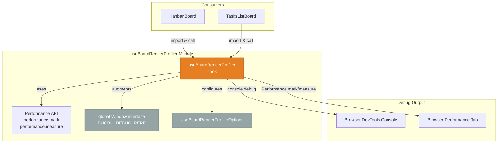
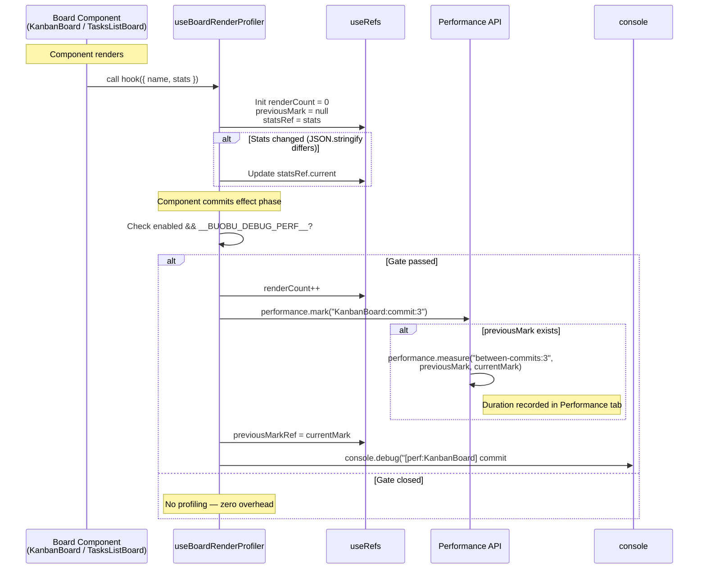

# useBoardRenderProfiler

This document maps module `src/hooks/useBoardRenderProfiler.ts`; the source is authoritative.

## Table of Contents

1. [Introduction](#introduction)
2. [Architecture Overview](#architecture-overview)
3. [Detailed API Reference](#detailed-api-reference)
   - [useBoardRenderProfiler](#useboardrenderprofiler)
   - [UseBoardRenderProfilerOptions](#useboardrenderprofileroptions)
   - [Window augmentation (`__BUOBU_DEBUG_PERF__`)](#window-augmentation-__buobu_debug_perf__)
4. [Usage Pattern](#usage-pattern)
5. [How It Works](#how-it-works)
6. [Process Flow](#process-flow)
7. [Activation & Debugging](#activation--debugging)
8. [Consumers](#consumers)
9. [Dependencies & References](#dependencies--references)

---

## Introduction

The **`useBoardRenderProfiler`** module is a lightweight React hook designed for **debugging and optimizing render performance** in board-oriented UI components (kanban boards, task list boards, etc.). It leverages the [User Timing API](https://developer.mozilla.org/en-US/docs/Web/API/Performance_API/User_timing) (`performance.mark()` / `performance.measure()`) to track render cycles and provides structured debug logging of component commits.

The hook is **gated behind two conditions** — it only activates when both:

1. The app is **not running in production** (`process.env.NODE_ENV !== "production"`)
2. A global debug flag `window.__BUOBU_DEBUG_PERF__` is explicitly set to `true`

This ensures zero overhead in production while giving developers a powerful tool for diagnosing unnecessary re-renders during development.

---

## Architecture Overview



### Key Relationships

| Component / Type | Role | Connects to |
|---|---|---|
| `useBoardRenderProfiler` | The hook itself — creates performance marks and logs | `Performance API`, `console.debug`, `useEffect`, `useRef` |
| `UseBoardRenderProfilerOptions` | Configuration type for naming and flagging | — |
| `Window` (augmented) | Global type declaration for the debug flag | Browser `window` object |
| `KanbanBoard` | Primary consumer — kanban board view | `useBoardRenderProfiler` |
| `TasksListBoard` | Secondary consumer — list view of boards | `useBoardRenderProfiler` |

---

## Detailed API Reference

### `useBoardRenderProfiler`

**File**: `src/hooks/useBoardRenderProfiler.ts`

```typescript
export function useBoardRenderProfiler({
  name,
  enabled = process.env.NODE_ENV !== "production",
  stats = {},
}: UseBoardRenderProfilerOptions)
```

A React hook that profiles render cycles of the calling component. It is **void-returning** and works entirely through side effects (performance marks, console logs, ref updates).

### `UseBoardRenderProfilerOptions`

A module-local type (it is declared in the file but **not exported**):

| Property | Type | Default | Description |
|---|---|---|---|
| `name` | `string` | **(required)** | A human-readable identifier for the profiled component. Used in performance mark names and log prefixes (e.g., `"KanbanBoard"`, `"TasksListBoard"`). |
| `enabled` | `boolean` | `process.env.NODE_ENV !== "production"` | Master switch for the profiler. When `false`, all profiling logic is skipped entirely. Defaults to active only in non-production environments. |
| `stats` | `Record<string, string \| number \| boolean \| null \| undefined>` | `{}` | A set of key-value pairs logged alongside each render event. Useful for tracking state dimensions like task count, swimlane count, mode flags, etc. |

### Window augmentation (`__BUOBU_DEBUG_PERF__`)

```typescript
declare global {
  interface Window {
    __BUOBU_DEBUG_PERF__?: boolean;
  }
}
```

A second gate that must be explicitly enabled at runtime. Even when the hook is enabled (non-production), profiling **will not run** unless `window.__BUOBU_DEBUG_PERF__` is `true`. This allows developers to:

- Keep the hook active in code without incurring runtime costs
- Enable profiling on-demand via the browser console:  
  `window.__BUOBU_DEBUG_PERF__ = true;`
- Disable it again:  
  `window.__BUOBU_DEBUG_PERF__ = false;`

> **Note**: The type augmentation is declared globally, so any file referencing the `Window` type will see `__BUOBU_DEBUG_PERF__` as an optional property.

---

## Usage Pattern

The hook is called at the top level of a board component — typically alongside other hooks — and receives a unique `name` plus contextual `stats`.

### Example: `KanbanBoard`

```typescript
useBoardRenderProfiler({
  name: "KanbanBoard",
  stats: {
    swimlanes: filteredSwimlanes.length,
    visibleTasks: boardVisibleTasks.length,
    activeTask: activeTaskId ?? "none",
    archivedMode: isArchivedSelectionMode,
  },
});
```

### Example: `TasksListBoard`

```typescript
useBoardRenderProfiler({
  name: "TasksListBoard",
  stats: {
    swimlanes: filteredSwimlanes.length,
    visibleTasks: boardVisibleTasks.length,
    activeTask: activeTaskId ?? "none",
    archivedMode: isArchivedSelectionMode,
  },
});
```

Both consumers pass the same shape of `stats`, enabling consistent cross-component comparison during performance debugging.

---

## How It Works

### Internal Mechanism

1. **Render Counter**: A `useRef(0)` (`renderCountRef`) tracks how many times the effect has fired (i.e., how many times the component committed after a state change).

2. **Stats Sync**: A separate `useEffect` keeps `statsRef.current` in sync with the latest `stats` object, comparing by `JSON.stringify` signature to avoid unnecessary updates.

3. **Profiling Effect** (core):
   - Guards: exits early if `enabled === false`, or `window` is undefined (SSR), or `window.__BUOBU_DEBUG_PERF__` is falsy.
   - Increments `renderCountRef`.
   - Creates a **performance mark** with the name pattern: `{name}:commit:{count}`, e.g., `KanbanBoard:commit:3`.
   - If a previous mark exists, measures the **duration between the last commit and this one** using `performance.measure` with the name pattern: `{name}:between-commits:{count}`.
   - Stores the current mark name for the next cycle.
   - Logs a structured debug message: `[perf:{name}] commit #{count}` followed by the current `stats` snapshot.

4. **Dependencies**: The core effect re-runs only when `enabled`, `name`, or `statsSignature` (the JSON-stringified stats) change. This means **every render with different stats triggers a new profile entry**.

### Ref Usage

| Ref | Purpose |
|---|---|
| `renderCountRef` | Monotonically increasing counter of profiled commits |
| `previousMarkRef` | Stores the previous mark name to enable `performance.measure()` between consecutive commits |
| `statsRef` | Always points to the latest `stats` object so the console log captures current state |

---

## Process Flow



---

## Activation & Debugging

### Step-by-Step Developer Workflow

1. **Ensure you're in development mode** — the hook is disabled in production by default.
2. **Open the browser's DevTools console.**
3. **Enable the profiler** by setting the global flag:
   ```javascript
   window.__BUOBU_DEBUG_PERF__ = true;
   ```
4. **Interact with the board UI** — every render commit will now:
   - Log a structured debug message to the console
   - Create entries in the **Performance** tab (under "User Timing")
5. **Disable** when done:
   ```javascript
   window.__BUOBU_DEBUG_PERF__ = false;
   ```

### What to Look For

| Signal | Meaning |
|---|---|
| Rapid commit numbers | Possible excessive re-renders in a short period |
| Large `between-commits` durations | Heavy computation or rendering in the commit |
| Unexpected commits with identical stats | State updates that don't affect UI but still trigger re-renders |
| Presence of `[perf:...]` logs | Confirms the debug flag is active and hook is tracking |

### Example Console Output

```
[perf:KanbanBoard] commit #1 {swimlanes: 4, visibleTasks: 23, activeTask: "none", archivedMode: false}
[perf:KanbanBoard] commit #2 {swimlanes: 4, visibleTasks: 24, activeTask: "task-abc", archivedMode: false}
[perf:KanbanBoard] commit #3 {swimlanes: 4, visibleTasks: 24, activeTask: "task-abc", archivedMode: false}
```

> **Tip**: Filter the console with `[perf:` to see only profiler output.

---

## Consumers

The hook is currently consumed by two board components in the application:

| Consumer | File | Profiler Name |
|---|---|---|
| `KanbanBoard` | `src/components/kanban/KanbanBoard.tsx` | `"KanbanBoard"` |
| `TasksListBoard` | `src/components/kanban/TasksListBoard.tsx` | `"TasksListBoard"` |

Both components pass similar `stats` payloads, allowing direct performance comparison between the kanban-style and list-style board views under identical data conditions.

---

## Dependencies & References

### Internal Dependencies

| Dependency | Used For |
|---|---|
| `react` (`useEffect`, `useRef`) | React hook primitives for side effects and mutable refs |
| `Window` (global augmentation) | TypeScript type declaration for `__BUOBU_DEBUG_PERF__` |

### External Browser APIs

| API | Used For |
|---|---|
| [`performance.mark()`](https://developer.mozilla.org/en-US/docs/Web/API/Performance/mark) | Creating timestamp entries in the browser's performance timeline |
| [`performance.measure()`](https://developer.mozilla.org/en-US/docs/Web/API/Performance/measure) | Measuring duration between two marks |
| [`console.debug()`](https://developer.mozilla.org/en-US/docs/Web/API/console/debug) | Logging structured commit information to the console |

### Related Modules

| Module | Relationship |
|---|---|
| [`BoardModal`](board-modal.md) | The board configuration dialog; consumers `KanbanBoard` and `TasksListBoard` render board data configured through this modal |
| [`Stores`](stores.md) | Board state management (boards, swimlanes, tasks) that drives the data flowing through profiled components |
| [`MobileFab`](mobile-fab.md) | A layout component used alongside `TasksListBoard` |
| [`AuthProvider`](auth-provider.md) | Authentication context required for board access |

### Notes

- **Production Behavior**: In production builds (`process.env.NODE_ENV === "production"`) `enabled` defaults to `false`, and the profiling effect returns on its first guard, so no marks, measures or logs are produced.
- **Server-render Safety**: The hook checks `typeof window === "undefined"` before reading `window.__BUOBU_DEBUG_PERF__`, so it does not throw when the component is rendered outside the browser.
- **Stable Stats**: The hook uses `JSON.stringify(stats)` as a dependency to the core effect, so passing a new object reference with the same key-value pairs will not trigger unnecessary re-profiling.
