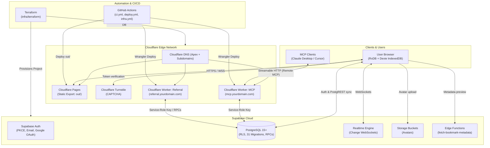
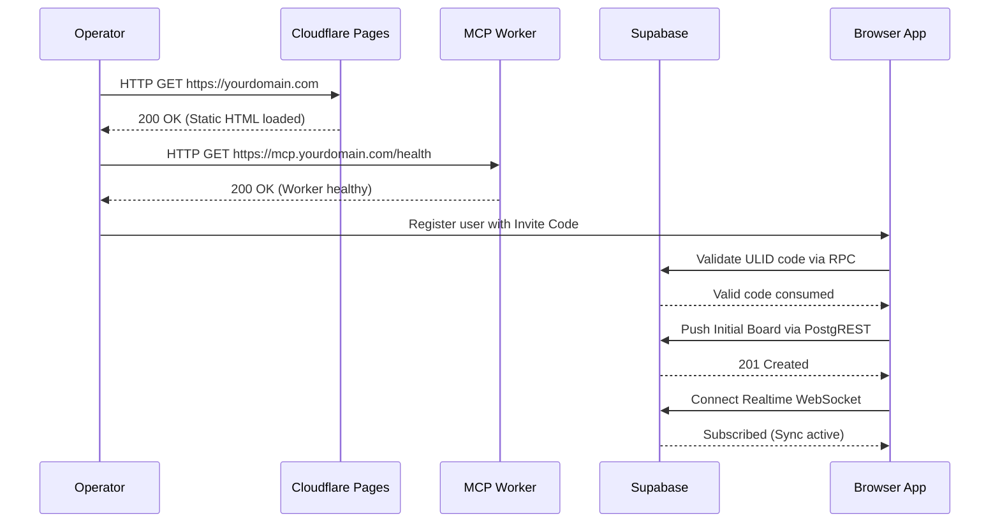

# Buobu Infrastructure & Production Deployment Playbook

A complete end-to-end technical playbook for provisioning, configuring, and operating Buobu in **Cloud Mode** across **Terraform**, **Supabase**, **Cloudflare (Pages + Workers + DNS)**, and **GitHub Actions CI/CD pipelines**.

---

## Table of Contents

1. [Architecture Overview](#1-architecture-overview)
2. [Prerequisites & Account Setup](#2-prerequisites--account-setup)
3. [Infrastructure as Code with Terraform](#3-infrastructure-as-code-with-terraform)
4. [Supabase Backend Configuration](#4-supabase-backend-configuration)
5. [Cloudflare Workers Deployment](#5-cloudflare-workers-deployment)
6. [Domain & DNS Setup](#6-domain--dns-setup)
7. [Client Application Build & Deployment](#7-client-application-build--deployment)
8. [CI/CD Pipeline Setup (GitHub Actions)](#8-cicd-pipeline-setup-github-actions)
9. [Automated Setup Script (`setup-cloudflare.sh`)](#9-automated-setup-script-setup-cloudflaresh)
10. [Verification & Health Checks](#10-verification--health-checks)
11. [Day-2 Operations & Troubleshooting](#11-day-2-operations--troubleshooting)

---

## 1. Architecture Overview

Buobu is a local-first productivity platform built on Next.js 16 (statically exported), React 18, Tailwind CSS 4, RxDB (over IndexedDB via Dexie), and Supabase.

In **Local Mode** (`NEXT_PUBLIC_LOCAL_MODE=true`), the app operates 100% offline within the browser's IndexedDB with no remote services. In **Cloud Mode** (production deployments), the app replicates local state to Supabase PostgreSQL over PostgREST and Realtime WebSockets, protected by Row Level Security (RLS) and gated by subscription entitlements.



### Component Responsibility Matrix

| Component | Technology | Role & Responsibility |
|---|---|---|
| **App Shell** | Next.js 16 (Static Export), React 18, Tailwind 4 | Serves the client-side SPA (`out/`) with no Node server. |
| **Local Database** | RxDB 16 + Dexie (IndexedDB) | Primary database of record in the browser; reactive mutations. |
| **Cloud Database** | Supabase PostgreSQL + RLS | Remote replica, accounts, subscriptions, sync audit. |
| **Realtime Sync** | Supabase Realtime + PostgREST | Synchronizes state changes between client and cloud. |
| **Hosting & CDN** | Cloudflare Pages | Hosts static files with global edge caching and security headers. |
| **DNS & SSL/TLS** | Cloudflare DNS | Manages apex, `www`, `mcp`, and `referral` routing with automatic TLS. |
| **MCP Worker** | Cloudflare Worker (`workers/mcp`) | Model Context Protocol server for external AI tools with rate limiting. |
| **Referral Worker** | Cloudflare Worker (`workers/referral`) | API for invite codes, campaign validation, and referral trees. |
| **Link Previews** | Supabase Edge Function | Fetches OpenGraph metadata for bookmarks. |
| **Infrastructure** | Terraform (`infra/terraform`) | Provisions Cloudflare Pages, DNS records, and Supabase project. |
| **CI/CD** | GitHub Actions (`.github/workflows`) | Automated testing, Terraform planning/applying, and static deployment. |

---

## 2. Prerequisites & Account Setup

Before initiating deployment, ensure the following command-line tools and service accounts are ready.

### 2.1 Required CLI Tools

| Tool | Version Requirement | Installation Command |
|---|---|---|
| **Node.js** | 20.x to 24.x LTS (Node 26 is incompatible with jsdom) | `brew install node@24` or `nvm install 24` |
| **pnpm** | `>= 10.33.2` (Pinned in `package.json`) | `corepack enable` or `npm i -g pnpm@10.33.2` |
| **Terraform** | `>= 1.6` | `brew install terraform` |
| **Wrangler** | `>= 4.84.1` (Included in `devDependencies`) | `pnpm install` |
| **Supabase CLI** | Latest | `brew install supabase/tap/supabase` |
| **GitHub CLI** | Latest (`gh`) | `brew install gh && gh auth login` |
| **Utilities** | `curl`, `jq` | `brew install curl jq` |

### 2.2 Account Credentials & API Tokens

#### 1. Cloudflare
- **Account ID**: Navigate to Cloudflare Dashboard → Any Domain → **Overview** → **Account ID** (right sidebar).
- **API Token**: Create at `https://dash.cloudflare.com/profile/api-tokens` using **Create Custom Token** with the following permissions:
  - `Zone > DNS > Edit`
  - `Zone > Zone > Read`
  - `Account > Cloudflare Pages > Edit`
  - `Account > Workers Scripts > Edit`
- **Domain Zone**: Your apex domain (e.g. `example.com`) must already be added as an active zone in Cloudflare with nameservers pointing to Cloudflare.

#### 2. Supabase
- **Organization ID**: Navigate to Supabase Dashboard → Organizations → **Settings** → **Organization ID**.
- **Personal Access Token (PAT)**: Generate at `https://supabase.com/dashboard/account/tokens`.
- **Database Superuser Password**: A strong random password (minimum 12 characters, alphanumeric + symbols).
- **Target Region**: Choose the region closest to your users (e.g. `eu-central-1`, `us-east-1`, `ap-southeast-1`).

#### 3. GitHub
- Repository with administrative access to configure Secrets and Environment Variables under **Settings > Secrets and variables > Actions**.

---

## 3. Infrastructure as Code with Terraform

The directory `infra/terraform/` provisions the primary Cloudflare and Supabase resources.

### 3.1 Terraform Module Structure

```text
infra/terraform/
├── main.tf                  # Provider versions, backend configuration, provider blocks
├── cloudflare.tf            # Cloudflare Pages project, Apex/WWW DNS CNAMEs, custom domains
├── supabase.tf              # Supabase Project resource (optional provisioning)
├── variables.tf             # Input variables with validation rules
├── outputs.tf               # Provisioned URLs, IDs, connection strings, next steps
└── terraform.tfvars.example # Example variable definitions
```

### 3.2 Configure Remote State Backend

In `infra/terraform/main.tf`:
```hcl
terraform {
  required_version = ">= 1.6"

  # Option A: Terraform Cloud (Default)
  backend "remote" {
    hostname     = "app.terraform.io"
    organization = "<your-terraform-org>"
    workspaces {
      prefix = "buobu-"
    }
  }

  # Option B: S3 / Cloudflare R2 / Local State (Alternative)
  # Remove backend "remote" and configure a partial backend or local state:
  # backend "local" { path = "terraform.tfstate" }
}
```

> [!IMPORTANT]
> If using Terraform Cloud, update `organization = "<your-terraform-org>"` in `main.tf`, or remove the `backend "remote"` block and initialize with partial configuration (`terraform init -backend-config=backend.hcl`).

### 3.3 Prepare `terraform.tfvars`

Copy the example file and fill in your values:

```bash
cp infra/terraform/terraform.tfvars.example infra/terraform/terraform.tfvars
chmod 600 infra/terraform/terraform.tfvars
```

Configure `infra/terraform/terraform.tfvars`:

```hcl
# Resource naming
project_name = "buobu-production"  # Lowercase, alphanumeric + hyphens
root_domain  = "yourdomain.com"     # Apex domain without http/https

# Cloudflare credentials
cloudflare_api_token  = "YOUR_CLOUDFLARE_API_TOKEN"
cloudflare_account_id = "YOUR_CLOUDFLARE_ACCOUNT_ID"

# Supabase configuration
supabase_access_token    = "YOUR_SUPABASE_PERSONAL_ACCESS_TOKEN"
supabase_organization_id = "YOUR_SUPABASE_ORG_ID"
supabase_db_password     = "YOUR_SECURE_POSTGRES_PASSWORD"
supabase_region          = "eu-central-1"

# Set to true to create a fresh Supabase project.
# Set to false if you already have an existing Supabase project.
create_supabase_project  = true
```

### 3.4 Initialize and Apply Terraform

Run the following commands:

```bash
cd infra/terraform

# 1. Initialize providers and backend
terraform init -upgrade

# 2. Validate configuration
terraform validate

# 3. Plan provisioning
terraform plan -out=tfplan

# 4. Apply changes
terraform apply tfplan
```

### 3.5 Extract Terraform Outputs

After apply finishes, inspect the output values:

```bash
terraform output
```

You will receive:
- `app_url`: `https://yourdomain.com`
- `mcp_url`: `https://mcp.yourdomain.com`
- `referral_url`: `https://referral.yourdomain.com`
- `pages_project_name`: `buobu-production`
- `supabase_project_id`: `<project-ref-id>`
- `supabase_api_url`: `https://<project-ref-id>.supabase.co`
- `supabase_db_url`: `postgresql://postgres.<project-ref-id>:<DB_PASSWORD>@aws-0-<region>.pooler.supabase.com:6543/postgres`

---

## 4. Supabase Backend Configuration

With the project created (either via Terraform or manually), configure database migrations, edge functions, authentication, and storage.

### 4.1 Retrieve API Keys

From the Supabase Dashboard (**Project Settings > API**):
1. **Project URL**: `https://<project-ref>.supabase.co` (`NEXT_PUBLIC_SUPABASE_URL`)
2. **Publishable Key**: `anon` / `publishable` key (`NEXT_PUBLIC_SUPABASE_PUBLISHABLE_KEY`)
3. **Service Role Key**: `service_role` secret key (`SUPABASE_SERVICE_ROLE_KEY`) — *keep secret, used by Workers only*.

### 4.2 Apply Database Migrations

The repository contains 31 incremental, idempotent migrations under `supabase/migrations/`. These create tables, Row Level Security policies, indexes, and custom RPC functions.

Link and push migrations using the Supabase CLI:

```bash
# Login to Supabase CLI
supabase login

# Link local repo to remote project
supabase link --project-ref <your-project-ref>

# Push all migrations
supabase db push
```

#### What Migrations Provision:
- **Core Entities**: `boards`, `swimlanes`, `tasks`, `backlogs`, `habits`, `habit_logs`, `notes`, `mindmaps`, `bookmarks`, `timeblocks`, `vision_items`, `routines`, `routine_logs`.
- **Row Level Security**: Every user table has RLS enabled with policies verifying `auth.uid() = user_id`.
- **System & Security**: `api_keys` (SHA-256 hashed keys), `app_config`, `avatars` bucket storage policies, `generate_ulid()` functions.
- **Access Control & Billing**: `campaign_codes`, `invite_codes`, `referral_codes`, `subscriptions`.

### 4.3 Deploy the Bookmark Metadata Edge Function

Bookmark link preview fetching runs on a Supabase Edge Function:

```bash
supabase functions deploy fetch-bookmark-metadata --project-ref <your-project-ref>
```

> [!NOTE]
> `supabase/config.toml` enforces `verify_jwt = true` on `fetch-bookmark-metadata`. Callers must supply a valid Supabase JWT Bearer token.

### 4.4 Configure Supabase Authentication

In Supabase Dashboard under **Authentication**:

1. **URL Configuration**:
   - **Site URL**: `https://yourdomain.com`
   - **Redirect URLs**:
     - `https://yourdomain.com/**`
     - `https://www.yourdomain.com/**`
     - `http://localhost:3000/**` (for local testing)

2. **Auth Providers**:
   - **Email**: Enable Email provider. Disable "Confirm email" only if you do not want email confirmation during testing.
   - **Google OAuth (Optional)**: If enabled, OAuth sign-up is restricted to users who already exist in the database (enforced by `restrict_google_signup.sql`).

3. **Email Templates**:
   Copy the production-ready email templates from `supabase/templates/` into **Authentication > Email Templates**:
   - `supabase/templates/confirm-signup.html` → **Confirm signup**
   - `supabase/templates/reset-password.html` → **Reset password**
   - `supabase/templates/magic-link.html` → **Magic Link**
   - `supabase/templates/change-email.html` → **Change Email Address**
   - `supabase/templates/invite.html` → **Invite user**

### 4.5 Storage Bucket Verification

Verify that the `avatars` bucket is present under **Storage > Buckets**. The migration `20250902000001_avatars_bucket.sql` creates this bucket as public with RLS policies allowing users to upload only their own avatar image.

### 4.6 Mint the Initial Invite Code

Buobu Cloud Mode uses invite/campaign codes for user onboarding. Migrations do not seed hardcoded credentials. Generate your first ULID invite code via the Supabase SQL Editor:

```sql
insert into public.campaign_codes (campaign_type, max_uses, expires_at)
values ('invite', 5, now() + interval '30 days')
returning code;
```

This returns a Crockford base32 ULID (e.g. `01K4ZQ8XW3F7M9V0R2B5N6T4HD`). Use this code during initial user registration.

---

## 5. Cloudflare Workers Deployment

Buobu uses two Cloudflare Workers:
1. **MCP Worker** (`workers/mcp`): Serves the Model Context Protocol over Streamable HTTP for Claude, Cursor, and AI agents.
2. **Referral Worker** (`workers/referral`): Handles referral code validation and generation.

### 5.1 Worker Architecture & Constraints

- Workers do **not** use Cloudflare KV, D1, or Durable Objects; all state is persisted in Supabase via PostgREST using the `SUPABASE_SERVICE_ROLE_KEY`.
- Custom domains are **not** declared inside `wrangler.jsonc`. Wrangler considers `routes` the source of truth and would overwrite dashboard configurations on deploy. Custom domains must be bound via the Cloudflare Dashboard.

### 5.2 Deploy Workers via Wrangler

Both workers support `production` and `staging` environments defined in `wrangler.jsonc`.

```bash
# 1. Login to Cloudflare Wrangler
pnpm exec wrangler login

# 2. Deploy MCP Worker to Production
pnpm exec wrangler deploy \
  --config workers/mcp/wrangler.jsonc \
  --env production

# 3. Deploy Referral Worker to Production
pnpm exec wrangler deploy \
  --config workers/referral/wrangler.jsonc \
  --env production
```

### 5.3 Configure Worker Secrets

Set the required secrets for each Worker:

```bash
# MCP Worker Secrets
pnpm exec wrangler secret put NEXT_PUBLIC_SUPABASE_URL \
  --config workers/mcp/wrangler.jsonc --env production
# (Enter https://<project-ref>.supabase.co)

pnpm exec wrangler secret put SUPABASE_SERVICE_ROLE_KEY \
  --config workers/mcp/wrangler.jsonc --env production
# (Enter your SUPABASE_SERVICE_ROLE_KEY)

pnpm exec wrangler secret put MCP_ALLOWED_ORIGIN \
  --config workers/mcp/wrangler.jsonc --env production
# (Enter https://yourdomain.com)

# Referral Worker Secrets
pnpm exec wrangler secret put NEXT_PUBLIC_SUPABASE_URL \
  --config workers/referral/wrangler.jsonc --env production

pnpm exec wrangler secret put SUPABASE_SERVICE_ROLE_KEY \
  --config workers/referral/wrangler.jsonc --env production

pnpm exec wrangler secret put ALLOWED_ORIGIN \
  --config workers/referral/wrangler.jsonc --env production
# (Enter https://yourdomain.com)
```

### 5.4 Bind Custom Domains to Workers

To make `mcp.yourdomain.com` and `referral.yourdomain.com` active:

1. Go to **Cloudflare Dashboard > Workers & Pages**.
2. Select `buobu-mcp` → **Settings** → **Domains & Routes** → **Add** → **Custom Domain**.
3. Enter `mcp.yourdomain.com` and confirm.
4. Select `buobu-referral` → **Settings** → **Domains & Routes** → **Add** → **Custom Domain**.
5. Enter `referral.yourdomain.com` and confirm.

Cloudflare will automatically provision DNS records and SSL certificates for both subdomains.

---

## 6. Domain & DNS Setup

### 6.1 DNS Record Mapping

Terraform automatically establishes the DNS records for the main application. If managing DNS manually, configure the following in Cloudflare:

| Type | Name | Content / Target | Proxy Status | Description |
|---|---|---|---|---|
| **CNAME** | `@` (apex) | `<project-name>.pages.dev` | Proxied (Orange Cloud) | Apex web application |
| **CNAME** | `www` | `<project-name>.pages.dev` | Proxied (Orange Cloud) | WWW web application |
| **Custom Domain** | `mcp` | Worker `buobu-mcp` | Proxied (Managed by Worker) | MCP endpoint |
| **Custom Domain** | `referral` | Worker `buobu-referral` | Proxied (Managed by Worker) | Referral API endpoint |

### 6.2 SSL/TLS & Edge Security

In Cloudflare Dashboard:
1. **SSL/TLS Encryption Mode**: Set to **Full (Strict)**.
2. **Edge Certificates**:
   - **Always Use HTTPS**: `On`
   - **Minimum TLS Version**: `TLS 1.2` (or `1.3`)
   - **Automatic HTTPS Rewrites**: `On`

### 6.3 Security Headers & Content Security Policy (CSP)

Cloudflare Pages reads `public/_headers` directly.

> [!WARNING]
> If using custom worker domains (e.g. `https://mcp.yourdomain.com` and `https://referral.yourdomain.com`), you **must** update the `connect-src` directive in `public/_headers` before deploying, or the browser will block requests to the workers:
>
> ```text
> connect-src 'self' https://*.supabase.co wss://*.supabase.co https://*.workers.dev https://mcp.yourdomain.com https://referral.yourdomain.com https://challenges.cloudflare.com;
> ```

---

## 7. Client Application Build & Deployment

Next.js is configured with `output: "export"`, which emits a pure static SPA into `out/`.

### 7.1 Build-Time Environment Inlining

Because `NEXT_PUBLIC_*` values are inlined into JavaScript bundles during `pnpm build`, they must be supplied at build time:

```bash
# Cloud Mode Build
export NEXT_PUBLIC_LOCAL_MODE=false
export NEXT_PUBLIC_SUPABASE_URL=https://<project-ref>.supabase.co
export NEXT_PUBLIC_SUPABASE_PUBLISHABLE_KEY=<your-anon-key>
export NEXT_PUBLIC_MCP_URL=https://mcp.yourdomain.com
export NEXT_PUBLIC_REFERRAL_API_URL=https://referral.yourdomain.com
export NEXT_PUBLIC_BUILD_VERSION=$(git rev-parse --short HEAD)
export NEXT_PUBLIC_BUILD_TIME=$(date -u +%Y-%m-%dT%H:%M:%SZ)

# Build static bundle
pnpm install --frozen-lockfile
pnpm build
```

> [!CAUTION]
> Never set `NEXT_PUBLIC_LOCAL_MODE=true` in a production build. Doing so forces the app to run completely offline in the user's browser, bypassing Supabase sync entirely.

### 7.2 Manual Deployment to Cloudflare Pages

Publish the `out/` directory using Wrangler:

```bash
pnpm exec wrangler pages deploy out --project-name=<pages-project-name>
```

Your site is immediately available at `https://<pages-project-name>.pages.dev` and on your apex domain `https://yourdomain.com`.

---

## 8. CI/CD Pipeline Setup (GitHub Actions)

The repository includes ready-to-arm workflow templates in `.github/workflows/`:

```text
.github/workflows/
├── ci.yml               # Always active: lint, typecheck, unit tests, local & cloud test builds
├── deploy.yml.disabled  # Build + deploy out/ to Cloudflare Pages & deploy Workers
├── infra.yml.disabled   # Terraform plan on PRs, terraform apply on push to main
└── e2e.yml.disabled     # Playwright E2E suite against live Supabase project
```

### 8.1 Configuring GitHub Secrets and Variables

Configure these values in GitHub under **Repository Settings > Secrets and variables > Actions**:

#### Variables (Non-sensitive)
| Variable Name | Example Value | Description |
|---|---|---|
| `PROJECT_NAME` | `buobu-production` | Cloudflare Pages and Supabase project name |
| `ROOT_DOMAIN` | `yourdomain.com` | Apex domain |
| `NEXT_PUBLIC_SUPABASE_URL` | `https://xxx.supabase.co` | Supabase API endpoint |
| `NEXT_PUBLIC_MCP_URL` | `https://mcp.yourdomain.com` | MCP Worker endpoint |
| `NEXT_PUBLIC_REFERRAL_API_URL` | `https://referral.yourdomain.com` | Referral Worker endpoint |
| `SUPABASE_ORGANIZATION_ID` | `org_abc123` | Supabase Org ID (for Terraform) |
| `SUPABASE_REGION` | `eu-central-1` | Supabase Region (default: `eu-central-1`) |
| `CREATE_SUPABASE_PROJECT` | `false` | `true` if Terraform manages project lifecycle |

#### Secrets (Sensitive)
| Secret Name | Description |
|---|---|
| `CLOUDFLARE_API_TOKEN` | Custom API Token with Pages, Workers, DNS Edit permissions |
| `CLOUDFLARE_ACCOUNT_ID` | Cloudflare Account ID |
| `NEXT_PUBLIC_SUPABASE_PUBLISHABLE_KEY` | Supabase anon/publishable key |
| `SUPABASE_SERVICE_ROLE_KEY` | Supabase service-role key (used by Workers & E2E) |
| `SUPABASE_ACCESS_TOKEN` | Supabase Personal Access Token (for Terraform) |
| `SUPABASE_DB_PASSWORD` | PostgreSQL superuser password (for Terraform) |
| `TF_API_TOKEN` | Terraform Cloud API token (if using Terraform Cloud) |

### 8.2 Arming the Deployment Workflows

GitHub Actions will only execute workflow files ending in `.yml` or `.yaml`.

To arm continuous infrastructure updates:
```bash
git mv .github/workflows/infra.yml.disabled .github/workflows/infra.yml
```
*Edit `.github/workflows/infra.yml` and replace `example-app` with your project/workspace name.*

To arm continuous deployment:
```bash
git mv .github/workflows/deploy.yml.disabled .github/workflows/deploy.yml
```
*Edit `.github/workflows/deploy.yml` and replace `example-app` in `pages deploy out --project-name=example-app` with your Cloudflare Pages project name.*

Commit and push to `main`:
```bash
git add .github/workflows/
git commit -m "ci: arm deployment and infrastructure pipelines"
git push origin main
```

---

## 9. Automated Setup Script (`setup-cloudflare.sh`)

For local operator control, `scripts/setup-cloudflare.sh` automates the entire orchestration in order.

```bash
# Display interactive menu
./scripts/setup-cloudflare.sh

# Run end-to-end setup (infra -> worker -> secrets -> migrate)
ROOT_DOMAIN=yourdomain.com ./scripts/setup-cloudflare.sh all

# Or run individual stages:
ROOT_DOMAIN=yourdomain.com ./scripts/setup-cloudflare.sh infra    # Terraform apply
ROOT_DOMAIN=yourdomain.com ./scripts/setup-cloudflare.sh worker   # Deploy MCP worker
ROOT_DOMAIN=yourdomain.com ./scripts/setup-cloudflare.sh secrets  # Push secrets to GitHub Actions
ROOT_DOMAIN=yourdomain.com ./scripts/setup-cloudflare.sh migrate  # Run Supabase migrations
ROOT_DOMAIN=yourdomain.com ./scripts/setup-cloudflare.sh status   # Health and URL check
```

---

## 10. Verification & Health Checks

Execute the following checks after deployment:



### 1. HTTP Endpoint Status
```bash
# Web application root
curl -Is https://yourdomain.com | head -n 5

# MCP Worker health
curl -Is https://mcp.yourdomain.com/health | head -n 5
```

### 2. User Registration & Sync
1. Visit `https://yourdomain.com`.
2. Click **Sign In** → **Register**.
3. Provide an email, password, and the ULID invite code generated in [Section 4.6](#46-mint-the-initial-invite-code).
4. Create a task in the **Tasks** board.
5. In Supabase Dashboard, inspect table `public.tasks` to verify the record replicated to Postgres with your `user_id`.

### 3. MCP Worker Connectivity
Test calling the MCP endpoint using curl with a created Buobu API key:
```bash
curl -X POST https://mcp.yourdomain.com/mcp \
  -H "Authorization: Bearer buobu_your_api_key" \
  -H "Content-Type: application/json" \
  -d '{"jsonrpc": "2.0", "id": 1, "method": "tools/list"}'
```

---

## 11. Day-2 Operations & Troubleshooting

### 11.1 Applying Future Database Migrations
When pulling updates that contain new migrations in `supabase/migrations/`:
```bash
supabase link --project-ref <your-project-ref>
supabase db push
```

### 11.2 Instant Rollbacks on Cloudflare Pages
Cloudflare Pages keeps every deployed build immutable:
1. Navigate to **Cloudflare Dashboard > Workers & Pages > your-pages-project**.
2. Under **Deployments**, locate the last known good deployment.
3. Click **...** → **Rollback to this deployment**.

### 11.3 Secret Rotation Runbook

#### Supabase Service Role Key Rotation:
1. Generate a new service role key in **Supabase Dashboard > Project Settings > API**.
2. Update Worker secrets:
   ```bash
   pnpm exec wrangler secret put SUPABASE_SERVICE_ROLE_KEY --config workers/mcp/wrangler.jsonc --env production
   pnpm exec wrangler secret put SUPABASE_SERVICE_ROLE_KEY --config workers/referral/wrangler.jsonc --env production
   ```
3. Update GitHub Repository Secret: `SUPABASE_SERVICE_ROLE_KEY`.

#### Cloudflare API Token Rotation:
1. Generate a replacement token at Cloudflare Dashboard.
2. Update GitHub Repository Secret: `CLOUDFLARE_API_TOKEN`.
3. If using Terraform locally, update `infra/terraform/terraform.tfvars`.

### 11.4 Troubleshooting Matrix

| Symptom | Probable Cause | Remedy |
|---|---|---|
| Build halts: `"Cloud Mode requires NEXT_PUBLIC_SUPABASE_URL..."` | Missing build-time environment variables in GitHub Actions or local environment. | Ensure `NEXT_PUBLIC_SUPABASE_URL` and `NEXT_PUBLIC_SUPABASE_PUBLISHABLE_KEY` are provided to the build process. |
| Browser console CSP error: `"Refused to connect to https://mcp.domain.com..."` | The Worker custom domain is missing from `connect-src` in `public/_headers`. | Add your custom domain to `connect-src` in `public/_headers` and trigger a new build. |
| Deep links return 404 on Cloudflare Pages | Host configured with aggressive single-page rewriting. | Cloudflare Pages handles subpaths natively; verify static export routes are generated under `out/` as `<route>/index.html`. |
| Sync never triggers in Cloud Mode | User lacks Plus subscription or sync entitlement. | With `NEXT_PUBLIC_BILLING_ENABLED=false`, all users receive Plus access. If billing is enabled, check `public.subscriptions` table for an active user entry. |
| Supabase RLS error: `"Permission denied for table..."` | Client attempting write without valid user session, or migration timestamp mismatch. | Ensure migrations are fully applied via `supabase db push` and user session is valid. |
| Terraform fails: `"Workspace already locked"` | Another operation was aborted midway in Terraform Cloud. | Unlock the workspace in Terraform Cloud UI under **Settings > Lock status**. |
